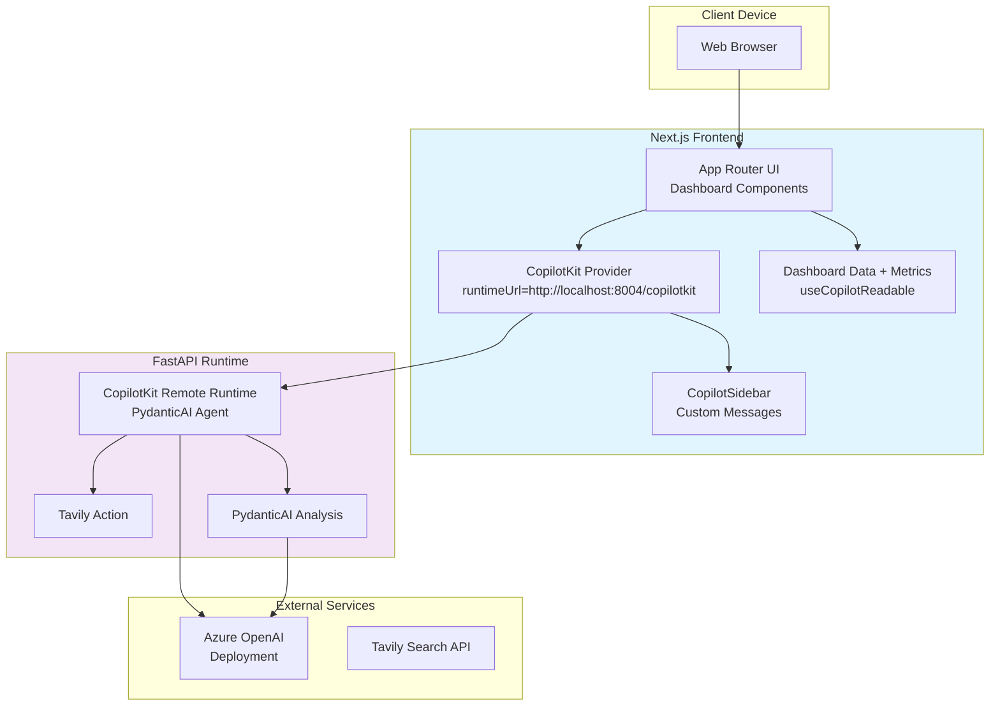
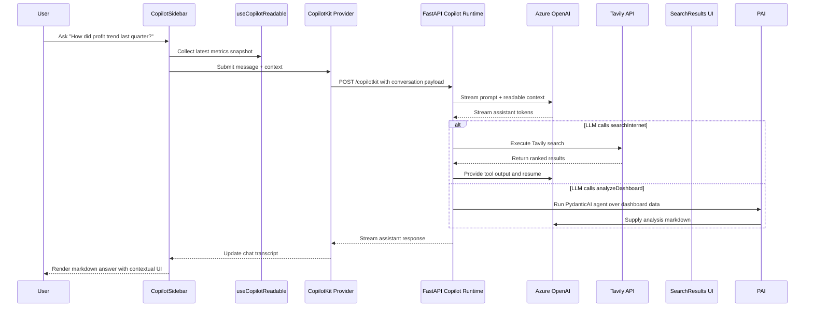

# Architecture Overview

This document describes the end-to-end architecture of the **Copilot Chat with Your Data** example application. The solution combines a Next.js 15 App Router frontend, a FastAPI backend that hosts the CopilotKit remote runtime powered by PydanticAI, and Azure OpenAI backed large language model (LLM) execution with optional Tavily web search augmentation.

## System Overview
- **Next.js frontend (`app/`, `components/`)**: Renders the dashboard and chat shell in React 19 with Tailwind utility classes and Tremor/Recharts visualizations. All client components are hydrated in the browser.
- **CopilotKit bridge (`app/layout.tsx`)**: Wraps the application tree in the `CopilotKit` provider and points it at `process.env.NEXT_PUBLIC_COPILOT_RUNTIME_URL` (default `http://localhost:8004/copilotkit`) so all children share a single chat session with the FastAPI runtime.
- **Chat experience (`app/page.tsx`, `components/AssistantMessage.tsx`)**: Dynamically imports the `CopilotSidebar`, customises message rendering, and manages responsive layout offsets when the sidebar opens.
- **Structured data + generative UI (`components/Dashboard.tsx`)**: Exposes dashboard metrics through `useCopilotReadable` and registers a render-only `useCopilotAction` that drives the `SearchResults` component for action status updates.
- **FastAPI Copilot runtime (`backend/main.py`)**: Serves the CopilotKit remote endpoint on `/copilotkit`, wires Tavily search and a PydanticAI dashboard analysis agent, and brokers all Azure OpenAI requests.
- **External AI services**: Azure OpenAI handles LLM completions for both the Copilot runtime and the PydanticAI agent; Tavily Search API provides optional real-time search augmentation when the runtime triggers the action.

## Runtime Components
- **CopilotKit Provider**: Configured in `app/layout.tsx`, establishes the websocket connection to the FastAPI runtime and shares state between all CopilotKit hooks.
- **Dashboard + Charts**: Built from `components/Dashboard.tsx` with static datasets in `data/dashboard-data.ts`. Derived metrics are recalculated on render so the AI always reads fresh values.
- **Copilot Sidebar**: `@copilotkit/react-ui` sidebar streamed in via dynamic import, labelled as a “Data Assistant”, and extended with the `CustomAssistantMessage` renderer.
- **FastAPI CopilotKit Runtime**: Hosts the CopilotKit remote endpoint, orchestrates conversations against Azure OpenAI via PydanticAI, and streams responses back to the client.
- **Runtime Actions**: `searchInternet` executes Tavily queries server-side, while `analyzeDashboard` runs a PydanticAI agent over the dashboard dataset to produce markdown insights.
- **External Services**: Azure OpenAI performs completion streaming and powers the PydanticAI agent; Tavily responds to internet search requests initiated by the runtime action.

## Data Flow
1. When `app/page.tsx` mounts, the dashboard loads static datasets from `data/dashboard-data.ts` and derives summary metrics.
2. `useCopilotReadable` serialises the datasets and metrics so CopilotKit can inject them into prompts and tool calls.
3. The user sends a message from the `CopilotSidebar`. The provider packages the message, conversation history, and readable context and posts it to the FastAPI runtime (`/copilotkit`).
4. FastAPI receives the CopilotKit request, assembles the prompt, merges readable data, and streams the request to Azure OpenAI through the configured PydanticAI agent.
5. If the agent invokes `searchInternet`, the Tavily client runs server-side and its markdown output is supplied back to the LLM. Otherwise, the agent answers directly using the dashboard dataset.
6. The CopilotKit runtime streams the response back to the browser, including any action results.
7. The `CopilotSidebar` renders streamed tokens as assistant messages while `SearchResults` visualises action status updates.

## Deployment View

## Sequence: Typical Chat Interaction

## Cross-Cutting Concerns
- **Configuration**: The frontend targets the FastAPI runtime via `NEXT_PUBLIC_COPILOT_RUNTIME_URL` (default `http://localhost:8004/copilotkit`). The backend requires Azure OpenAI credentials and optionally `TAVILY_API_KEY`; it validates these at startup and exposes `/health` for monitoring.
- **Security**: Secrets and Tavily credentials stay entirely within the FastAPI runtime. The frontend communicates over HTTPS and never handles sensitive keys.
- **Local development**: Run `bun run dev` for Next.js (port 3000) and `uvicorn main:app --port 8004 --reload` for the FastAPI runtime. Both share the same Azure OpenAI project via environment variables.
- **Extensibility**: Extend `backend/dashboard_data.py` to enrich the PydanticAI agent context and register additional actions within the FastAPI runtime without altering the frontend chat interface.
