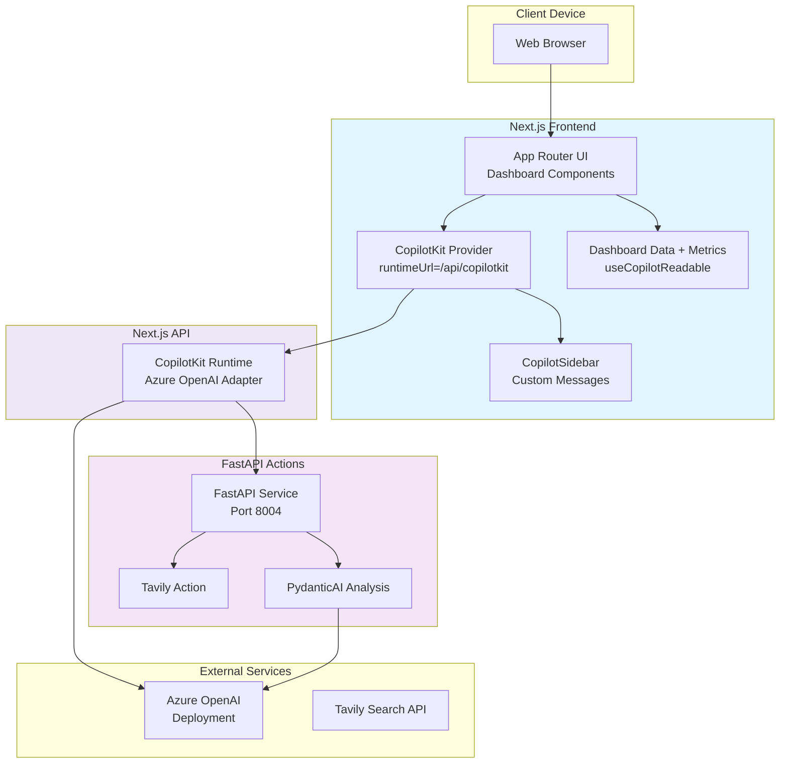
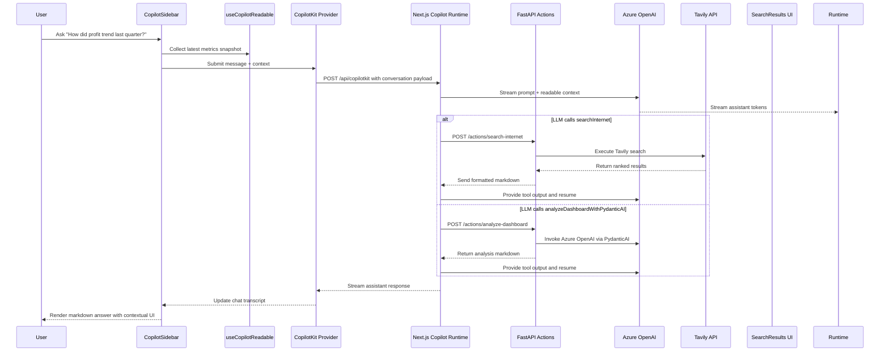

# Architecture Overview

This document describes the end-to-end architecture of the **Copilot Chat with Your Data** example application. The solution combines a Next.js 15 App Router frontend, a CopilotKit runtime served from the Next.js API route, and a FastAPI services layer that provides backend actions backed by Tavily search and PydanticAI running on Azure OpenAI.

## System Overview
- **Next.js frontend (`app/`, `components/`)**: Renders the dashboard and chat shell in React 19 with Tailwind utility classes and Tremor/Recharts visualizations. All client components are hydrated in the browser.
- **CopilotKit bridge (`app/layout.tsx`)**: Wraps the application tree in the `CopilotKit` provider and points it at `process.env.NEXT_PUBLIC_COPILOT_RUNTIME_URL` (default `http://localhost:8004/copilotkit`) so all children share a single chat session.
- **Chat experience (`app/page.tsx`, `components/AssistantMessage.tsx`)**: Dynamically imports the `CopilotSidebar`, customises message rendering, and manages responsive layout offsets when the sidebar opens.
- **Structured data + generative UI (`components/Dashboard.tsx`)**: Exposes dashboard metrics through `useCopilotReadable` and registers a render-only `useCopilotAction` that drives the `SearchResults` component for action status updates.
- **Next.js API runtime (`app/api/copilotkit/route.ts`)**: Wraps the CopilotKit runtime with an Azure OpenAI adapter and exposes actions that proxy to the Python backend.
- **FastAPI actions service (`backend/main.py`)**: Hosts REST endpoints for Tavily search and a PydanticAI-powered dashboard analysis agent.
- **External AI services**: Azure OpenAI handles both CopilotKit runtime completions and the backend PydanticAI agent; Tavily Search API provides optional real-time search augmentation when the runtime triggers the action.

## Runtime Components
- **CopilotKit Provider**: Configured in `app/layout.tsx`, establishes the websocket connection to the runtime endpoint and shares state between all CopilotKit hooks.
- **Dashboard + Charts**: Built from `components/Dashboard.tsx` with static datasets in `data/dashboard-data.ts`. Derived metrics are recalculated on render so the AI always reads fresh values.
- **Copilot Sidebar**: `@copilotkit/react-ui` sidebar streamed in via dynamic import, labelled as a “Data Assistant”, and extended with the `CustomAssistantMessage` renderer.
- **Generative UI action**: The disabled client-side `searchInternet` action renders `components/generative-ui/SearchResults.tsx` to surface backend action status while keeping execution server-side.
- **Next.js CopilotKit Runtime**: Encapsulates prompt assembly, context fusion, and streaming responses between the frontend and the Azure OpenAI deployment. Actions fan out to the Python backend when needed.
- **FastAPI Actions Service**: Python application with CORS enabled for `localhost:3000`. Exposes `/actions/search-internet` (Tavily) and `/actions/analyze-dashboard` (PydanticAI) plus `/health` for readiness checks.
- **External Services**: Azure OpenAI performs completion streaming and powers the PydanticAI agent; Tavily responds to internet search requests initiated by the runtime action.

## Data Flow
1. When `app/page.tsx` mounts, the dashboard loads static datasets from `data/dashboard-data.ts` and derives summary metrics.
2. `useCopilotReadable` serialises the datasets and metrics so CopilotKit can inject them into prompts and tool calls.
3. The user sends a message from the `CopilotSidebar`. The provider packages the message, conversation history, and readable context and posts it to `/api/copilotkit`.
4. The Next.js API route hosts the CopilotKit runtime, which assembles the prompt, merges readable data, and streams the request to Azure OpenAI.
5. If the LLM calls `searchInternet` or `analyzeDashboardWithPydanticAI`, the runtime issues an HTTP POST to the FastAPI backend.
6. FastAPI executes Tavily search or runs the PydanticAI Azure OpenAI agent over the shared dashboard dataset, returning a markdown response string.
7. Action results are appended to the conversation and streamed back to the browser. CopilotKit emits tool status updates that hydrate the `SearchResults` component rendered by `useCopilotAction`, and the `CustomAssistantMessage` component renders the final markdown beside the dashboard visuals.

## Deployment View

## Sequence: Typical Chat Interaction

## Cross-Cutting Concerns
- **Configuration**: The frontend defaults to `/api/copilotkit` but honours `NEXT_PUBLIC_COPILOT_RUNTIME_URL`. The FastAPI server requires Azure OpenAI credentials (shared with the runtime) and optionally `TAVILY_API_KEY`; it validates these at startup and exposes `/health` for monitoring.
- **Security**: LLM secrets remain on the server side. The FastAPI service is the only component that touches Tavily keys and PydanticAI / Azure credentials outside the Next.js runtime.
- **Local development**: Run `bun run dev` for Next.js (port 3000) and `uvicorn main:app --port 8004 --reload` for the Python service. The runtime actions default to `http://localhost:8004` but read `PY_BACKEND_URL` if supplied.
- **Extensibility**: Add new actions by expanding the FastAPI service and registering corresponding handlers in `app/api/copilotkit/route.ts`. The PydanticAI agent shares a Python-native dashboard snapshot to keep analyses in sync with the frontend data.
