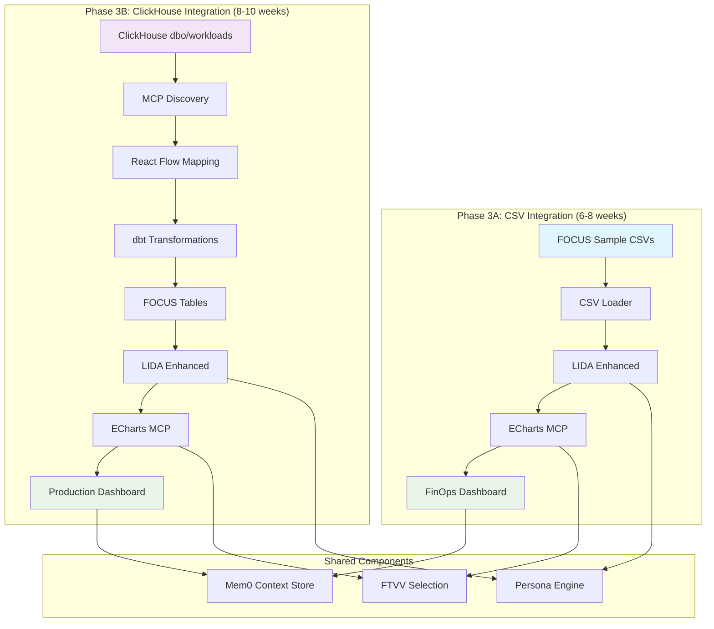
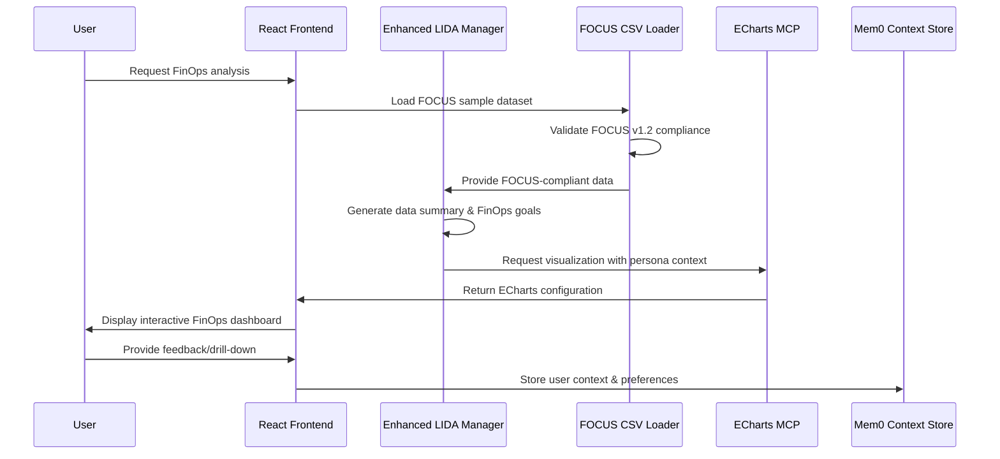
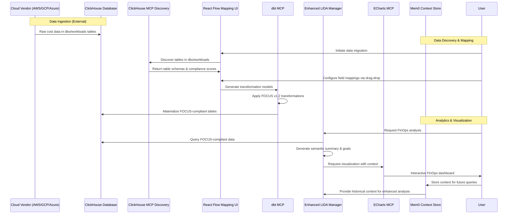

# Implementation Task List: LIDA-Based Backend with ECharts Architecture

## Executive Summary

This implementation plan leverages Microsoft's LIDA (Automatic Generation of Visualizations and Infographics using Large Language Models) as the foundation for a context-aware, agentic data visualization backend. We will enhance LIDA's proven data understanding and goal generation capabilities while replacing its static chart generation with ECharts MCP Server integration and adding enterprise-grade features like persona-aware selection, memory persistence, and semantic layer integration.

## Phase 1: Core Infrastructure Setup

### 1.1 Backend Foundation Migration (1-2 weeks)
- [ ] **Adapt LIDA Manager class** to integrate with your FastAPI backend
  - Fork LIDA's core manager functionality
  - Replace synchronous operations with async/await patterns
  - Integrate with existing FastAPI route structure
  - Maintain LIDA's fluent API design while adding enterprise features

- [ ] **Replace LIDA's visualization libraries** (matplotlib/seaborn/altair) with ECharts MCP Server integration
  - Remove dependencies on matplotlib, seaborn, altair
  - Create ECharts MCP client wrapper
  - Implement chart type mapping from LIDA intents to ECharts types
  - Add interactive capabilities not available in static LIDA outputs

- [ ] **Maintain LIDA's data summarization module** for semantic understanding
  - Preserve LIDA's compact data summary generation
  - Enhance with business entity recognition
  - Add support for ClickHouse data sources beyond CSV
  - Integrate with dbt semantic layer for metric definitions

- [ ] **Preserve LIDA's goal generation system** but map to your FTVV narrative categories
  - Keep LIDA's natural language goal generation
  - Map generated goals to FTVV categories (magnitude, ranking, change_over_time, etc.)
  - Add business context awareness to goal prioritization
  - Implement persona-specific goal filtering

- [ ] **Integrate LIDA's LLM abstraction layer** with your GPT-4o orchestrator
  - Maintain LIDA's llmx abstraction for multi-provider support
  - Configure for GPT-4o as primary model
  - Add context injection for business domain knowledge
  - Implement cost optimization and prompt caching

### 1.2 ECharts Integration Layer (1 week)
- [ ] **Create ECharts MCP adapter** to replace LIDA's code generation
  ```python
  class EChartsLidaAdapter:
      def __init__(self, echarts_mcp_client):
          self.echarts_client = echarts_mcp_client

      async def generate_visualization(self, goal, data_summary, persona):
          chart_type = self.map_goal_to_chart_type(goal, persona)
          echarts_config = await self.echarts_client.get_chart(
              type=chart_type,
              data=data_summary.processed_data,
              title=goal.question,
              series_name=goal.metric,
              x_axis_name=goal.dimensions[0] if goal.dimensions else "Category",
              y_axis_name=goal.metric
          )
          return echarts_config
  ```

- [ ] **Map LIDA's visualization intents** to ECharts chart types
  - Create intent → chart type mapping dictionary
  - Implement Cleveland-McGill hierarchy filtering
  - Add persona complexity constraints
  - Handle edge cases and fallback options

- [ ] **Implement chart configuration translator** from LIDA goals to ECharts options
  - Parse LIDA's natural language goals
  - Extract chart requirements (axes, colors, interactions)
  - Generate ECharts option objects
  - Add accessibility and responsive features

- [ ] **Add interactive features** not available in LIDA's static output
  - Implement drill-down capabilities
  - Add hover interactions and tooltips
  - Create export functionality (PNG, SVG, PDF)
  - Enable chart editing and customization

### 1.3 Semantic Layer Integration (1 week)
- [ ] **Connect LIDA's data summarization** to your dbt MCP server
  - Replace LIDA's basic CSV analysis with dbt metric queries
  - Implement semantic model awareness in data summarization
  - Add business entity and relationship understanding
  - Create metric-aware data profiling

- [ ] **Replace LIDA's simple CSV processing** with your ClickHouse OLAP integration
  - Add ClickHouse data source connector
  - Implement query optimization for large datasets
  - Add data sampling strategies for performance
  - Create data type mapping and validation

- [ ] **Enhance metric definitions** beyond LIDA's basic column analysis
  - Import dbt metric definitions
  - Add calculated fields and business logic
  - Implement metric hierarchies and drill paths
  - Create metric recommendation engine

- [ ] **Implement business entity mapping** from your semantic model
  - Map raw data columns to business entities
  - Create entity relationship understanding
  - Add domain-specific knowledge injection
  - Implement entity-aware visualization suggestions

## Phase 2: Architecture Enhancement

### 2.1 Persona-Aware Visualization Selection (2 weeks)
- [ ] **Extend LIDA's persona parameter** with your detailed persona profiles
  ```python
  class PersonaAwareManager(Manager):
      def __init__(self, llm, persona_db):
          super().__init__(llm)
          self.persona_db = persona_db

      def visualize(self, summary, goal, persona_id):
          persona = self.persona_db.get_persona(persona_id)
          filtered_charts = self.filter_by_persona(goal.charts, persona)
          return self.generate_visualization(summary, goal, filtered_charts[0])
  ```

- [ ] **Implement Cleveland-McGill perceptual hierarchy** filtering in chart selection
  - Create perceptual accuracy scoring system
  - Implement chart type ranking by encoding effectiveness
  - Add persona-specific complexity thresholds
  - Filter out inappropriate chart types automatically

- [ ] **Replace LIDA's simple chart selection** with your FTVV-based algorithm
  - Implement FTVV narrative goal classification
  - Create data relationship pattern recognition
  - Add multi-criteria decision matrix for chart selection
  - Implement weighted scoring based on context

- [ ] **Add cognitive load assessment** to LIDA's evaluation module
  - Create cognitive complexity metrics
  - Implement attention span considerations
  - Add accessibility compliance checking
  - Generate simplification recommendations

### 2.2 Memory and Context Integration (1-2 weeks)
- [ ] **Replace LIDA's stateless design** with Mem0 context persistence
  ```python
  class ContextAwareLidaManager:
      def __init__(self, llm, mem0_client):
          self.lida = Manager(llm)
          self.memory = mem0_client

      async def visualize_with_context(self, user_id, query):
          context = await self.memory.get_context(user_id)
          enhanced_query = self.inject_context(query, context)
          result = self.lida.visualize(enhanced_query)
          await self.memory.store_interaction(user_id, query, result)
          return result
  ```

- [ ] **Implement user interaction history** tracking beyond LIDA's session scope
  - Store visualization generation patterns
  - Track user preferences and feedback
  - Create interaction timeline and analytics
  - Implement preference learning algorithms

- [ ] **Add contextual visualization recommendations** using stored patterns
  - Analyze historical visualization choices
  - Identify common drill-down paths
  - Generate personalized suggestions
  - Implement collaborative filtering for recommendations

- [ ] **Integrate Opik evaluation** for continuous improvement
  - Add feedback collection mechanisms
  - Implement A/B testing for visualization choices
  - Create evaluation metrics and dashboards
  - Add automated model retraining triggers

### 2.3 CopilotKit Frontend Integration (1 week)
- [ ] **Adapt LIDA's web API** to work with CopilotKit actions
  ```typescript
  useCopilotAction({
    name: 'generateVisualization',
    description: 'Generate data visualization using LIDA backend',
    parameters: [
      { name: 'query', type: 'string', description: 'Natural language query' }
    ],
    handler: async ({ query }) => {
      const response = await fetch('/api/lida/visualize', {
        method: 'POST',
        body: JSON.stringify({ query, userId: currentUser.id })
      });
      return await response.json();
    }
  });
  ```

- [ ] **Implement streaming responses** for progressive visualization generation
  - Add WebSocket support for real-time updates
  - Create progressive loading states
  - Implement partial result streaming
  - Add cancellation and retry mechanisms

- [ ] **Add drill-down capabilities** not present in LIDA
  - Implement click-to-filter functionality
  - Create breadcrumb navigation
  - Add context preservation across drill-downs
  - Enable multi-dimensional exploration

- [ ] **Create interactive ECharts components** with feedback loops
  - Build React components for ECharts integration
  - Add user feedback collection UI
  - Implement chart customization controls
  - Create export and sharing features

## Phase 3: FinOps Solution Implementation - Two-Phase Approach

### Overview: Phased FinOps Implementation Strategy

This implementation follows a two-phase approach to minimize risk and ensure rapid value delivery:

**Phase 3A (6-8 weeks)**: FOCUS CSV Integration & Core Analytics
- Use sample CSV datasets from FOCUS specification
- Build core LIDA-ECharts visualization capabilities
- Implement FOCUS v1.2 compliant analytics
- Deliver working FinOps dashboard with standard datasets

**Phase 3B (8-10 weeks)**: ClickHouse Integration & Production Deployment
- Add ClickHouse MCP integration
- Implement data migration and mapping UI
- Deploy production-ready solution
- Enable real-time data ingestion

### Complete Two-Phase Architecture Flow



---

## Phase 3A: FOCUS CSV Integration & Core Analytics (6-8 weeks)

### 3A.1 FOCUS Sample Data Integration (1-2 weeks)
- [ ] **Download and analyze FOCUS specification sample datasets**
  ```python
  class FocusCsvDataLoader:
      def __init__(self):
          self.focus_repo_url = "https://github.com/FinOps-Open-Cost-and-Usage-Spec/FOCUS_Spec"
          self.sample_data_path = "specification/data"
          self.excluded_patterns = ["saas_examples"]

      async def load_focus_samples(self):
          """Load all FOCUS sample CSV files except SaaS examples"""
          sample_datasets = []

          # Download sample data from GitHub
          datasets = await self.fetch_sample_datasets()

          # Filter out SaaS examples
          filtered_datasets = [
              ds for ds in datasets
              if not any(pattern in ds.path for pattern in self.excluded_patterns)
          ]

          # Load and validate each dataset
          for dataset in filtered_datasets:
              csv_data = await self.load_csv_from_github(dataset.path)
              validated_data = await self.validate_focus_compliance(csv_data)

              sample_datasets.append({
                  'name': dataset.name,
                  'path': dataset.path,
                  'data': csv_data,
                  'validation': validated_data,
                  'schema': await self.infer_schema(csv_data)
              })

          return sample_datasets

      async def validate_focus_compliance(self, csv_data):
          """Validate CSV data against FOCUS v1.2 specification"""
          required_fields = [
              'billing_account_id', 'billing_currency', 'billing_period_start',
              'billing_period_end', 'charge_category', 'charge_frequency',
              'charge_period_start', 'charge_period_end', 'billed_cost', 'service_name'
          ]

          validation_results = {
              'is_compliant': True,
              'missing_fields': [],
              'field_coverage': 0,
              'data_quality_score': 0
          }

          # Check required fields
          present_fields = set(csv_data.columns.str.lower())
          missing_fields = [f for f in required_fields if f not in present_fields]

          validation_results['missing_fields'] = missing_fields
          validation_results['field_coverage'] = (len(required_fields) - len(missing_fields)) / len(required_fields)
          validation_results['is_compliant'] = len(missing_fields) == 0

          # Data quality assessment
          validation_results['data_quality_score'] = await self.assess_data_quality(csv_data)

          return validation_results
  ```

- [ ] **Create FOCUS-compliant data models for LIDA integration**
  - Map FOCUS CSV structure to LIDA's expected data format
  - Create data transformation layer for LIDA consumption
  - Implement FOCUS field definitions and constraints
  - Add data validation and type checking

- [ ] **Build sample dataset management system**
  - Create dataset catalog with metadata
  - Implement dataset switching/selection UI
  - Add data preview and exploration capabilities
  - Enable dataset comparison and benchmarking

### 3A.2 Enhanced LIDA Integration with FOCUS Data (2-3 weeks)
- [ ] **Extend LIDA's data summarization for FOCUS datasets**
  ```python
  class FocusLidaDataSummarizer(DataSummarizer):
      def __init__(self):
          super().__init__()
          self.focus_field_definitions = self.load_focus_field_definitions()
          self.finops_business_logic = FinOpsDomainKnowledge()

      def summarize(self, focus_csv_data):
          """Enhanced summarization for FOCUS-compliant data"""
          base_summary = super().summarize(focus_csv_data)

          # Add FOCUS-specific insights
          focus_insights = {
              'billing_accounts': self.analyze_billing_accounts(focus_csv_data),
              'service_distribution': self.analyze_service_distribution(focus_csv_data),
              'charge_categories': self.analyze_charge_categories(focus_csv_data),
              'cost_trends': self.analyze_cost_trends(focus_csv_data),
              'commitment_discounts': self.analyze_commitment_discounts(focus_csv_data)
          }

          # Add FinOps domain knowledge
          finops_context = {
              'optimization_opportunities': self.identify_optimization_opportunities(focus_csv_data),
              'anomaly_candidates': self.identify_potential_anomalies(focus_csv_data),
              'kpi_calculations': self.calculate_finops_kpis(focus_csv_data)
          }

          return self.merge_summaries(base_summary, focus_insights, finops_context)

      def generate_focus_aware_goals(self, summary):
          """Generate visualization goals specific to FOCUS data structure"""
          goals = []

          # Cost analysis goals
          if 'billed_cost' in summary.columns:
              goals.extend([
                  "Show total billed cost by service_name",
                  "Analyze cost trends over charge_period_start",
                  "Compare effective_cost vs billed_cost",
                  "Show cost distribution by charge_category"
              ])

          # Commitment discount analysis
          if 'commitment_discount_id' in summary.columns:
              goals.extend([
                  "Analyze commitment discount utilization",
                  "Show savings from commitment discounts",
                  "Compare discount coverage across services"
              ])

          # Multi-cloud analysis
          if summary.billing_accounts.count() > 1:
              goals.extend([
                  "Compare costs across billing accounts",
                  "Show multi-cloud spend distribution",
                  "Analyze cross-account resource utilization"
              ])

          return goals
  ```

- [ ] **Implement FOCUS-aware goal generation**
  - Create FinOps-specific visualization goals
  - Add FOCUS field-aware query generation
  - Implement cost optimization analysis patterns
  - Add multi-cloud comparison capabilities

- [ ] **Build FOCUS metric calculation engine**
  - Implement standard FinOps KPIs using FOCUS fields
  - Add commitment discount utilization calculations
  - Create cost efficiency metrics
  - Build anomaly detection algorithms

### 3A.3 ECharts Visualization for FinOps Analytics (2-3 weeks)
- [ ] **Create FinOps-specific ECharts visualization templates**
  ```typescript
  class FinOpsEChartsTemplates {
      static getCostTrendChart(data: FocusData[]): EChartsOption {
          return {
              title: { text: 'Cost Trends Over Time' },
              tooltip: { trigger: 'axis' },
              legend: { data: ['Billed Cost', 'Effective Cost'] },
              xAxis: {
                  type: 'time',
                  data: data.map(d => d.charge_period_start)
              },
              yAxis: { type: 'value', name: 'Cost ($)' },
              series: [
                  {
                      name: 'Billed Cost',
                      type: 'line',
                      data: data.map(d => d.billed_cost),
                      smooth: true
                  },
                  {
                      name: 'Effective Cost',
                      type: 'line',
                      data: data.map(d => d.effective_cost || d.billed_cost),
                      smooth: true
                  }
              ]
          };
      }

      static getServiceCostDistribution(data: FocusData[]): EChartsOption {
          const serviceData = this.aggregateByService(data);

          return {
              title: { text: 'Cost Distribution by Service' },
              tooltip: { trigger: 'item' },
              series: [{
                  name: 'Service Cost',
                  type: 'treemap',
                  data: serviceData.map(item => ({
                      name: item.service_name,
                      value: item.total_cost,
                      itemStyle: {
                          color: this.getServiceColor(item.service_name)
                      }
                  }))
              }]
          };
      }

      static getCommitmentDiscountChart(data: FocusData[]): EChartsOption {
          const discountData = this.aggregateByCommitmentDiscount(data);

          return {
              title: { text: 'Commitment Discount Utilization' },
              tooltip: { trigger: 'axis' },
              xAxis: { type: 'category', data: discountData.map(d => d.discount_name) },
              yAxis: { type: 'value', name: 'Utilization %' },
              series: [{
                  name: 'Utilization',
                  type: 'bar',
                  data: discountData.map(d => ({
                      value: d.utilization_percentage,
                      itemStyle: {
                          color: d.utilization_percentage > 80 ? '#52c41a' :
                                 d.utilization_percentage > 60 ? '#faad14' : '#ff4d4f'
                      }
                  }))
              }]
          };
      }
  }
  ```

- [ ] **Implement interactive FinOps dashboards**
  - Create executive summary dashboard
  - Build cost optimization dashboard
  - Add resource utilization dashboard
  - Implement anomaly detection dashboard

- [ ] **Add FinOps-specific drill-down capabilities**
  - Service → Resource → Cost breakdown
  - Time-based cost trend analysis
  - Cross-account cost comparison
  - Commitment discount analysis flows

### 3A.4 FinOps Analytics Web Application (2 weeks)
- [ ] **Build sample dataset selection interface**
  ```typescript
  // components/SampleDatasetSelector.tsx
  export function SampleDatasetSelector() {
      const [datasets, setDatasets] = useState<FocusSampleDataset[]>([]);
      const [selectedDataset, setSelectedDataset] = useState<string>('');

      useEffect(() => {
          loadFocusSampleDatasets().then(setDatasets);
      }, []);

      return (
          <Card>
              <CardHeader>
                  <CardTitle>FOCUS Sample Datasets</CardTitle>
                  <CardDescription>
                      Choose from FOCUS v1.2 specification sample datasets
                  </CardDescription>
              </CardHeader>
              <CardContent>
                  <div className="grid gap-4">
                      {datasets.map(dataset => (
                          <div
                              key={dataset.name}
                              className={`p-4 border rounded cursor-pointer ${
                                  selectedDataset === dataset.name
                                      ? 'border-blue-500 bg-blue-50'
                                      : 'border-gray-300'
                              }`}
                              onClick={() => setSelectedDataset(dataset.name)}
                          >
                              <div className="flex justify-between items-start">
                                  <div>
                                      <h3 className="font-medium">{dataset.name}</h3>
                                      <p className="text-sm text-gray-600 mt-1">
                                          {dataset.description}
                                      </p>
                                  </div>
                                  <div className="flex gap-2">
                                      <Badge variant="outline">
                                          {dataset.rows.toLocaleString()} rows
                                      </Badge>
                                      <Badge className={getComplianceColor(dataset.compliance_score)}>
                                          {Math.round(dataset.compliance_score * 100)}% compliant
                                      </Badge>
                                  </div>
                              </div>
                          </div>
                      ))}
                  </div>
              </CardContent>
          </Card>
      );
  }
  ```

- [ ] **Create FinOps analytics dashboard with sample data**
  - Build responsive dashboard layout
  - Add dataset switching capabilities
  - Implement real-time chart updates
  - Create export and sharing features

- [ ] **Add data exploration and comparison tools**
  - Dataset comparison interface
  - Field mapping visualization
  - Data quality assessment display
  - Sample data preview capabilities

### Phase 3A: Detailed Interaction Flow



---

## Phase 3B: ClickHouse Integration & Production Deployment (8-10 weeks)

### 3B.1 ClickHouse MCP Discovery and Analysis (2-3 weeks)
- [ ] **Implement ClickHouse MCP integration for database discovery**
  ```python
  class ClickHouseMCPDiscoveryService:
      def __init__(self, clickhouse_mcp_client):
          self.mcp_client = clickhouse_mcp_client
          self.focus_validator = FocusV12Validator()

      async def discover_databases_and_tables(self):
          """Discover all available databases and tables in ClickHouse"""
          discovery_result = {
              'databases': [],
              'tables': {},
              'schema_analysis': {},
              'focus_compliance': {}
          }

          # Discover databases
          databases = await self.mcp_client.list_databases()
          discovery_result['databases'] = databases

          # Focus on dbo and workloads databases
          target_databases = ['dbo', 'workloads']
          for db in target_databases:
              if db in databases:
                  tables = await self.mcp_client.list_tables(database=db)
                  discovery_result['tables'][db] = []

                  for table in tables:
                      table_info = await self.analyze_table_structure(db, table)
                      discovery_result['tables'][db].append(table_info)

          return discovery_result

      async def analyze_table_structure(self, database, table):
          """Analyze table structure and assess FOCUS v1.2 compliance"""
          schema = await self.mcp_client.describe_table(database, table)
          sample_data = await self.mcp_client.sample_data(database, table, limit=100)

          compliance_assessment = await self.assess_focus_compliance(schema, sample_data)

          return {
              'database': database,
              'table': table,
              'schema': schema,
              'row_count': await self.mcp_client.count_rows(database, table),
              'sample_data': sample_data,
              'focus_compliance': compliance_assessment,
              'suggested_mappings': await self.generate_mapping_suggestions(schema, compliance_assessment)
          }
  ```

- [ ] **Build FOCUS v1.2 compliance assessment engine**
  - Implement comprehensive field mapping analysis
  - Create confidence scoring for automatic mappings
  - Add data type compatibility checking
  - Generate transformation requirements assessment

- [ ] **Create intelligent mapping suggestion system**
  - Use LLM-powered field name similarity analysis
  - Implement semantic meaning matching for field mappings
  - Add data pattern recognition for field classification
  - Generate confidence scores for mapping suggestions

### 3.2 React Flow-Based Mapping Interface (3-4 weeks)
- [ ] **Develop React Flow drag-and-drop mapping UI**
  ```typescript
  // components/DataMigrationFlow.tsx
  import ReactFlow, {
      Node,
      Edge,
      ConnectionMode,
      useNodesState,
      useEdgesState,
      addEdge,
      Connection
  } from '@xyflow/react';

  interface MappingFlowProps {
      sourceSchema: TableSchema;
      targetSchema: FocusSchema;
      suggestions: MappingSuggestion[];
      onMappingChange: (mappings: FieldMapping[]) => void;
  }

  export function DataMigrationFlow({
      sourceSchema,
      targetSchema,
      suggestions,
      onMappingChange
  }: MappingFlowProps) {
      const [nodes, setNodes, onNodesChange] = useNodesState(initialNodes);
      const [edges, setEdges, onEdgesChange] = useEdgesState(initialEdges);

      const onConnect = useCallback((connection: Connection) => {
          const newEdge = {
              ...connection,
              type: 'smoothstep',
              data: {
                  confidence: calculateMappingConfidence(connection),
                  transformation: suggestTransformation(connection)
              }
          };
          setEdges((eds) => addEdge(newEdge, eds));
          updateMappings(connection);
      }, []);

      return (
          <div className="mapping-flow-container">
              <ReactFlow
                  nodes={nodes}
                  edges={edges}
                  onNodesChange={onNodesChange}
                  onEdgesChange={onEdgesChange}
                  onConnect={onConnect}
                  connectionMode={ConnectionMode.Loose}
                  fitView
              >
                  <MappingControls />
                  <ConfidenceAssessment />
                  <TransformationPanel />
              </ReactFlow>
          </div>
      );
  }
  ```

- [ ] **Implement interactive field mapping components**
  - Create draggable source table field nodes
  - Build target FOCUS v1.2 field receiver nodes
  - Add visual confidence indicators for mappings
  - Implement transformation preview functionality

- [ ] **Build mapping confidence assessment system**
  ```typescript
  interface MappingConfidence {
      overall_score: number;
      field_name_similarity: number;
      data_type_compatibility: number;
      semantic_similarity: number;
      pattern_match_score: number;
      manual_review_required: boolean;
  }

  class MappingConfidenceCalculator {
      calculateConfidence(
          sourceField: FieldDefinition,
          targetField: FieldDefinition,
          sampleData: any[]
      ): MappingConfidence {
          const nameScore = this.calculateNameSimilarity(sourceField.name, targetField.name);
          const typeScore = this.calculateTypeCompatibility(sourceField.type, targetField.type);
          const semanticScore = this.calculateSemanticSimilarity(sourceField, targetField);
          const patternScore = this.calculatePatternMatch(sampleData, targetField.pattern);

          const overallScore = (
              nameScore * 0.3 +
              typeScore * 0.25 +
              semanticScore * 0.3 +
              patternScore * 0.15
          );

          return {
              overall_score: overallScore,
              field_name_similarity: nameScore,
              data_type_compatibility: typeScore,
              semantic_similarity: semanticScore,
              pattern_match_score: patternScore,
              manual_review_required: overallScore < 0.7
          };
      }
  }
  ```

- [ ] **Create data lineage visualization components**
  - Build lineage trace from source tables to FOCUS model
  - Add transformation step visualization
  - Implement data flow impact analysis
  - Create dependency mapping visualization

### 3.3 dbt Backend Integration for Data Lineage (2-3 weeks)
- [ ] **Sync mapping configurations with dbt semantic layer**
  ```python
  class DbtMappingSyncService:
      def __init__(self, dbt_mcp_client, mapping_store):
          self.dbt_client = dbt_mcp_client
          self.mapping_store = mapping_store

      async def sync_mappings_to_dbt(self, mapping_config: MappingConfiguration):
          """Generate dbt models based on mapping configuration"""

          # Generate dbt source definitions
          source_yml = self.generate_dbt_sources(mapping_config.source_tables)
          await self.dbt_client.write_file('models/sources.yml', source_yml)

          # Generate staging models with transformations
          for mapping in mapping_config.field_mappings:
              staging_model = self.generate_staging_model(mapping)
              model_path = f'models/staging/stg_{mapping.source_table}.sql'
              await self.dbt_client.write_file(model_path, staging_model)

          # Generate FOCUS-compliant mart models
          focus_model = self.generate_focus_mart_model(mapping_config)
          await self.dbt_client.write_file('models/marts/focus_cost_usage_v1_2.sql', focus_model)

          # Update dbt metric definitions
          metrics_yml = self.generate_focus_metrics(mapping_config)
          await self.dbt_client.write_file('models/metrics/focus_metrics.yml', metrics_yml)

      def generate_staging_model(self, mapping: FieldMapping) -> str:
          """Generate dbt staging model with transformations"""
          transformations = []

          for field_map in mapping.field_mappings:
              if field_map.transformation:
                  transformation = f"{field_map.transformation} as {field_map.target_field}"
              else:
                  transformation = f"{field_map.source_field} as {field_map.target_field}"
              transformations.append(transformation)

          return f"""
          {{{{ config(materialized='view') }}}}

          select
              {chr(10).join([f'    {t},' for t in transformations])[:-1]}
          from {{{{ source('{mapping.source_database}', '{mapping.source_table}') }}}}
          where {mapping.filter_conditions or '1=1'}
          """
  ```

- [ ] **Implement real-time lineage tracking**
  - Track data flow from source to FOCUS model
  - Monitor transformation success rates
  - Add data quality metrics to lineage
  - Create impact analysis for schema changes

- [ ] **Build automated dbt model generation**
  - Generate dbt source definitions from ClickHouse schema
  - Create staging models with FOCUS transformations
  - Build mart models for FOCUS v1.2 compliance
  - Auto-generate metric definitions and tests

### 3.4 Migration Validation and Testing (2 weeks)
- [ ] **Implement comprehensive migration validation**
  ```python
  class MigrationValidator:
      def __init__(self, source_client, target_client, focus_validator):
          self.source = source_client
          self.target = target_client
          self.focus_validator = focus_validator

      async def validate_migration(self, mapping_config: MappingConfiguration):
          """Comprehensive migration validation"""
          validation_results = {
              'data_completeness': await self.validate_data_completeness(mapping_config),
              'focus_compliance': await self.validate_focus_compliance(mapping_config),
              'data_quality': await self.validate_data_quality(mapping_config),
              'performance': await self.validate_performance(mapping_config),
              'lineage_integrity': await self.validate_lineage_integrity(mapping_config)
          }

          return validation_results

      async def validate_focus_compliance(self, mapping_config):
          """Validate FOCUS v1.2 compliance after migration"""
          migrated_data = await self.target.query_sample(mapping_config.target_table)

          compliance_results = {
              'required_fields_present': self.check_required_fields(migrated_data),
              'data_types_correct': self.check_data_types(migrated_data),
              'enum_values_valid': self.check_enum_values(migrated_data),
              'referential_integrity': self.check_referential_integrity(migrated_data),
              'business_rules_satisfied': self.check_business_rules(migrated_data)
          }

          return compliance_results
  ```

- [ ] **Create automated testing framework**
  - Build unit tests for transformation logic
  - Add integration tests for end-to-end migration
  - Create data quality assertion tests
  - Implement regression testing for schema changes

- [ ] **Build migration monitoring dashboard**
  - Track migration progress and success rates
  - Monitor data quality metrics over time
  - Add alerting for migration failures
  - Create performance optimization recommendations

### Phase 3B: Detailed Interaction Flow



---

## Phase 4: Domain-Specific Customization

### 4.1 FinOps Domain Template (2-3 weeks)
- [ ] **Extend LIDA's data summarization** with FinOps-specific entity recognition
  ```python
  class FocusCompliantFinOpsDataSummarizer(DataSummarizer):
      def __init__(self):
          super().__init__()
          self.focus_entities = [
              'billing_account_id', 'service_name', 'resource_id',
              'charge_category', 'billed_cost', 'effective_cost'
          ]
          self.finops_entities = [
              'allocation_cost_center', 'allocation_project_id',
              'commitment_discount_id', 'usage_quantity'
          ]

      def summarize(self, data):
          base_summary = super().summarize(data)
          focus_summary = self.extract_focus_entities(data)
          finops_summary = self.extract_finops_entities(data)
          return self.merge_summaries(base_summary, focus_summary, finops_summary)
  ```

- [ ] **Create FOCUS v1.2 compliant FinOps metric templates**
  - Define FOCUS-based FinOps KPIs (billed_cost, effective_cost trends)
  - Implement commitment discount utilization analysis
  - Add FOCUS-compliant budget variance analysis patterns
  - Create resource efficiency metrics using FOCUS usage fields

- [ ] **Implement FOCUS-aware cost optimization goal patterns**
  - Add FOCUS v1.2 specific goal templates
  - Create cost trend analysis using charge_period_start
  - Implement waste detection using service_category groupings
  - Add commitment discount optimization using FOCUS discount fields

### 3.2 Advanced Analytics Features (2 weeks)
- [ ] **Enhance LIDA's basic statistical summaries** with your advanced metrics
  - Add time-series analysis capabilities
  - Implement statistical significance testing
  - Create correlation and causation analysis
  - Add forecasting and prediction features

- [ ] **Implement anomaly detection goals** in the goal generation pipeline
  - Create anomaly detection templates
  - Add statistical outlier identification
  - Implement time-series anomaly detection
  - Create alerting and notification features

- [ ] **Add trend analysis capabilities** beyond LIDA's snapshot approach
  - Implement moving averages and seasonality detection
  - Add trend line generation and extrapolation
  - Create comparative period analysis
  - Add growth rate and acceleration metrics

- [ ] **Create variance and deviation analysis** patterns
  - Implement budget vs. actual variance analysis
  - Add performance benchmark comparisons
  - Create control chart and SPC analysis
  - Add root cause analysis suggestions

### 3.3 Visualization Intelligence (2 weeks)
- [ ] **Replace LIDA's simple chart evaluation** with your comprehensive scoring
  ```python
  class EnhancedVisualizationEvaluator:
      def evaluate(self, chart_config, data, persona, context):
          scores = {
              'perceptual_accuracy': self.score_perceptual_hierarchy(chart_config),
              'narrative_clarity': self.score_ftvv_alignment(chart_config, context),
              'persona_appropriateness': self.score_persona_fit(chart_config, persona),
              'accessibility': self.score_accessibility(chart_config),
              'interactivity': self.score_interactive_features(chart_config)
          }
          return self.calculate_weighted_score(scores)
  ```

- [ ] **Implement narrative clarity assessment** using FTVV categories
  - Create FTVV category classification system
  - Add narrative goal alignment scoring
  - Implement story structure evaluation
  - Create clarity improvement suggestions

- [ ] **Add accessibility compliance checking** to LIDA's validation
  - Implement WCAG 2.1 compliance checking
  - Add color contrast validation
  - Create alt-text generation for charts
  - Add keyboard navigation support

- [ ] **Create visualization appropriateness scoring** based on data relationships
  - Implement data-chart type compatibility matrix
  - Add statistical validity checking
  - Create misleading visualization detection
  - Add ethical visualization guidelines

## Phase 4: Production Features

### 4.1 Scalability Enhancements (1-2 weeks)
- [ ] **Replace LIDA's synchronous processing** with async/await patterns
  ```python
  class AsyncLidaManager:
      async def visualize(self, summary, goal):
          # Parallel processing of data analysis and chart generation
          data_task = asyncio.create_task(self.process_data(summary))
          chart_task = asyncio.create_task(self.generate_chart_options(goal))

          data_result, chart_options = await asyncio.gather(data_task, chart_task)
          return await self.create_visualization(data_result, chart_options)
  ```

- [ ] **Implement request queuing** for multiple concurrent visualizations
  - Add Redis-based job queue
  - Implement priority-based processing
  - Create load balancing across workers
  - Add timeout and retry mechanisms

- [ ] **Add caching layer** for repeated data summarization requests
  - Implement Redis caching for data summaries
  - Add cache invalidation strategies
  - Create cache warming for common queries
  - Add cache hit rate monitoring

- [ ] **Optimize LLM calls** to reduce LIDA's token usage
  - Implement prompt compression techniques
  - Add result caching for similar queries
  - Create batch processing for multiple requests
  - Implement prompt template optimization

### 4.2 Monitoring and Observability (1 week)
- [ ] **Implement performance metrics** for visualization generation time
  - Add Prometheus metrics collection
  - Create Grafana dashboards
  - Implement SLA monitoring
  - Add performance alerting

- [ ] **Add error tracking** and automatic retry mechanisms
  - Integrate with Sentry for error tracking
  - Implement exponential backoff retry logic
  - Create error classification and handling
  - Add automated recovery procedures

- [ ] **Create dashboard** for LIDA backend health monitoring
  - Monitor LLM API usage and costs
  - Track visualization generation success rates
  - Add user satisfaction metrics
  - Create capacity planning dashboards

- [ ] **Integrate with Opik** for continuous evaluation
  - Add evaluation metrics collection
  - Create feedback loop dashboards
  - Implement A/B testing infrastructure
  - Add model performance tracking

## Phase 5: Advanced Features

### 5.1 Natural Language Enhancement (2 weeks)
- [ ] **Extend LIDA's goal generation** with your context-aware prompting
  ```python
  class ContextAwareGoalGenerator:
      def generate_goals(self, summary, user_context, domain_knowledge):
          enhanced_prompt = self.build_context_prompt(
              base_prompt=self.base_goal_prompt,
              user_context=user_context,
              domain_knowledge=domain_knowledge,
              historical_patterns=self.get_user_patterns(user_context.user_id)
          )
          return self.llm.generate(enhanced_prompt)
  ```

- [ ] **Implement conversation memory** for multi-turn interactions
  - Add conversation state management
  - Create context carryover between requests
  - Implement reference resolution ("show me more of that")
  - Add conversation summarization

- [ ] **Add intent classification** beyond LIDA's basic parsing
  - Implement intent recognition models
  - Add slot filling for query parameters
  - Create disambiguation handling
  - Add intent confidence scoring

- [ ] **Create personalized response generation** based on user history
  - Implement user preference learning
  - Add personalized explanation generation
  - Create adaptive interaction patterns
  - Add recommendation personalization

### 5.2 Automated Insight Generation (2-3 weeks)
- [ ] **Enhance LIDA's explanation module** with actionable insights
  ```python
  class InsightGenerator:
      def generate_insights(self, visualization, data, business_context):
          statistical_insights = self.analyze_statistical_patterns(data)
          business_insights = self.generate_business_implications(
              statistical_insights, business_context
          )
          action_items = self.suggest_actions(business_insights)

          return {
              'key_findings': statistical_insights,
              'business_implications': business_insights,
              'recommended_actions': action_items
          }
  ```

- [ ] **Implement trend detection** and anomaly highlighting
  - Add automated trend identification
  - Create anomaly detection algorithms
  - Implement pattern change detection
  - Add significance testing for trends

- [ ] **Add predictive analytics** suggestions to visualizations
  - Implement time-series forecasting
  - Add regression analysis capabilities
  - Create scenario modeling features
  - Add confidence interval visualization

- [ ] **Create executive summary generation** from visualization data
  - Generate natural language summaries
  - Create key insight extraction
  - Add business impact assessment
  - Create action-oriented recommendations

### 5.3 Multi-Domain Support (3-4 weeks)
- [ ] **Abstract LIDA's domain logic** into pluggable modules
  ```python
  class DomainTemplate:
      def __init__(self, domain_name):
          self.domain_name = domain_name
          self.entities = self.load_domain_entities()
          self.metrics = self.load_domain_metrics()
          self.goal_templates = self.load_goal_templates()

      def customize_summarization(self, base_summary):
          return self.add_domain_context(base_summary)

      def generate_domain_goals(self, summary):
          return self.apply_goal_templates(summary)
  ```

- [ ] **Create DevOps domain template** following FinOps pattern
  - Define DevOps entities (pipelines, deployments, incidents)
  - Create DevOps-specific metrics (MTTR, deployment frequency)
  - Add DevOps goal patterns (performance monitoring, reliability)
  - Implement DevOps data source connectors

- [ ] **Implement Sales analytics domain** with appropriate metrics
  - Define sales entities (leads, opportunities, accounts)
  - Create sales metrics (conversion rates, pipeline velocity)
  - Add sales-specific visualizations (funnel charts, cohort analysis)
  - Implement CRM system integrations

- [ ] **Add Marketing domain** with campaign-specific visualizations
  - Define marketing entities (campaigns, channels, audiences)
  - Create marketing metrics (CAC, LTV, ROAS)
  - Add marketing-specific chart types (attribution models, journey maps)
  - Implement marketing automation platform integrations

### 5.4 Enterprise Integration (2 weeks) - **⚠️ REQUIRES APPROVAL BEFORE IMPLEMENTATION**

> **IMPORTANT**: This phase includes enterprise security and compliance features that require stakeholder approval, security review, and compliance team involvement before implementation. Do not proceed without explicit approval.

- [ ] **Add authentication/authorization** beyond LIDA's basic setup *(Requires Security Team Approval)*
  - Implement JWT-based authentication
  - Add role-based access control (RBAC)
  - Create API key management
  - Add SSO integration capabilities

- [ ] **Implement row-level security** for multi-tenant data access *(Requires Compliance Review)*
  - Add tenant isolation at data layer
  - Create user-specific data filtering
  - Implement data access audit trails
  - Add compliance reporting features

- [ ] **Create audit logging** for all visualization generations *(Requires Legal Review)*
  - Log all API requests and responses
  - Track user interactions and feedback
  - Create compliance reporting
  - Add data lineage tracking

- [ ] **Add data governance compliance** features *(Requires Data Protection Officer Approval)*
  - Implement data classification tagging
  - Add PII detection and masking
  - Create data retention policies
  - Add GDPR compliance features

**Prerequisites for Phase 5.4:**
- [ ] Security architecture review completed
- [ ] Compliance requirements documented
- [ ] Legal team approval obtained
- [ ] Data protection impact assessment (DPIA) completed
- [ ] Budget approval for enterprise security tools
- [ ] Security team resource allocation confirmed

**Alternative Approach:**
If enterprise integration approval is not obtained, the solution can operate in "Evaluation Mode" with:
- Basic authentication (development only)
- Single-tenant deployment
- Manual audit processes
- Standard data handling (no special compliance features)

---

## Technical Architecture

### File Structure
```
backend/
├── lida_enhanced/                 # Enhanced LIDA core
│   ├── managers/
│   │   ├── async_manager.py      # Async-enabled manager
│   │   ├── context_manager.py    # Memory-aware manager
│   │   └── persona_manager.py    # Persona-aware manager
│   ├── components/
│   │   ├── data_summarizer.py    # Enhanced data summarization
│   │   ├── goal_generator.py     # Context-aware goal generation
│   │   ├── chart_selector.py     # FTVV-based chart selection
│   │   └── insight_generator.py  # Automated insight generation
│   ├── echarts_generator/
│   │   ├── mcp_adapter.py        # ECharts MCP integration
│   │   ├── config_translator.py  # LIDA → ECharts translation
│   │   └── interaction_handler.py # Interactive features
│   ├── persona_engine/
│   │   ├── persona_profiles.py   # Persona definitions
│   │   ├── complexity_filter.py  # Cognitive load assessment
│   │   └── accessibility_checker.py # WCAG compliance
│   └── evaluation/
│       ├── ftvv_evaluator.py     # Narrative clarity assessment
│       ├── perceptual_scorer.py  # Cleveland-McGill scoring
│       └── opik_integration.py   # Continuous evaluation
├── data_migration/                # FOCUS v1.2 Migration System
│   ├── discovery/
│   │   ├── clickhouse_discovery.py # ClickHouse MCP discovery service
│   │   ├── schema_analyzer.py    # Table schema analysis
│   │   └── focus_validator.py    # FOCUS v1.2 compliance validator
│   ├── mapping/
│   │   ├── confidence_calculator.py # Mapping confidence assessment
│   │   ├── suggestion_engine.py  # AI-powered mapping suggestions
│   │   └── transformation_builder.py # Data transformation logic
│   ├── validation/
│   │   ├── migration_validator.py # Comprehensive migration validation
│   │   ├── data_quality_checker.py # Data quality assessment
│   │   └── focus_compliance_tester.py # FOCUS compliance testing
│   └── lineage/
│       ├── dbt_sync_service.py   # dbt model generation
│       ├── lineage_tracker.py    # Data lineage tracking
│       └── impact_analyzer.py    # Schema change impact analysis
├── domain_templates/
│   ├── finops/
│   │   ├── focus_entities.py     # FOCUS v1.2 FinOps entities
│   │   ├── focus_metrics.py      # FOCUS-compliant FinOps metrics
│   │   └── clickhouse_connectors.py # ClickHouse data connectors
│   ├── devops/
│   │   ├── entities.py           # DevOps entities
│   │   ├── metrics.py            # DevOps metrics
│   │   └── connectors.py         # CI/CD platform APIs
│   └── base_template.py          # Abstract domain template
├── api/
│   ├── routers/
│   │   ├── visualization.py      # Visualization endpoints
│   │   ├── analytics.py          # Analytics endpoints
│   │   ├── migration.py          # Data migration endpoints
│   │   └── admin.py              # Admin endpoints
│   ├── middleware/
│   │   ├── auth.py               # Authentication
│   │   ├── rate_limiting.py      # Rate limiting
│   │   └── audit.py              # Audit logging
│   └── models/
│       ├── requests.py           # Request models
│       ├── responses.py          # Response models
│       ├── migration_models.py   # Migration-specific models
│       └── schemas.py            # Database schemas
├── integrations/
│   ├── mcp_clients/
│   │   ├── echarts_client.py     # ECharts MCP client
│   │   ├── clickhouse_client.py  # ClickHouse MCP client
│   │   └── dbt_client.py         # dbt MCP client
│   ├── memory/
│   │   ├── mem0_client.py        # Mem0 integration
│   │   └── context_manager.py    # Context management
│   ├── evaluation/
│   │   └── opik_client.py        # Opik integration
│   └── llm/
│       ├── openai_client.py      # OpenAI integration
│       └── prompt_templates.py   # Optimized prompts
├── utils/
│   ├── caching.py                # Redis caching utilities
│   ├── queuing.py                # Job queue management
│   └── monitoring.py             # Metrics and monitoring
└── tests/
    ├── unit/                     # Unit tests
    ├── integration/              # Integration tests
    ├── migration/                # Migration-specific tests
    └── performance/              # Performance tests

frontend/
├── src/
│   ├── components/
│   │   ├── migration/            # Data Migration Components
│   │   │   ├── DataMigrationFlow.tsx # React Flow mapping interface
│   │   │   ├── TableDiscovery.tsx # ClickHouse table discovery UI
│   │   │   ├── SchemaMapper.tsx  # Field mapping interface
│   │   │   ├── ConfidenceIndicator.tsx # Mapping confidence display
│   │   │   ├── TransformationPanel.tsx # Data transformation UI
│   │   │   ├── LineageVisualization.tsx # Data lineage visualization
│   │   │   └── MigrationDashboard.tsx # Migration monitoring
│   │   ├── visualization/        # Enhanced Visualization Components
│   │   │   ├── AgenticDashboard.tsx # LIDA-enhanced dashboard
│   │   │   ├── VisualizationCard.tsx # ECharts visualization cards
│   │   │   └── PersonaSelector.tsx # User persona selection
│   │   └── common/
│   │       ├── Loading.tsx       # Loading components
│   │       └── ErrorBoundary.tsx # Error handling
│   ├── hooks/
│   │   ├── useMigration.tsx      # Migration state management
│   │   ├── useClickHouseMCP.tsx  # ClickHouse MCP integration
│   │   ├── useFocusValidation.tsx # FOCUS validation hooks
│   │   └── useDataLineage.tsx    # Data lineage tracking
│   ├── services/
│   │   ├── migrationAPI.ts       # Migration API service
│   │   ├── clickhouseService.ts  # ClickHouse service
│   │   └── focusValidationService.ts # FOCUS validation service
│   └── types/
│       ├── migration.ts          # Migration type definitions
│       ├── focus.ts              # FOCUS v1.2 type definitions
│       └── lineage.ts            # Data lineage types
```

### Key Integration Points

#### React Flow Migration Interface Components

```typescript
// components/migration/TableDiscovery.tsx
import { useState, useEffect } from 'react';
import { useClickHouseMCP } from '@/hooks/useClickHouseMCP';
import { Card, CardContent, CardHeader, CardTitle } from '@/components/ui/card';
import { Badge } from '@/components/ui/badge';
import { CheckCircle, AlertTriangle, XCircle } from 'lucide-react';

interface TableDiscoveryProps {
    onTableSelect: (tables: SelectedTable[]) => void;
}

export function TableDiscovery({ onTableSelect }: TableDiscoveryProps) {
    const { discoverTables, discoveryResult, isLoading } = useClickHouseMCP();
    const [selectedTables, setSelectedTables] = useState<SelectedTable[]>([]);

    useEffect(() => {
        discoverTables(['dbo', 'workloads']);
    }, []);

    const getComplianceIcon = (score: number) => {
        if (score >= 0.8) return <CheckCircle className="text-green-500" />;
        if (score >= 0.5) return <AlertTriangle className="text-yellow-500" />;
        return <XCircle className="text-red-500" />;
    };

    const getComplianceColor = (score: number) => {
        if (score >= 0.8) return 'bg-green-100 text-green-800';
        if (score >= 0.5) return 'bg-yellow-100 text-yellow-800';
        return 'bg-red-100 text-red-800';
    };

    return (
        <div className="space-y-6">
            <div className="grid gap-4">
                {discoveryResult?.tables && Object.entries(discoveryResult.tables).map(([database, tables]) => (
                    <Card key={database}>
                        <CardHeader>
                            <CardTitle className="flex items-center gap-2">
                                Database: {database}
                                <Badge variant="outline">{tables.length} tables</Badge>
                            </CardTitle>
                        </CardHeader>
                        <CardContent>
                            <div className="grid gap-3">
                                {tables.map((table: any) => (
                                    <div
                                        key={`${database}.${table.table}`}
                                        className={`p-4 border rounded-lg cursor-pointer transition-colors ${
                                            selectedTables.some(t => t.database === database && t.table === table.table)
                                                ? 'border-blue-500 bg-blue-50'
                                                : 'border-gray-300 hover:border-gray-400'
                                        }`}
                                        onClick={() => handleTableSelection(database, table)}
                                    >
                                        <div className="flex items-center justify-between">
                                            <div className="flex items-center gap-3">
                                                {getComplianceIcon(table.focus_compliance.overall_score)}
                                                <div>
                                                    <h4 className="font-medium">{table.table}</h4>
                                                    <p className="text-sm text-gray-600">
                                                        {table.row_count.toLocaleString()} rows
                                                    </p>
                                                </div>
                                            </div>
                                            <div className="flex items-center gap-2">
                                                <Badge className={getComplianceColor(table.focus_compliance.overall_score)}>
                                                    {Math.round(table.focus_compliance.overall_score * 100)}% FOCUS compliant
                                                </Badge>
                                                <Badge variant="outline">
                                                    {table.focus_compliance.missing_required_fields.length} missing fields
                                                </Badge>
                                            </div>
                                        </div>
                                    </div>
                                ))}
                            </div>
                        </CardContent>
                    </Card>
                ))}
            </div>
        </div>
    );
}
```

```typescript
// components/migration/ConfidenceIndicator.tsx
import { Badge } from '@/components/ui/badge';
import { Tooltip, TooltipContent, TooltipProvider, TooltipTrigger } from '@/components/ui/tooltip';
import { Info } from 'lucide-react';

interface ConfidenceIndicatorProps {
    confidence: MappingConfidence;
    className?: string;
}

export function ConfidenceIndicator({ confidence, className }: ConfidenceIndicatorProps) {
    const getConfidenceColor = (score: number) => {
        if (score >= 0.8) return 'bg-green-100 text-green-800 border-green-300';
        if (score >= 0.6) return 'bg-yellow-100 text-yellow-800 border-yellow-300';
        return 'bg-red-100 text-red-800 border-red-300';
    };

    const getConfidenceLabel = (score: number) => {
        if (score >= 0.8) return 'High Confidence';
        if (score >= 0.6) return 'Medium Confidence';
        return 'Low Confidence';
    };

    return (
        <TooltipProvider>
            <Tooltip>
                <TooltipTrigger asChild>
                    <div className={`flex items-center gap-2 ${className}`}>
                        <Badge className={getConfidenceColor(confidence.overall_score)}>
                            {getConfidenceLabel(confidence.overall_score)}
                        </Badge>
                        <Info className="h-4 w-4 text-gray-400" />
                    </div>
                </TooltipTrigger>
                <TooltipContent side="bottom" className="max-w-sm">
                    <div className="space-y-2">
                        <div className="font-medium">Confidence Breakdown:</div>
                        <div className="grid grid-cols-2 gap-2 text-sm">
                            <span>Name Similarity:</span>
                            <span>{Math.round(confidence.field_name_similarity * 100)}%</span>
                            <span>Type Compatibility:</span>
                            <span>{Math.round(confidence.data_type_compatibility * 100)}%</span>
                            <span>Semantic Match:</span>
                            <span>{Math.round(confidence.semantic_similarity * 100)}%</span>
                            <span>Pattern Match:</span>
                            <span>{Math.round(confidence.pattern_match_score * 100)}%</span>
                        </div>
                        {confidence.manual_review_required && (
                            <div className="mt-2 p-2 bg-yellow-50 border border-yellow-200 rounded text-sm">
                                ⚠️ Manual review recommended
                            </div>
                        )}
                    </div>
                </TooltipContent>
            </Tooltip>
        </TooltipProvider>
    );
}
```

```typescript
// components/migration/TransformationPanel.tsx
import { useState } from 'react';
import { Card, CardContent, CardHeader, CardTitle } from '@/components/ui/card';
import { Button } from '@/components/ui/button';
import { Textarea } from '@/components/ui/textarea';
import { Select, SelectContent, SelectItem, SelectTrigger, SelectValue } from '@/components/ui/select';
import { Badge } from '@/components/ui/badge';
import { Code, Play, Save } from 'lucide-react';

interface TransformationPanelProps {
    mapping: FieldMapping;
    onTransformationChange: (transformation: string) => void;
    onTest: (transformation: string) => Promise<any>;
}

export function TransformationPanel({ mapping, onTransformationChange, onTest }: TransformationPanelProps) {
    const [transformation, setTransformation] = useState(mapping.transformation || '');
    const [testResult, setTestResult] = useState<any>(null);
    const [isLoading, setIsLoading] = useState(false);

    const commonTransformations = [
        { label: 'Direct Mapping', value: '{source_field}' },
        { label: 'Type Cast to String', value: 'CAST({source_field} AS String)' },
        { label: 'Type Cast to Decimal', value: 'CAST({source_field} AS Decimal64(4))' },
        { label: 'Date Format', value: 'toDateTime64({source_field}, 3)' },
        { label: 'Null Coalesce', value: 'COALESCE({source_field}, \'\')' },
        { label: 'Case When Transform', value: 'CASE WHEN {source_field} = \'value\' THEN \'mapped\' ELSE \'default\' END' }
    ];

    const handleTest = async () => {
        setIsLoading(true);
        try {
            const result = await onTest(transformation);
            setTestResult(result);
        } catch (error) {
            setTestResult({ error: error.message });
        } finally {
            setIsLoading(false);
        }
    };

    return (
        <Card className="w-full">
            <CardHeader>
                <CardTitle className="flex items-center gap-2">
                    <Code className="h-5 w-5" />
                    Data Transformation
                </CardTitle>
                <div className="flex items-center gap-2">
                    <Badge variant="outline">{mapping.source_field}</Badge>
                    <span>→</span>
                    <Badge variant="outline">{mapping.target_field}</Badge>
                </div>
            </CardHeader>
            <CardContent className="space-y-4">
                <div>
                    <label className="block text-sm font-medium mb-2">
                        Quick Templates
                    </label>
                    <Select onValueChange={(value) => {
                        const template = value.replace('{source_field}', mapping.source_field);
                        setTransformation(template);
                    }}>
                        <SelectTrigger>
                            <SelectValue placeholder="Choose a transformation template" />
                        </SelectTrigger>
                        <SelectContent>
                            {commonTransformations.map((transform) => (
                                <SelectItem key={transform.value} value={transform.value}>
                                    {transform.label}
                                </SelectItem>
                            ))}
                        </SelectContent>
                    </Select>
                </div>

                <div>
                    <label className="block text-sm font-medium mb-2">
                        Custom SQL Transformation
                    </label>
                    <Textarea
                        value={transformation}
                        onChange={(e) => setTransformation(e.target.value)}
                        placeholder="Enter SQL transformation logic..."
                        className="font-mono text-sm"
                        rows={6}
                    />
                    <p className="text-xs text-gray-500 mt-1">
                        Use {mapping.source_field} to reference the source field
                    </p>
                </div>

                <div className="flex gap-2">
                    <Button
                        onClick={handleTest}
                        disabled={!transformation || isLoading}
                        variant="outline"
                        size="sm"
                    >
                        <Play className="h-4 w-4 mr-1" />
                        {isLoading ? 'Testing...' : 'Test Transform'}
                    </Button>
                    <Button
                        onClick={() => onTransformationChange(transformation)}
                        disabled={!transformation}
                        size="sm"
                    >
                        <Save className="h-4 w-4 mr-1" />
                        Save Transform
                    </Button>
                </div>

                {testResult && (
                    <div className="mt-4">
                        <label className="block text-sm font-medium mb-2">Test Results</label>
                        <div className="bg-gray-50 border rounded p-3">
                            {testResult.error ? (
                                <div className="text-red-600 text-sm">
                                    <strong>Error:</strong> {testResult.error}
                                </div>
                            ) : (
                                <div className="space-y-2">
                                    <div className="text-sm">
                                        <strong>Sample Output:</strong>
                                    </div>
                                    <pre className="text-xs bg-white border rounded p-2 overflow-x-auto">
                                        {JSON.stringify(testResult.sample_output, null, 2)}
                                    </pre>
                                    <div className="flex gap-4 text-xs text-gray-600">
                                        <span>Rows processed: {testResult.rows_processed}</span>
                                        <span>Success rate: {testResult.success_rate}%</span>
                                    </div>
                                </div>
                            )}
                        </div>
                    </div>
                )}
            </CardContent>
        </Card>
    );
}
```

```typescript
// hooks/useMigration.tsx
import { useState, useCallback } from 'react';
import { migrationAPI } from '@/services/migrationAPI';

export function useMigration() {
    const [migrationState, setMigrationState] = useState<MigrationState>({
        phase: 'discovery',
        selectedTables: [],
        mappingConfiguration: null,
        validationResults: null,
        isLoading: false,
        error: null
    });

    const discoverTables = useCallback(async (databases: string[]) => {
        setMigrationState(prev => ({ ...prev, isLoading: true, error: null }));
        try {
            const discoveryResult = await migrationAPI.discoverTables(databases);
            setMigrationState(prev => ({
                ...prev,
                discoveryResult,
                isLoading: false
            }));
        } catch (error) {
            setMigrationState(prev => ({
                ...prev,
                error: error.message,
                isLoading: false
            }));
        }
    }, []);

    const generateMappingSuggestions = useCallback(async (selectedTables: SelectedTable[]) => {
        setMigrationState(prev => ({ ...prev, isLoading: true }));
        try {
            const suggestions = await migrationAPI.generateMappingSuggestions(selectedTables);
            setMigrationState(prev => ({
                ...prev,
                mappingSuggestions: suggestions,
                selectedTables,
                phase: 'mapping',
                isLoading: false
            }));
        } catch (error) {
            setMigrationState(prev => ({
                ...prev,
                error: error.message,
                isLoading: false
            }));
        }
    }, []);

    const validateMapping = useCallback(async (mappingConfig: MappingConfiguration) => {
        setMigrationState(prev => ({ ...prev, isLoading: true }));
        try {
            const validationResults = await migrationAPI.validateMapping(mappingConfig);
            setMigrationState(prev => ({
                ...prev,
                mappingConfiguration: mappingConfig,
                validationResults,
                phase: 'validation',
                isLoading: false
            }));
        } catch (error) {
            setMigrationState(prev => ({
                ...prev,
                error: error.message,
                isLoading: false
            }));
        }
    }, []);

    const executeMigration = useCallback(async (mappingConfig: MappingConfiguration) => {
        setMigrationState(prev => ({ ...prev, isLoading: true, phase: 'execution' }));
        try {
            const migrationResult = await migrationAPI.executeMigration(mappingConfig);
            setMigrationState(prev => ({
                ...prev,
                migrationResult,
                phase: 'completed',
                isLoading: false
            }));
        } catch (error) {
            setMigrationState(prev => ({
                ...prev,
                error: error.message,
                phase: 'failed',
                isLoading: false
            }));
        }
    }, []);

    return {
        migrationState,
        discoverTables,
        generateMappingSuggestions,
        validateMapping,
        executeMigration
    };
}
```

#### ECharts MCP Integration
```python
class EChartsLidaIntegration:
    def __init__(self, echarts_mcp_client):
        self.echarts_client = echarts_mcp_client
        self.chart_type_mapping = {
            'bar': 'bar',
            'line': 'line',
            'scatter': 'scatter',
            'pie': 'pie',
            'histogram': 'bar',  # Converted to bar with binned data
            'heatmap': 'heatmap'
        }

    async def generate_from_lida_goal(self, goal, data_summary, persona):
        # Translate LIDA goal to ECharts configuration
        chart_type = self.select_chart_type(goal, persona)
        echarts_config = await self.echarts_client.get_chart(
            type=chart_type,
            data=self.format_data_for_echarts(data_summary.data),
            title=goal.question,
            series_name=goal.measure,
            x_axis_name=goal.x if hasattr(goal, 'x') else 'Category',
            y_axis_name=goal.measure
        )

        # Enhance with interactivity
        enhanced_config = self.add_interactivity(echarts_config, goal)
        return enhanced_config
```

#### Memory Integration
```python
class MemoryAwareLidaManager:
    def __init__(self, base_manager, mem0_client):
        self.lida = base_manager
        self.memory = mem0_client

    async def visualize_with_memory(self, user_id, query, data):
        # Retrieve user context
        context = await self.memory.get_user_context(user_id)

        # Enhance query with context
        enhanced_query = self.inject_context(query, context)

        # Generate visualization
        result = await self.lida.visualize(data, enhanced_query)

        # Store interaction
        await self.memory.store_interaction(
            user_id=user_id,
            query=query,
            result=result,
            feedback=None  # Will be updated when user provides feedback
        )

        return result
```

## Success Metrics

### Performance Targets
- **Visualization Generation Time**: < 3 seconds (95th percentile)
- **Data Processing Time**: < 5 seconds for datasets up to 1M rows
- **API Response Time**: < 500ms for cached queries
- **Concurrent User Support**: 100+ simultaneous users
- **LLM Token Efficiency**: 50% reduction from base LIDA usage

### Quality Metrics
- **Visualization Appropriateness**: >90% user approval rating
- **Semantic Query Accuracy**: >95% correct interpretation
- **Persona Alignment**: 100% compliance with persona constraints
- **Accessibility Compliance**: 100% WCAG 2.1 AA compliance
- **Narrative Clarity**: >92% FTVV category alignment

### Business Impact
- **Time to Insight**: 75% reduction from manual chart creation
- **User Adoption**: >80% of target users actively using within 30 days
- **Decision Acceleration**: 50% faster management decision-making
- **Cost Optimization**: 25% improvement in identified savings opportunities

## Risk Mitigation

### Technical Risks
1. **LIDA Dependency Risk**
   - Mitigation: Fork LIDA and maintain internal version
   - Contingency: Develop alternative data summarization if needed

2. **LLM API Rate Limits**
   - Mitigation: Implement intelligent caching and request batching
   - Contingency: Deploy local models as fallback

3. **Performance Degradation at Scale**
   - Mitigation: Implement horizontal scaling and caching
   - Contingency: Add request prioritization and throttling

4. **ECharts MCP Server Reliability**
   - Mitigation: Implement fallback chart generation
   - Contingency: Direct ECharts integration if MCP fails

### Business Risks
1. **User Adoption Challenges**
   - Mitigation: Comprehensive training and onboarding
   - Contingency: Phased rollout with feedback incorporation

2. **Data Security Concerns**
   - Mitigation: Implement comprehensive security controls
   - Contingency: On-premises deployment option

3. **Integration Complexity**
   - Mitigation: Thorough testing and staged deployment
   - Contingency: Manual fallback processes

## Timeline Summary

| Phase | Duration | Key Deliverables |
|-------|----------|------------------|
| Phase 1: Core Infrastructure | 3-4 weeks | LIDA-ECharts integration, semantic layer connection |
| Phase 2: Architecture Enhancement | 4-5 weeks | Persona-aware selection, memory integration, CopilotKit frontend |
| **Phase 3A: FOCUS CSV Integration** | **6-8 weeks** | **Sample data integration, FinOps dashboards, FOCUS analytics** |
| **Phase 3B: ClickHouse Integration** | **8-10 weeks** | **Data migration UI, production database integration** |
| Phase 4: Production Features | 2-3 weeks | Scalability, monitoring, observability |
| Phase 5: Advanced Features | 9-13 weeks | NLP enhancement, automated insights, multi-domain support, **enterprise integration (approval required)** |

**Total Estimated Duration: 30-39 weeks (7.5-9.5 months)**
*Note: Timeline reduced by 2 weeks with Enterprise Integration moved to optional final phase*

### FinOps Implementation Phases

**Phase 3A Benefits (6-8 weeks to value):**
- ✅ Working FinOps dashboard with FOCUS sample data
- ✅ Proven LIDA-ECharts integration
- ✅ Standard FinOps KPIs and visualizations
- ✅ User feedback and iteration capability
- ✅ Demonstration-ready solution

**Phase 3B Benefits (Additional 8-10 weeks):**
- ✅ Production-ready ClickHouse integration
- ✅ Real-time data ingestion and analysis
- ✅ Drag-and-drop data mapping interface
- ✅ Enterprise-scale data processing
- ✅ Custom data source integration

## Next Steps

### Immediate Actions (Week 1-2)
1. **Development Environment Setup**: Fork LIDA and set up development environment
2. **FOCUS Sample Data Acquisition**: Download and catalog FOCUS v1.2 sample datasets
3. **Architecture Review**: Validate two-phase approach with stakeholders
4. **Team Alignment**: Brief team on phased implementation strategy

### Phase 3A Implementation Path (Weeks 3-10)
1. **Sprint 1 (Weeks 3-4)**: FOCUS CSV integration and validation
2. **Sprint 2 (Weeks 5-6)**: Enhanced LIDA integration with FOCUS data
3. **Sprint 3 (Weeks 7-8)**: ECharts FinOps visualization templates
4. **Sprint 4 (Weeks 9-10)**: Complete FinOps analytics web application

### Phase 3A Success Criteria
- ✅ Working dashboard with all FOCUS sample datasets
- ✅ Standard FinOps KPIs calculated and visualized
- ✅ Interactive drill-down capabilities
- ✅ Persona-aware visualization selection
- ✅ Export and sharing functionality

### Phase 3B Decision Point (Week 11)
**Evaluation Criteria for Phase 3B:**
- User satisfaction with Phase 3A deliverables
- Business value demonstration with sample data
- Stakeholder approval for production database integration
- Resource availability for ClickHouse implementation

### Phase 3B Implementation Path (Weeks 12-22) - *If Approved*
1. **Months 3-4**: ClickHouse MCP integration and discovery
2. **Months 4-5**: React Flow mapping interface development
3. **Months 5-6**: Data migration and validation systems
4. **Month 6**: Production deployment and testing

## Risk Mitigation Strategy

### Phase 3A Risks (Lower Risk)
- **CSV Data Quality**: Mitigated by using official FOCUS samples
- **LIDA Integration**: Lower risk with proven technology
- **Timeline Predictability**: Higher with simpler data pipeline

### Phase 3B Risks (Higher Risk)
- **ClickHouse Complexity**: Mitigated by proven Phase 3A foundation
- **Data Migration Challenges**: Addressed by comprehensive testing
- **UI Complexity**: Reduced risk with React Flow experience

## Value Delivery Timeline

**Week 6-8**: First working FinOps dashboard demo
**Week 10**: Complete Phase 3A with production-quality sample data analytics
**Week 16**: React Flow data mapping interface (if Phase 3B approved)
**Week 22**: Full production ClickHouse integration (if Phase 3B completed)

This two-phase approach provides rapid value delivery while minimizing risk, allowing stakeholders to evaluate ROI before committing to full production database integration.