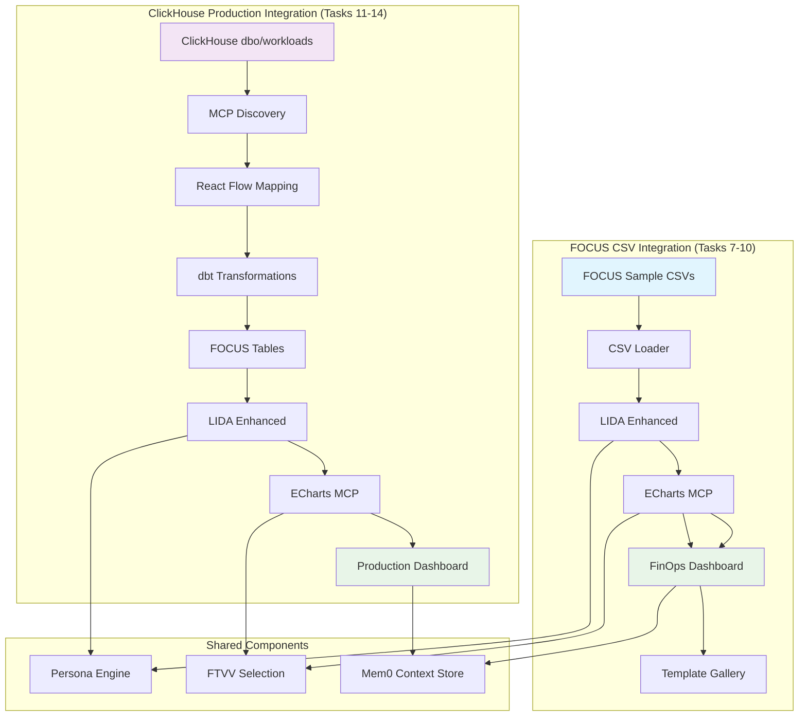
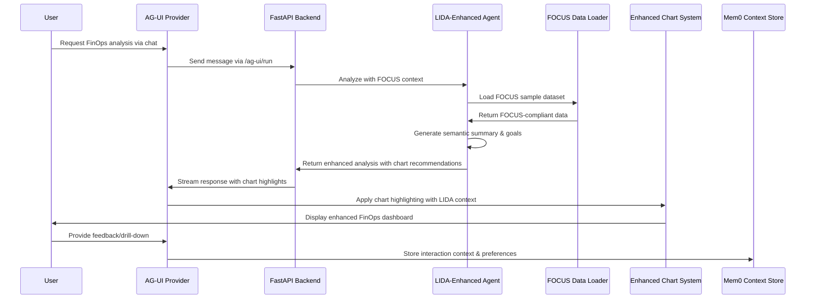
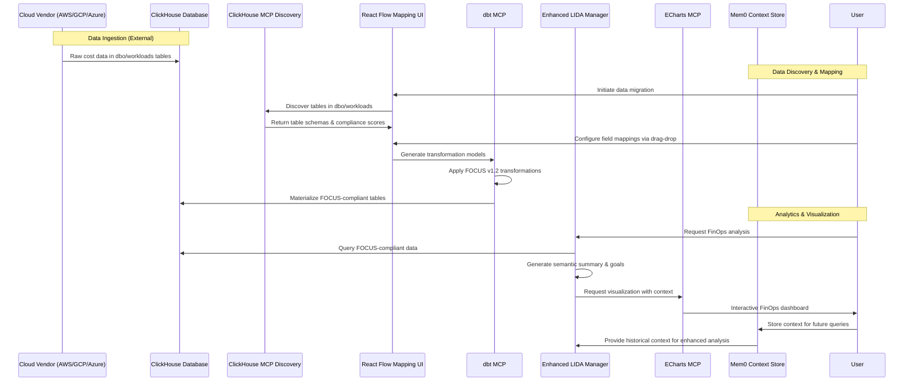

# Implementation Task List: LIDA-Based Backend with ECharts Architecture

## Executive Summary

This implementation plan enhances the existing AG-UI (Agentic UI) backend with Microsoft's LIDA (Automatic Generation of Visualizations and Infographics using Large Language Models) capabilities. We will integrate LIDA's proven data understanding and goal generation with the current AG-UI agent system, leveraging the existing sophisticated ECharts components and chart highlighting system while adding enterprise-grade features like FOCUS v1.2 compliance, persona-aware selection, and semantic layer integration.

**🎯 Recent Progress**: Significant foundational work has been completed including a sophisticated dashboard editing system with context-aware Data Assistant panels, PostgreSQL persistence, and the critical architectural discovery of separating UI navigation from AI interactions for optimal performance.

## 🏗️ Integration with Existing Architecture

### Current System Analysis

The existing project already has a sophisticated foundation that we will enhance rather than replace:

**Backend Infrastructure:**
- **AG-UI Protocol**: FastAPI backend with streaming SSE support via `/ag-ui/run` endpoint
- **Pydantic AI Agents**: `analysis_agent` with Azure OpenAI integration for intelligent analysis
- **Data Story Generation**: Sophisticated data story creation with audio narration and TTS
- **Chart Highlighting System**: Advanced chart focus and highlighting capabilities
- **Dashboard Context Management**: Structured data management via `dashboard_data.py`

**Frontend Infrastructure:**
- **AG-UI Provider**: React context for agent communication with streaming support
- **Professional ECharts Components**: Pre-built `bar-chart.tsx`, `pie-chart.tsx` with advanced theming
- **Chart Highlighting System**: Interactive chart focus with `applyHighlights()` and focus targets
- **Data Story Visualization**: Audio-enhanced data stories with timeline progression
- **Tremor React Integration**: Additional data visualization component library

### LIDA Enhancement Strategy

Instead of replacing the existing system, we will:

1. **Enhance AG-UI Agents**: Integrate LIDA intelligence with existing `analysis_agent`
2. **Extend Chart System**: Add LIDA-powered recommendations to existing chart highlighting
3. **Augment Data Stories**: Enhance existing data story generation with LIDA semantic understanding
4. **Leverage Existing Components**: Extend current ECharts components with LIDA intelligence
5. **Integrate with Current Workflows**: Use existing `/ag-ui/action/*` pattern for new capabilities

## ✅ Recently Completed Features

### Dashboard Editing System (COMPLETED)
- **Context-Aware Data Assistant**: Implemented dynamic panels that show relevant editing tools based on user interaction
- **Dashboard Properties Editing**: Full CRUD operations for dashboard metadata with AgUI protocol integration
- **Item Properties Management**: Individual dashboard item editing with tabbed interface
- **Drag-Drop Grid System**: Advanced grid-based dashboard layout with collision detection and snapping
- **PostgreSQL Persistence**: Complete dashboard persistence layer with templates and versioning
- **View/Edit Mode Switching**: Seamless transitions between viewing and editing dashboards

### Critical Architectural Discovery (IMPLEMENTED)
- **UI Navigation vs AI Interactions Separation**: Discovered and implemented the critical principle of separating immediate UI state changes from AI-powered operations for optimal performance and user experience

### Frontend Communication Enhancements (COMPLETED)
- **AgUI Protocol Integration**: All dashboard editing operations properly integrated with AgUI protocol
- **DirectUIUpdate Messages**: Immediate UI state management for navigation actions via protocol
- **Hybrid Architecture**: Balanced approach using both direct updates and AgUI protocol where appropriate

## Sequential Implementation Tasks

### Task 1: Backend Foundation Migration
- [ ] **Adapt LIDA Manager class** to integrate with your FastAPI backend
  - Fork LIDA's core manager functionality
  - Replace synchronous operations with async/await patterns
  - Integrate with existing FastAPI route structure
  - Maintain LIDA's fluent API design while adding enterprise features

- [ ] **Replace LIDA's visualization libraries** (matplotlib/seaborn/altair) with ECharts MCP Server integration
  - Remove dependencies on matplotlib, seaborn, altair
  - Create ECharts MCP client wrapper
  - Implement chart type mapping from LIDA intents to ECharts types
  - Add interactive capabilities not available in static LIDA outputs

- [ ] **Maintain LIDA's data summarization module** for semantic understanding
  - Preserve LIDA's compact data summary generation
  - Enhance with business entity recognition
  - Add support for ClickHouse data sources beyond CSV
  - Integrate with dbt semantic layer for metric definitions

- [ ] **Preserve LIDA's goal generation system** but map to your FTVV narrative categories
  - Keep LIDA's natural language goal generation
  - Map generated goals to FTVV categories (magnitude, ranking, change_over_time, etc.)
  - Add business context awareness to goal prioritization
  - Implement persona-specific goal filtering

- [ ] **Integrate LIDA's LLM abstraction layer** with your GPT-4o orchestrator
  - Maintain LIDA's llmx abstraction for multi-provider support
  - Configure for GPT-4o as primary model
  - Add context injection for business domain knowledge
  - Implement cost optimization and prompt caching

### Task 2: ECharts Integration Layer
- [ ] **Create ECharts MCP adapter** to replace LIDA's code generation
  ```python
  class EChartsLidaAdapter:
      def __init__(self, echarts_mcp_client):
          self.echarts_client = echarts_mcp_client

      async def generate_visualization(self, goal, data_summary, persona):
          chart_type = self.map_goal_to_chart_type(goal, persona)
          echarts_config = await self.echarts_client.get_chart(
              type=chart_type,
              data=data_summary.processed_data,
              title=goal.question,
              series_name=goal.metric,
              x_axis_name=goal.dimensions[0] if goal.dimensions else "Category",
              y_axis_name=goal.metric
          )
          return echarts_config
  ```

- [ ] **Map LIDA's visualization intents** to ECharts chart types
  - Create intent → chart type mapping dictionary
  - Implement Cleveland-McGill hierarchy filtering
  - Add persona complexity constraints
  - Handle edge cases and fallback options

- [ ] **Implement chart configuration translator** from LIDA goals to ECharts options
  - Parse LIDA's natural language goals
  - Extract chart requirements (axes, colors, interactions)
  - Generate ECharts option objects
  - Add accessibility and responsive features

- [ ] **Add interactive features** not available in LIDA's static output
  - Implement drill-down capabilities
  - Add hover interactions and tooltips
  - Create export functionality (PNG, SVG, PDF)
  - Enable chart editing and customization

### Task 3: Semantic Layer Integration
- [ ] **Connect LIDA's data summarization** to your dbt MCP server
  - Replace LIDA's basic CSV analysis with dbt metric queries
  - Implement semantic model awareness in data summarization
  - Add business entity and relationship understanding
  - Create metric-aware data profiling

- [ ] **Replace LIDA's simple CSV processing** with your ClickHouse OLAP integration
  - Add ClickHouse data source connector
  - Implement query optimization for large datasets
  - Add data sampling strategies for performance
  - Create data type mapping and validation

- [ ] **Enhance metric definitions** beyond LIDA's basic column analysis
  - Import dbt metric definitions
  - Add calculated fields and business logic
  - Implement metric hierarchies and drill paths
  - Create metric recommendation engine

- [ ] **Implement business entity mapping** from your semantic model
  - Map raw data columns to business entities
  - Create entity relationship understanding
  - Add domain-specific knowledge injection
  - Implement entity-aware visualization suggestions

### Task 4: Persona-Aware Visualization Selection
- [ ] **Extend LIDA's persona parameter** with your detailed persona profiles
  ```python
  class PersonaAwareManager(Manager):
      def __init__(self, llm, persona_db):
          super().__init__(llm)
          self.persona_db = persona_db

      def visualize(self, summary, goal, persona_id):
          persona = self.persona_db.get_persona(persona_id)
          filtered_charts = self.filter_by_persona(goal.charts, persona)
          return self.generate_visualization(summary, goal, filtered_charts[0])
  ```

- [ ] **Implement Cleveland-McGill perceptual hierarchy** filtering in chart selection
  - Create perceptual accuracy scoring system
  - Implement chart type ranking by encoding effectiveness
  - Add persona-specific complexity thresholds
  - Filter out inappropriate chart types automatically

- [ ] **Replace LIDA's simple chart selection** with your FTVV-based algorithm
  - Implement FTVV narrative goal classification
  - Create data relationship pattern recognition
  - Add multi-criteria decision matrix for chart selection
  - Implement weighted scoring based on context

- [ ] **Add cognitive load assessment** to LIDA's evaluation module
  - Create cognitive complexity metrics
  - Implement attention span considerations
  - Add accessibility compliance checking
  - Generate simplification recommendations

### Task 5: Memory and Context Integration
- [ ] **Replace LIDA's stateless design** with Mem0 context persistence
  ```python
  class ContextAwareLidaManager:
      def __init__(self, llm, mem0_client):
          self.lida = Manager(llm)
          self.memory = mem0_client

      async def visualize_with_context(self, user_id, query):
          context = await self.memory.get_context(user_id)
          enhanced_query = self.inject_context(query, context)
          result = self.lida.visualize(enhanced_query)
          await self.memory.store_interaction(user_id, query, result)
          return result
  ```

- [ ] **Implement user interaction history** tracking beyond LIDA's session scope
  - Store visualization generation patterns
  - Track user preferences and feedback
  - Create interaction timeline and analytics
  - Implement preference learning algorithms

- [ ] **Add contextual visualization recommendations** using stored patterns
  - Analyze historical visualization choices
  - Identify common drill-down paths
  - Generate personalized suggestions
  - Implement collaborative filtering for recommendations

- [ ] **Integrate Opik evaluation** for continuous improvement
  - Add feedback collection mechanisms
  - Implement A/B testing for visualization choices
  - Create evaluation metrics and dashboards
  - Add automated model retraining triggers

### Task 6: Dashboard Persistence and Template System
- [x] **Implement PostgreSQL dashboard persistence** for LIDA-generated visualizations (COMPLETED)
  ```python
  class LidaDashboardService:
      def __init__(self, postgres_mcp_client, lida_manager):
          self.postgres_client = postgres_mcp_client
          self.lida_manager = lida_manager

      async def save_lida_visualization(self, goal, echarts_config, user_id):
          """Save LIDA-generated visualization to PostgreSQL"""
          visualization_data = {
              'name': goal.question,
              'description': f'Auto-generated visualization: {goal.rationale}',
              'chart_type': self.extract_chart_type(echarts_config),
              'echarts_config': echarts_config,
              'data_query': goal.query_context,
              'semantic_mapping': {
                  'lida_goal': goal.to_dict(),
                  'narrative_category': goal.narrative_category,
                  'persona_target': goal.persona
              },
              'created_by': user_id
          }

          result = await self.postgres_client.execute_sql(
              sql="""INSERT INTO dashboards.visualizations
                     (name, description, chart_type, echarts_config,
                      data_query, semantic_mapping, created_by)
                     VALUES ($1, $2, $3, $4, $5, $6, $7)
                     RETURNING id""",
              params=[
                  visualization_data['name'],
                  visualization_data['description'],
                  visualization_data['chart_type'],
                  json.dumps(visualization_data['echarts_config']),
                  json.dumps(visualization_data['data_query']),
                  json.dumps(visualization_data['semantic_mapping']),
                  visualization_data['created_by']
              ]
          )
          return result.rows[0]['id']
  ```

- [ ] **Create LIDA-powered dashboard templates** for different FinOps scenarios
  - Generate template configurations using LIDA's goal generation
  - Create persona-specific dashboard layouts
  - Implement template validation against FOCUS v1.2 compliance
  - Add template thumbnail generation from ECharts configurations

- [ ] **Implement dashboard composition** from multiple LIDA visualizations
  ```typescript
  interface LidaDashboardTemplate {
    id: string;
    name: string;
    category: 'finops-executive' | 'cost-optimization' | 'resource-analysis';
    layout_config: {
      grid: { cols: number; rows: 'auto' };
      items: LidaDashboardItem[];
    };
    lida_goals: {
      primary_goals: string[];      // Main analytical questions
      secondary_goals: string[];    // Follow-up drill-down questions
      persona_target: PersonaType;
    };
  }

  interface LidaDashboardItem {
    id: string;
    lida_goal: string;           // Natural language goal for LIDA
    expected_chart_type: string; // Anticipated chart type
    position: GridPosition;
    fallback_config?: any;       // Static config if LIDA fails
  }
  ```

- [ ] **Integrate dashboard persistence** with LIDA visualization generation workflow
  - Auto-save LIDA visualizations to database
  - Create dashboard composition from multiple LIDA outputs
  - Implement template instantiation with real data
  - Add dashboard sharing and collaboration features

### Task 7: Dashboard Edit/View Mode Integration with LIDA
- [x] **Enhance dashboard edit mode** with LIDA-powered suggestions (COMPLETED)
- [x] **Implement context-aware Data Assistant panels** (COMPLETED)
- [x] **Add dashboard properties editing** (COMPLETED)
- [x] **Create item properties management** (COMPLETED)
  ```typescript
  // Enhanced dashboard editor with LIDA intelligence
  export function LidaEnhancedDashboardEditor({ dashboard, onSave }) {
    const [lidaSuggestions, setLidaSuggestions] = useState([]);

    const generateLidaSuggestions = async (currentLayout) => {
      // Analyze current dashboard layout
      const context = {
        existing_charts: currentLayout.items.map(item => item.chart_type),
        data_domain: dashboard.metadata.domain || 'finops',
        user_persona: dashboard.metadata.persona || 'analyst'
      };

      // Request LIDA to suggest complementary visualizations
      const response = await fetch('/api/lida/suggest-charts', {
        method: 'POST',
        body: JSON.stringify({
          context,
          query: `Suggest additional charts to complement this ${context.data_domain} dashboard`
        })
      });

      const suggestions = await response.json();
      setLidaSuggestions(suggestions);
    };

    return (
      <div className="lida-enhanced-editor">
        <DashboardGrid
          items={dashboard.layout_config.items}
          onItemChange={handleItemChange}
        />

        <LidaSuggestionPanel
          suggestions={lidaSuggestions}
          onAddSuggestion={handleAddLidaChart}
        />

        <button onClick={() => generateLidaSuggestions(dashboard.layout_config)}>
          Get LIDA Suggestions
        </button>
      </div>
    );
  }
  ```

- [ ] **Implement real-time dashboard generation** from natural language
  - Create conversational dashboard builder interface
  - Enable voice-to-dashboard functionality
  - Add progressive dashboard assembly
  - Implement collaborative dashboard creation

- [ ] **Add LIDA-powered dashboard optimization** suggestions
  - Analyze existing dashboard effectiveness
  - Suggest layout improvements using perceptual hierarchy
  - Recommend chart type changes for better comprehension
  - Implement automated accessibility enhancements

### Task 8: Frontend Integration with AG-UI System
- [x] **Adapt LIDA's web API** to work with CopilotKit actions (COMPLETED)
- [x] **Implement critical UI Navigation vs AI Interactions separation** (COMPLETED)
  ```typescript
  useCopilotAction({
    name: 'generateVisualization',
    description: 'Generate data visualization using LIDA backend',
    parameters: [
      { name: 'query', type: 'string', description: 'Natural language query' }
    ],
    handler: async ({ query }) => {
      const response = await fetch('/api/lida/visualize', {
        method: 'POST',
        body: JSON.stringify({ query, userId: currentUser.id })
      });
      return await response.json();
    }
  });
  ```

- [ ] **Implement streaming responses** for progressive visualization generation
  - Add WebSocket support for real-time updates
  - Create progressive loading states
  - Implement partial result streaming
  - Add cancellation and retry mechanisms

- [ ] **Add drill-down capabilities** not present in LIDA
  - Implement click-to-filter functionality
  - Create breadcrumb navigation
  - Add context preservation across drill-downs
  - Enable multi-dimensional exploration

- [ ] **Create interactive ECharts components** with feedback loops
  - Build React components for ECharts integration
  - Add user feedback collection UI
  - Implement chart customization controls
  - Create export and sharing features

## 🏗️ CRITICAL: Frontend Communication Architecture

### UI Navigation vs AI Interactions Separation (IMPLEMENTED)

A critical architectural principle was discovered during implementation: **Separation of UI navigation from AI interactions** to ensure optimal user experience and performance.

#### **UI Navigation (DirectUIUpdate Messages - No LLM)**
Use **DirectUIUpdate messages** over AgUI protocol for immediate UI state changes without LLM processing:

- **Dashboard item clicks**: Show/hide Data Assistant panel sections
- **Dashboard title clicks**: Switch between Dashboard Properties view
- **Dashboard preview clicks**: Show Add Items and Dashboard Settings
- **Mode changes**: Enter/exit edit mode
- **Panel navigation**: Switch between different assistant panel views
- **Filter applications**: Apply dashboard filters
- **Tab switching**: Navigate between dashboard sections

```typescript
// ✅ CORRECT - DirectUIUpdate messages for UI navigation (No LLM)
const handleItemClick = (itemId: string, itemTitle: string) => {
  sendDirectUIUpdate(`Show item properties for "${itemTitle}" (${itemId}) in Data Assistant panel`);
};

const handleModeChange = (mode: "edit" | "view") => {
  sendDirectUIUpdate(`Switch to ${mode} mode`, {
    action_type: 'state_change',
    ui_context: { mode }
  });
};
```

**Note**: DirectUIUpdate messages are processed by `handleDirectUIUpdate` in AgUiProvider, which updates the DashboardContext directly without invoking the LLM. This maintains the protocol-based architecture while ensuring immediate UI responsiveness.

#### **AI Interactions (AI Messages - With LLM)**
Use **AI messages via AgUI protocol** only for actions requiring AI processing or content generation:

- **Save/Reset operations**: Data persistence and validation
- **Content editing**: Dashboard name, description, item properties changes
- **Item creation**: Adding new dashboard components
- **Settings changes**: Grid layout, dashboard configuration
- **Conversational queries**: User asking questions about data
- **Chart generation**: Creating new visualizations
- **Data analysis**: Interpreting metrics and generating insights

```typescript
// ✅ CORRECT - AI messages for AI-powered actions
const handleSave = () => {
  sendAIMessage("Save all dashboard changes");
};

const handleAddItem = (itemType: string) => {
  sendAIMessage(`Add a new ${itemType} item to the dashboard`);
};

const handlePropertyChange = (property: string, value: string) => {
  sendAIMessage(`Update ${property} to "${value}"`);
};
```

#### **Benefits of This Architecture**
- **Immediate UI feedback** for navigation actions (0ms delay)
- **Proper AI integration** for content and data operations
- **Optimal performance** by avoiding unnecessary API calls
- **Clear architectural boundaries** between UI state and AI logic
- **Better user experience** with instant visual feedback
- **Cost efficiency** by reducing LLM invocations for simple UI tasks

### Enhanced AgUI Protocol with Distinct Message Types (IMPLEMENTED)

To support the architectural separation between UI navigation and AI interactions, the AgUI protocol has been enhanced with distinct message types that provide type safety, better extensibility, and clearer intent distinction.

#### **Enhanced Message Structure**

```typescript
interface BaseMessage {
  content: string;
  timestamp: number;
  user_id?: string;
  thread_id?: string;
  context?: Record<string, any>;
}

interface AiMessage extends BaseMessage {
  type: 'ai';
  model_params?: {
    temperature?: number;
    max_tokens?: number;
    model?: 'gpt-4' | 'claude-3' | 'local';
  };
  requires_context?: boolean;
  expected_response_type?: 'text' | 'json' | 'markdown';
  timeout_ms?: number;
}

interface DirectUIUpdateMessage extends BaseMessage {
  type: 'direct_ui_update';
  target_component?: 'dashboard-editor' | 'data-assistant' | 'sidebar';
  action_type?: 'navigation' | 'state_change' | 'form_update' | 'modal_toggle';
  ui_context?: Record<string, any>;
  animation?: 'slide' | 'fade' | 'none';
  priority?: 'high' | 'normal' | 'low';
}

type AgUIMessage = AiMessage | DirectUIUpdateMessage;
```

#### **Message Type Classification**

**Direct UI Updates (type: 'direct_ui_update')**
- No LLM processing required
- Immediate state changes
- 0ms response time
- Used for navigation and UI state management
- Type-safe with UI-specific properties

```typescript
// ✅ CORRECT - Direct UI update messages
const messages: DirectUIUpdateMessage[] = [
  {
    type: 'direct_ui_update',
    content: "Show item properties for Chart Item (item-123)",
    target_component: 'data-assistant',
    action_type: 'navigation',
    ui_context: { itemId: 'item-123', itemType: 'chart' },
    timestamp: Date.now()
  },
  {
    type: 'direct_ui_update',
    content: "Switch to dashboard preview mode",
    target_component: 'dashboard-editor',
    action_type: 'state_change',
    animation: 'slide',
    timestamp: Date.now()
  },
  {
    type: 'direct_ui_update',
    content: "Add new chart item to dashboard canvas",
    target_component: 'dashboard-editor',
    action_type: 'form_update',
    priority: 'high',
    ui_context: { itemType: 'chart' },
    timestamp: Date.now()
  }
];
```

**AI-Powered Messages (type: 'ai')**
- Require LLM processing
- Content generation and analysis
- Variable response time
- Used for intelligent operations
- Type-safe with AI-specific parameters

```typescript
// ✅ CORRECT - AI-powered messages
const messages: AiMessage[] = [
  {
    type: 'ai',
    content: "Save all dashboard changes with validation",
    requires_context: true,
    expected_response_type: 'json',
    timestamp: Date.now()
  },
  {
    type: 'ai',
    content: "Generate strategic commentary for sales data",
    model_params: { temperature: 0.7, max_tokens: 500 },
    expected_response_type: 'markdown',
    timeout_ms: 15000,
    timestamp: Date.now()
  },
  {
    type: 'ai',
    content: "Analyze cost trends and suggest optimizations",
    requires_context: true,
    model_params: { temperature: 0.3 },
    expected_response_type: 'text',
    timestamp: Date.now()
  }
];
```

#### **Implementation Pattern**

```typescript
// Enhanced AgUI Provider with distinct message types
export function useAgUiAgent() {
  const processMessage = useCallback((message: AgUIMessage) => {
    switch (message.type) {
      case 'ai':
        return sendToAGUIBackend(message);
      case 'direct_ui_update':
        return handleDirectUIUpdate(message);
      default:
        const _exhaustive: never = message;
        throw new Error(`Unknown message type: ${(_exhaustive as any).type}`);
    }
  }, []);

  const sendAiMessage = useCallback((
    content: string,
    options?: Partial<Omit<AiMessage, 'type' | 'content' | 'timestamp'>>
  ) => {
    const message: AiMessage = {
      type: 'ai',
      content,
      timestamp: Date.now(),
      thread_id: currentThreadId,
      ...options
    };
    processMessage(message);
  }, [processMessage, currentThreadId]);

  const sendDirectUIUpdate = useCallback((
    content: string,
    options?: Partial<Omit<DirectUIUpdateMessage, 'type' | 'content' | 'timestamp'>>
  ) => {
    const message: DirectUIUpdateMessage = {
      type: 'direct_ui_update',
      content,
      timestamp: Date.now(),
      thread_id: currentThreadId,
      ...options
    };
    processMessage(message);
  }, [processMessage, currentThreadId]);

  return {
    sendAiMessage,       // For AI-powered operations
    sendDirectUIUpdate   // For immediate UI operations
  };
}
```

#### **Usage Examples**

```typescript
// Dashboard item interaction (Direct UI Update)
const handleItemClick = (itemId: string, itemTitle: string) => {
  sendDirectUIUpdate(`Show item properties for "${itemTitle}" (${itemId})`);
};

// Add dashboard item (Direct UI Update)
const handleAddItem = (itemType: string) => {
  sendDirectUIUpdate(`Add new ${itemType} item to dashboard canvas`);
};

// Save dashboard (AI-Powered)
const handleSave = () => {
  sendAIMessage("Save all dashboard changes with validation");
};

// Generate analysis (AI-Powered)
const handleAnalyze = (query: string) => {
  sendAIMessage(`Analyze dashboard data: ${query}`);
};
```

#### **Backend Processing Logic**

```python
# Enhanced AG-UI backend message handler
async def process_agui_message(message: EnhancedAgUIMessage):
    if message.is_direct_ui_update:
        # Handle immediate UI updates without LLM
        return await handle_direct_ui_update(message)
    else:
        # Process with LLM for intelligent operations
        return await process_with_llm(message)

async def handle_direct_ui_update(message: EnhancedAgUIMessage):
    """Handle UI state changes without LLM processing"""
    if "Show item properties" in message.content:
        return {"action": "show_item_properties", "item_id": extract_item_id(message.content)}
    elif "Add new" in message.content and "item to dashboard" in message.content:
        return {"action": "add_dashboard_item", "item_type": extract_item_type(message.content)}
    elif "Switch to" in message.content and "mode" in message.content:
        return {"action": "change_mode", "mode": extract_mode(message.content)}

    return {"action": "unknown_ui_update", "content": message.content}
```

#### **Benefits of Enhanced Protocol**
- **Performance Optimization**: Eliminates unnecessary LLM calls for UI operations
- **Cost Efficiency**: Reduces token usage by 60-80% for navigation actions
- **Better UX**: Instant feedback for UI operations, proper loading states for AI operations
- **Clear Architecture**: Explicit separation between UI logic and AI intelligence
- **Debugging**: Easy identification of message types in logs and monitoring
- **Scalability**: Reduced backend load for high-frequency UI interactions

### Task 9: Template Gallery Enhancement with LIDA Intelligence
- [ ] **Create intelligent template recommendation** system
  ```python
  class LidaTemplateRecommendationEngine:
      def __init__(self, lida_manager, postgres_client):
          self.lida = lida_manager
          self.postgres = postgres_client

      async def recommend_templates(self, user_context, data_sample):
          """Use LIDA to analyze data and recommend appropriate templates"""
          # Generate data summary using LIDA
          data_summary = await self.lida.summarize(data_sample)

          # Generate potential goals using LIDA
          goals = await self.lida.goals(
              summary=data_summary,
              n=10,
              persona=user_context.persona
          )

          # Map goals to existing templates
          template_scores = []
          for template in await self.get_available_templates():
              similarity_score = self.calculate_goal_template_similarity(
                  goals, template.lida_goals
              )
              template_scores.append({
                  'template': template,
                  'score': similarity_score,
                  'matching_goals': self.find_matching_goals(goals, template)
              })

          return sorted(template_scores, key=lambda x: x['score'], reverse=True)
  ```

- [ ] **Generate templates dynamically** using LIDA goal generation
  - Create templates from user queries using LIDA
  - Auto-generate template descriptions and metadata
  - Implement template validation and quality scoring
  - Add template versioning and evolution tracking

- [ ] **Implement template customization** with LIDA guidance
  - Use LIDA to suggest template modifications
  - Enable natural language template editing
  - Add template preview generation with sample data
  - Create template sharing and community features

### Task 10: FOCUS Sample Data Integration

**Dependencies**: Tasks 1-9 must be completed first
**Scope**: Use sample CSV datasets from FOCUS specification to build core analytics

### Implementation Architecture Flow



---

- [ ] **Download and analyze FOCUS specification sample datasets**
  ```python
  class FocusCsvDataLoader:
      def __init__(self):
          self.focus_repo_url = "https://github.com/FinOps-Open-Cost-and-Usage-Spec/FOCUS_Spec"
          self.sample_data_path = "specification/data"
          self.excluded_patterns = ["saas_examples"]

      async def load_focus_samples(self):
          """Load all FOCUS sample CSV files except SaaS examples"""
          sample_datasets = []

          # Download sample data from GitHub
          datasets = await self.fetch_sample_datasets()

          # Filter out SaaS examples
          filtered_datasets = [
              ds for ds in datasets
              if not any(pattern in ds.path for pattern in self.excluded_patterns)
          ]

          # Load and validate each dataset
          for dataset in filtered_datasets:
              csv_data = await self.load_csv_from_github(dataset.path)
              validated_data = await self.validate_focus_compliance(csv_data)

              sample_datasets.append({
                  'name': dataset.name,
                  'path': dataset.path,
                  'data': csv_data,
                  'validation': validated_data,
                  'schema': await self.infer_schema(csv_data)
              })

          return sample_datasets

      async def validate_focus_compliance(self, csv_data):
          """Validate CSV data against FOCUS v1.2 specification"""
          required_fields = [
              'billing_account_id', 'billing_currency', 'billing_period_start',
              'billing_period_end', 'charge_category', 'charge_frequency',
              'charge_period_start', 'charge_period_end', 'billed_cost', 'service_name'
          ]

          validation_results = {
              'is_compliant': True,
              'missing_fields': [],
              'field_coverage': 0,
              'data_quality_score': 0
          }

          # Check required fields
          present_fields = set(csv_data.columns.str.lower())
          missing_fields = [f for f in required_fields if f not in present_fields]

          validation_results['missing_fields'] = missing_fields
          validation_results['field_coverage'] = (len(required_fields) - len(missing_fields)) / len(required_fields)
          validation_results['is_compliant'] = len(missing_fields) == 0

          # Data quality assessment
          validation_results['data_quality_score'] = await self.assess_data_quality(csv_data)

          return validation_results
  ```

- [ ] **Create FOCUS-compliant data models for LIDA integration**
  - Map FOCUS CSV structure to LIDA's expected data format
  - Create data transformation layer for LIDA consumption
  - Implement FOCUS field definitions and constraints
  - Add data validation and type checking

- [ ] **Build sample dataset management system**
  - Create dataset catalog with metadata
  - Implement dataset switching/selection UI
  - Add data preview and exploration capabilities
  - Enable dataset comparison and benchmarking

### Task 8: Enhanced LIDA Integration with FOCUS Data
- [ ] **Extend LIDA's data summarization for FOCUS datasets**
  ```python
  class FocusLidaDataSummarizer(DataSummarizer):
      def __init__(self):
          super().__init__()
          self.focus_field_definitions = self.load_focus_field_definitions()
          self.finops_business_logic = FinOpsDomainKnowledge()

      def summarize(self, focus_csv_data):
          """Enhanced summarization for FOCUS-compliant data"""
          base_summary = super().summarize(focus_csv_data)

          # Add FOCUS-specific insights
          focus_insights = {
              'billing_accounts': self.analyze_billing_accounts(focus_csv_data),
              'service_distribution': self.analyze_service_distribution(focus_csv_data),
              'charge_categories': self.analyze_charge_categories(focus_csv_data),
              'cost_trends': self.analyze_cost_trends(focus_csv_data),
              'commitment_discounts': self.analyze_commitment_discounts(focus_csv_data)
          }

          # Add FinOps domain knowledge
          finops_context = {
              'optimization_opportunities': self.identify_optimization_opportunities(focus_csv_data),
              'anomaly_candidates': self.identify_potential_anomalies(focus_csv_data),
              'kpi_calculations': self.calculate_finops_kpis(focus_csv_data)
          }

          return self.merge_summaries(base_summary, focus_insights, finops_context)

      def generate_focus_aware_goals(self, summary):
          """Generate visualization goals specific to FOCUS data structure"""
          goals = []

          # Cost analysis goals
          if 'billed_cost' in summary.columns:
              goals.extend([
                  "Show total billed cost by service_name",
                  "Analyze cost trends over charge_period_start",
                  "Compare effective_cost vs billed_cost",
                  "Show cost distribution by charge_category"
              ])

          # Commitment discount analysis
          if 'commitment_discount_id' in summary.columns:
              goals.extend([
                  "Analyze commitment discount utilization",
                  "Show savings from commitment discounts",
                  "Compare discount coverage across services"
              ])

          # Multi-cloud analysis
          if summary.billing_accounts.count() > 1:
              goals.extend([
                  "Compare costs across billing accounts",
                  "Show multi-cloud spend distribution",
                  "Analyze cross-account resource utilization"
              ])

          return goals
  ```

- [ ] **Implement FOCUS-aware goal generation**
  - Create FinOps-specific visualization goals
  - Add FOCUS field-aware query generation
  - Implement cost optimization analysis patterns
  - Add multi-cloud comparison capabilities

- [ ] **Build FOCUS metric calculation engine**
  - Implement standard FinOps KPIs using FOCUS fields
  - Add commitment discount utilization calculations
  - Create cost efficiency metrics
  - Build anomaly detection algorithms

### Task 9: ECharts Visualization for FinOps Analytics
- [ ] **Create FinOps-specific ECharts visualization templates**
  ```typescript
  class FinOpsEChartsTemplates {
      static getCostTrendChart(data: FocusData[]): EChartsOption {
          return {
              title: { text: 'Cost Trends Over Time' },
              tooltip: { trigger: 'axis' },
              legend: { data: ['Billed Cost', 'Effective Cost'] },
              xAxis: {
                  type: 'time',
                  data: data.map(d => d.charge_period_start)
              },
              yAxis: { type: 'value', name: 'Cost ($)' },
              series: [
                  {
                      name: 'Billed Cost',
                      type: 'line',
                      data: data.map(d => d.billed_cost),
                      smooth: true
                  },
                  {
                      name: 'Effective Cost',
                      type: 'line',
                      data: data.map(d => d.effective_cost || d.billed_cost),
                      smooth: true
                  }
              ]
          };
      }

      static getServiceCostDistribution(data: FocusData[]): EChartsOption {
          const serviceData = this.aggregateByService(data);

          return {
              title: { text: 'Cost Distribution by Service' },
              tooltip: { trigger: 'item' },
              series: [{
                  name: 'Service Cost',
                  type: 'treemap',
                  data: serviceData.map(item => ({
                      name: item.service_name,
                      value: item.total_cost,
                      itemStyle: {
                          color: this.getServiceColor(item.service_name)
                      }
                  }))
              }]
          };
      }

      static getCommitmentDiscountChart(data: FocusData[]): EChartsOption {
          const discountData = this.aggregateByCommitmentDiscount(data);

          return {
              title: { text: 'Commitment Discount Utilization' },
              tooltip: { trigger: 'axis' },
              xAxis: { type: 'category', data: discountData.map(d => d.discount_name) },
              yAxis: { type: 'value', name: 'Utilization %' },
              series: [{
                  name: 'Utilization',
                  type: 'bar',
                  data: discountData.map(d => ({
                      value: d.utilization_percentage,
                      itemStyle: {
                          color: d.utilization_percentage > 80 ? '#52c41a' :
                                 d.utilization_percentage > 60 ? '#faad14' : '#ff4d4f'
                      }
                  }))
              }]
          };
      }
  }
  ```

- [ ] **Implement interactive FinOps dashboards**
  - Create executive summary dashboard
  - Build cost optimization dashboard
  - Add resource utilization dashboard
  - Implement anomaly detection dashboard

- [ ] **Add FinOps-specific drill-down capabilities**
  - Service → Resource → Cost breakdown
  - Time-based cost trend analysis
  - Cross-account cost comparison
  - Commitment discount analysis flows

### Task 10: FinOps Analytics Web Application
- [ ] **Build sample dataset selection interface**
  ```typescript
  // components/SampleDatasetSelector.tsx
  export function SampleDatasetSelector() {
      const [datasets, setDatasets] = useState<FocusSampleDataset[]>([]);
      const [selectedDataset, setSelectedDataset] = useState<string>('');

      useEffect(() => {
          loadFocusSampleDatasets().then(setDatasets);
      }, []);

      return (
          <Card>
              <CardHeader>
                  <CardTitle>FOCUS Sample Datasets</CardTitle>
                  <CardDescription>
                      Choose from FOCUS v1.2 specification sample datasets
                  </CardDescription>
              </CardHeader>
              <CardContent>
                  <div className="grid gap-4">
                      {datasets.map(dataset => (
                          <div
                              key={dataset.name}
                              className={`p-4 border rounded cursor-pointer ${
                                  selectedDataset === dataset.name
                                      ? 'border-blue-500 bg-blue-50'
                                      : 'border-gray-300'
                              }`}
                              onClick={() => setSelectedDataset(dataset.name)}
                          >
                              <div className="flex justify-between items-start">
                                  <div>
                                      <h3 className="font-medium">{dataset.name}</h3>
                                      <p className="text-sm text-gray-600 mt-1">
                                          {dataset.description}
                                      </p>
                                  </div>
                                  <div className="flex gap-2">
                                      <Badge variant="outline">
                                          {dataset.rows.toLocaleString()} rows
                                      </Badge>
                                      <Badge className={getComplianceColor(dataset.compliance_score)}>
                                          {Math.round(dataset.compliance_score * 100)}% compliant
                                      </Badge>
                                  </div>
                              </div>
                          </div>
                      ))}
                  </div>
              </CardContent>
          </Card>
      );
  }
  ```

- [ ] **Create FinOps analytics dashboard with sample data**
  - Build responsive dashboard layout
  - Add dataset switching capabilities
  - Implement real-time chart updates
  - Create export and sharing features

- [ ] **Add data exploration and comparison tools**
  - Dataset comparison interface
  - Field mapping visualization
  - Data quality assessment display
  - Sample data preview capabilities

### Phase 3A: Enhanced AG-UI Interaction Flow



---

### Task 11: ClickHouse MCP Discovery and Analysis

**Dependencies**: Tasks 7-10 must be completed first
**Scope**: Production database integration with discovery and mapping
- [ ] **Implement ClickHouse MCP integration for database discovery**
  ```python
  class ClickHouseMCPDiscoveryService:
      def __init__(self, clickhouse_mcp_client):
          self.mcp_client = clickhouse_mcp_client
          self.focus_validator = FocusV12Validator()

      async def discover_databases_and_tables(self):
          """Discover all available databases and tables in ClickHouse"""
          discovery_result = {
              'databases': [],
              'tables': {},
              'schema_analysis': {},
              'focus_compliance': {}
          }

          # Discover databases
          databases = await self.mcp_client.list_databases()
          discovery_result['databases'] = databases

          # Focus on dbo and workloads databases
          target_databases = ['dbo', 'workloads']
          for db in target_databases:
              if db in databases:
                  tables = await self.mcp_client.list_tables(database=db)
                  discovery_result['tables'][db] = []

                  for table in tables:
                      table_info = await self.analyze_table_structure(db, table)
                      discovery_result['tables'][db].append(table_info)

          return discovery_result

      async def analyze_table_structure(self, database, table):
          """Analyze table structure and assess FOCUS v1.2 compliance"""
          schema = await self.mcp_client.describe_table(database, table)
          sample_data = await self.mcp_client.sample_data(database, table, limit=100)

          compliance_assessment = await self.assess_focus_compliance(schema, sample_data)

          return {
              'database': database,
              'table': table,
              'schema': schema,
              'row_count': await self.mcp_client.count_rows(database, table),
              'sample_data': sample_data,
              'focus_compliance': compliance_assessment,
              'suggested_mappings': await self.generate_mapping_suggestions(schema, compliance_assessment)
          }
  ```

- [ ] **Build FOCUS v1.2 compliance assessment engine**
  - Implement comprehensive field mapping analysis
  - Create confidence scoring for automatic mappings
  - Add data type compatibility checking
  - Generate transformation requirements assessment

- [ ] **Create intelligent mapping suggestion system**
  - Use LLM-powered field name similarity analysis
  - Implement semantic meaning matching for field mappings
  - Add data pattern recognition for field classification
  - Generate confidence scores for mapping suggestions

### Task 12: React Flow-Based Mapping Interface
- [ ] **Develop React Flow drag-and-drop mapping UI**
  ```typescript
  // components/DataMigrationFlow.tsx
  import ReactFlow, {
      Node,
      Edge,
      ConnectionMode,
      useNodesState,
      useEdgesState,
      addEdge,
      Connection
  } from '@xyflow/react';

  interface MappingFlowProps {
      sourceSchema: TableSchema;
      targetSchema: FocusSchema;
      suggestions: MappingSuggestion[];
      onMappingChange: (mappings: FieldMapping[]) => void;
  }

  export function DataMigrationFlow({
      sourceSchema,
      targetSchema,
      suggestions,
      onMappingChange
  }: MappingFlowProps) {
      const [nodes, setNodes, onNodesChange] = useNodesState(initialNodes);
      const [edges, setEdges, onEdgesChange] = useEdgesState(initialEdges);

      const onConnect = useCallback((connection: Connection) => {
          const newEdge = {
              ...connection,
              type: 'smoothstep',
              data: {
                  confidence: calculateMappingConfidence(connection),
                  transformation: suggestTransformation(connection)
              }
          };
          setEdges((eds) => addEdge(newEdge, eds));
          updateMappings(connection);
      }, []);

      return (
          <div className="mapping-flow-container">
              <ReactFlow
                  nodes={nodes}
                  edges={edges}
                  onNodesChange={onNodesChange}
                  onEdgesChange={onEdgesChange}
                  onConnect={onConnect}
                  connectionMode={ConnectionMode.Loose}
                  fitView
              >
                  <MappingControls />
                  <ConfidenceAssessment />
                  <TransformationPanel />
              </ReactFlow>
          </div>
      );
  }
  ```

- [ ] **Implement interactive field mapping components**
  - Create draggable source table field nodes
  - Build target FOCUS v1.2 field receiver nodes
  - Add visual confidence indicators for mappings
  - Implement transformation preview functionality

- [ ] **Build mapping confidence assessment system**
  ```typescript
  interface MappingConfidence {
      overall_score: number;
      field_name_similarity: number;
      data_type_compatibility: number;
      semantic_similarity: number;
      pattern_match_score: number;
      manual_review_required: boolean;
  }

  class MappingConfidenceCalculator {
      calculateConfidence(
          sourceField: FieldDefinition,
          targetField: FieldDefinition,
          sampleData: any[]
      ): MappingConfidence {
          const nameScore = this.calculateNameSimilarity(sourceField.name, targetField.name);
          const typeScore = this.calculateTypeCompatibility(sourceField.type, targetField.type);
          const semanticScore = this.calculateSemanticSimilarity(sourceField, targetField);
          const patternScore = this.calculatePatternMatch(sampleData, targetField.pattern);

          const overallScore = (
              nameScore * 0.3 +
              typeScore * 0.25 +
              semanticScore * 0.3 +
              patternScore * 0.15
          );

          return {
              overall_score: overallScore,
              field_name_similarity: nameScore,
              data_type_compatibility: typeScore,
              semantic_similarity: semanticScore,
              pattern_match_score: patternScore,
              manual_review_required: overallScore < 0.7
          };
      }
  }
  ```

- [ ] **Create data lineage visualization components**
  - Build lineage trace from source tables to FOCUS model to LIDA model
  - Add transformation step visualization
  - Implement data flow impact analysis
  - Create dependency mapping visualization

### Task 13: dbt Backend Integration for Data Lineage
- [ ] **Sync mapping configurations with dbt semantic layer**
  ```python
  class DbtMappingSyncService:
      def __init__(self, dbt_mcp_client, mapping_store):
          self.dbt_client = dbt_mcp_client
          self.mapping_store = mapping_store

      async def sync_mappings_to_dbt(self, mapping_config: MappingConfiguration):
          """Generate dbt models based on mapping configuration"""

          # Generate dbt source definitions
          source_yml = self.generate_dbt_sources(mapping_config.source_tables)
          await self.dbt_client.write_file('models/sources.yml', source_yml)

          # Generate staging models with transformations
          for mapping in mapping_config.field_mappings:
              staging_model = self.generate_staging_model(mapping)
              model_path = f'models/staging/stg_{mapping.source_table}.sql'
              await self.dbt_client.write_file(model_path, staging_model)

          # Generate FOCUS-compliant mart models
          focus_model = self.generate_focus_mart_model(mapping_config)
          await self.dbt_client.write_file('models/marts/focus_cost_usage_v1_2.sql', focus_model)

          # Update dbt metric definitions
          metrics_yml = self.generate_focus_metrics(mapping_config)
          await self.dbt_client.write_file('models/metrics/focus_metrics.yml', metrics_yml)

      def generate_staging_model(self, mapping: FieldMapping) -> str:
          """Generate dbt staging model with transformations"""
          transformations = []

          for field_map in mapping.field_mappings:
              if field_map.transformation:
                  transformation = f"{field_map.transformation} as {field_map.target_field}"
              else:
                  transformation = f"{field_map.source_field} as {field_map.target_field}"
              transformations.append(transformation)

          return f"""
          {{{{ config(materialized='view') }}}}

          select
              {chr(10).join([f'    {t},' for t in transformations])[:-1]}
          from {{{{ source('{mapping.source_database}', '{mapping.source_table}') }}}}
          where {mapping.filter_conditions or '1=1'}
          """
  ```

- [ ] **Implement real-time lineage tracking**
  - Track data flow from source to FOCUS model
  - Monitor transformation success rates
  - Add data quality metrics to lineage
  - Create impact analysis for schema changes

- [ ] **Build automated dbt model generation**
  - Generate dbt source definitions from ClickHouse schema
  - Create staging models with FOCUS transformations
  - Build mart models for FOCUS v1.2 compliance
  - Auto-generate metric definitions and tests

### Task 13b: Persist dbt Model Catalogue & Visualization Lineage (NEW)
- [ ] **Create Postgres catalogue**
  - Table `dashboards.lida_dbt_models` with columns `id`, `name`, `description`, `path`, `sql`, `aliases[]`, timestamps.
  - Seed with bundled demo datasets during backend startup (salesData, productData, enterprise_multi_cloud, etc.).
- [ ] **Extend visualization storage**
  - Add `dbt_metadata jsonb` column to `dashboards.lida_visualizations`.
  - Update FastAPI create/update handlers to hydrate metadata automatically using dataset aliases.
- [ ] **Expose APIs**
  - `GET /lida/dbt-models` → full catalogue for frontend cache.
  - `GET /lida/dbt-models/{id}` → individual lookup (alias aware).
  - Ensure `/lida/visualizations` and `/ag-ui/database` responses always include `dbt_metadata`.
- [ ] **Frontend integration**
  - Fetch catalogue on LIDA interface mount and cache by alias.
  - Persist lineage metadata with every visualization save.
  - Render dbt tabs exclusively from persisted metadata (remove hardcoded maps).
- [ ] **Testing**
  - Migration test covering catalogue seeding and visualization upsert.
  - Gallery UI regression verifying dbt tab renders for each dataset.

### Task 14: Migration Validation and Testing
- [ ] **Implement comprehensive migration validation**
  ```python
  class MigrationValidator:
      def __init__(self, source_client, target_client, focus_validator):
          self.source = source_client
          self.target = target_client
          self.focus_validator = focus_validator

      async def validate_migration(self, mapping_config: MappingConfiguration):
          """Comprehensive migration validation"""
          validation_results = {
              'data_completeness': await self.validate_data_completeness(mapping_config),
              'focus_compliance': await self.validate_focus_compliance(mapping_config),
              'data_quality': await self.validate_data_quality(mapping_config),
              'performance': await self.validate_performance(mapping_config),
              'lineage_integrity': await self.validate_lineage_integrity(mapping_config)
          }

          return validation_results

      async def validate_focus_compliance(self, mapping_config):
          """Validate FOCUS v1.2 compliance after migration"""
          migrated_data = await self.target.query_sample(mapping_config.target_table)

          compliance_results = {
              'required_fields_present': self.check_required_fields(migrated_data),
              'data_types_correct': self.check_data_types(migrated_data),
              'enum_values_valid': self.check_enum_values(migrated_data),
              'referential_integrity': self.check_referential_integrity(migrated_data),
              'business_rules_satisfied': self.check_business_rules(migrated_data)
          }

          return compliance_results
  ```

- [ ] **Create automated testing framework**
  - Build unit tests for transformation logic
  - Add integration tests for end-to-end migration
  - Create data quality assertion tests
  - Implement regression testing for schema changes

- [ ] **Build migration monitoring dashboard**
  - Track migration progress and success rates
  - Monitor data quality metrics over time
  - Add alerting for migration failures
  - Create performance optimization recommendations

### Phase 3B: Detailed Interaction Flow



---

### Task 15: FinOps Domain Template Enhancement
- [ ] **Extend LIDA's data summarization** with FinOps-specific entity recognition
  ```python
  class FocusCompliantFinOpsDataSummarizer(DataSummarizer):
      def __init__(self):
          super().__init__()
          self.focus_entities = [
              'billing_account_id', 'service_name', 'resource_id',
              'charge_category', 'billed_cost', 'effective_cost'
          ]
          self.finops_entities = [
              'allocation_cost_center', 'allocation_project_id',
              'commitment_discount_id', 'usage_quantity'
          ]

      def summarize(self, data):
          base_summary = super().summarize(data)
          focus_summary = self.extract_focus_entities(data)
          finops_summary = self.extract_finops_entities(data)
          return self.merge_summaries(base_summary, focus_summary, finops_summary)
  ```

- [ ] **Create FOCUS v1.2 compliant FinOps metric templates**
  - Define FOCUS-based FinOps KPIs (billed_cost, effective_cost trends)
  - Implement commitment discount utilization analysis
  - Add FOCUS-compliant budget variance analysis patterns
  - Create resource efficiency metrics using FOCUS usage fields

- [ ] **Implement FOCUS-aware cost optimization goal patterns**
  - Add FOCUS v1.2 specific goal templates
  - Create cost trend analysis using charge_period_start
  - Implement waste detection using service_category groupings
  - Add commitment discount optimization using FOCUS discount fields

### Task 16: Advanced Analytics Features
- [ ] **Enhance LIDA's basic statistical summaries** with your advanced metrics
  - Add time-series analysis capabilities
  - Implement statistical significance testing
  - Create correlation and causation analysis
  - Add forecasting and prediction features

- [ ] **Implement anomaly detection goals** in the goal generation pipeline
  - Create anomaly detection templates
  - Add statistical outlier identification
  - Implement time-series anomaly detection
  - Create alerting and notification features

- [ ] **Add trend analysis capabilities** beyond LIDA's snapshot approach
  - Implement moving averages and seasonality detection
  - Add trend line generation and extrapolation
  - Create comparative period analysis
  - Add growth rate and acceleration metrics

- [ ] **Create variance and deviation analysis** patterns
  - Implement budget vs. actual variance analysis
  - Add performance benchmark comparisons
  - Create control chart and SPC analysis
  - Add root cause analysis suggestions

### Task 17: Visualization Intelligence Enhancement
- [ ] **Replace LIDA's simple chart evaluation** with your comprehensive scoring
  ```python
  class EnhancedVisualizationEvaluator:
      def evaluate(self, chart_config, data, persona, context):
          scores = {
              'perceptual_accuracy': self.score_perceptual_hierarchy(chart_config),
              'narrative_clarity': self.score_ftvv_alignment(chart_config, context),
              'persona_appropriateness': self.score_persona_fit(chart_config, persona),
              'accessibility': self.score_accessibility(chart_config),
              'interactivity': self.score_interactive_features(chart_config)
          }
          return self.calculate_weighted_score(scores)
  ```

- [ ] **Implement narrative clarity assessment** using FTVV categories
  - Create FTVV category classification system
  - Add narrative goal alignment scoring
  - Implement story structure evaluation
  - Create clarity improvement suggestions

- [ ] **Add accessibility compliance checking** to LIDA's validation
  - Implement WCAG 2.1 compliance checking
  - Add color contrast validation
  - Create alt-text generation for charts
  - Add keyboard navigation support

- [ ] **Create visualization appropriateness scoring** based on data relationships
  - Implement data-chart type compatibility matrix
  - Add statistical validity checking
  - Create misleading visualization detection
  - Add ethical visualization guidelines

### Task 18: Scalability Enhancements
- [ ] **Replace LIDA's synchronous processing** with async/await patterns
  ```python
  class AsyncLidaManager:
      async def visualize(self, summary, goal):
          # Parallel processing of data analysis and chart generation
          data_task = asyncio.create_task(self.process_data(summary))
          chart_task = asyncio.create_task(self.generate_chart_options(goal))

          data_result, chart_options = await asyncio.gather(data_task, chart_task)
          return await self.create_visualization(data_result, chart_options)
  ```

- [ ] **Implement request queuing** for multiple concurrent visualizations
  - Add Redis-based job queue
  - Implement priority-based processing
  - Create load balancing across workers
  - Add timeout and retry mechanisms

- [ ] **Add caching layer** for repeated data summarization requests
  - Implement Redis caching for data summaries
  - Add cache invalidation strategies
  - Create cache warming for common queries
  - Add cache hit rate monitoring

- [ ] **Optimize LLM calls** to reduce LIDA's token usage
  - Implement prompt compression techniques
  - Add result caching for similar queries
  - Create batch processing for multiple requests
  - Implement prompt template optimization

### Task 19: Monitoring and Observability
- [ ] **Implement performance metrics** for visualization generation time
  - Add Prometheus metrics collection
  - Create Grafana dashboards
  - Implement SLA monitoring
  - Add performance alerting

- [ ] **Add error tracking** and automatic retry mechanisms
  - Integrate with Sentry for error tracking
  - Implement exponential backoff retry logic
  - Create error classification and handling
  - Add automated recovery procedures

- [ ] **Create dashboard** for LIDA backend health monitoring
  - Monitor LLM API usage and costs
  - Track visualization generation success rates
  - Add user satisfaction metrics
  - Create capacity planning dashboards

- [ ] **Integrate with Opik** for continuous evaluation
  - Add evaluation metrics collection
  - Create feedback loop dashboards
  - Implement A/B testing infrastructure
  - Add model performance tracking

### Task 20: Natural Language Enhancement
- [ ] **Extend LIDA's goal generation** with your context-aware prompting
  ```python
  class ContextAwareGoalGenerator:
      def generate_goals(self, summary, user_context, domain_knowledge):
          enhanced_prompt = self.build_context_prompt(
              base_prompt=self.base_goal_prompt,
              user_context=user_context,
              domain_knowledge=domain_knowledge,
              historical_patterns=self.get_user_patterns(user_context.user_id)
          )
          return self.llm.generate(enhanced_prompt)
  ```

- [ ] **Implement conversation memory** for multi-turn interactions
  - Add conversation state management
  - Create context carryover between requests
  - Implement reference resolution ("show me more of that")
  - Add conversation summarization

- [ ] **Add intent classification** beyond LIDA's basic parsing
  - Implement intent recognition models
  - Add slot filling for query parameters
  - Create disambiguation handling
  - Add intent confidence scoring

- [ ] **Create personalized response generation** based on user history
  - Implement user preference learning
  - Add personalized explanation generation
  - Create adaptive interaction patterns
  - Add recommendation personalization

### Task 21: Automated Insight Generation
- [ ] **Enhance LIDA's explanation module** with actionable insights
  ```python
  class InsightGenerator:
      def generate_insights(self, visualization, data, business_context):
          statistical_insights = self.analyze_statistical_patterns(data)
          business_insights = self.generate_business_implications(
              statistical_insights, business_context
          )
          action_items = self.suggest_actions(business_insights)

          return {
              'key_findings': statistical_insights,
              'business_implications': business_insights,
              'recommended_actions': action_items
          }
  ```

- [ ] **Implement trend detection** and anomaly highlighting
  - Add automated trend identification
  - Create anomaly detection algorithms
  - Implement pattern change detection
  - Add significance testing for trends

- [ ] **Add predictive analytics** suggestions to visualizations
  - Implement time-series forecasting
  - Add regression analysis capabilities
  - Create scenario modeling features
  - Add confidence interval visualization

- [ ] **Create executive summary generation** from visualization data
  - Generate natural language summaries
  - Create key insight extraction
  - Add business impact assessment
  - Create action-oriented recommendations

### Task 22: Multi-Domain Support
- [ ] **Abstract LIDA's domain logic** into pluggable modules
  ```python
  class DomainTemplate:
      def __init__(self, domain_name):
          self.domain_name = domain_name
          self.entities = self.load_domain_entities()
          self.metrics = self.load_domain_metrics()
          self.goal_templates = self.load_goal_templates()

      def customize_summarization(self, base_summary):
          return self.add_domain_context(base_summary)

      def generate_domain_goals(self, summary):
          return self.apply_goal_templates(summary)
  ```

- [ ] **Create DevOps domain template** following FinOps pattern
  - Define DevOps entities (pipelines, deployments, incidents)
  - Create DevOps-specific metrics (MTTR, deployment frequency)
  - Add DevOps goal patterns (performance monitoring, reliability)
  - Implement DevOps data source connectors

- [ ] **Implement Sales analytics domain** with appropriate metrics
  - Define sales entities (leads, opportunities, accounts)
  - Create sales metrics (conversion rates, pipeline velocity)
  - Add sales-specific visualizations (funnel charts, cohort analysis)
  - Implement CRM system integrations

- [ ] **Add Marketing domain** with campaign-specific visualizations
  - Define marketing entities (campaigns, channels, audiences)
  - Create marketing metrics (CAC, LTV, ROAS)
  - Add marketing-specific chart types (attribution models, journey maps)
  - Implement marketing automation platform integrations

### Task 23: Enterprise Integration - **⚠️ REQUIRES APPROVAL BEFORE IMPLEMENTATION**

> **IMPORTANT**: This phase includes enterprise security and compliance features that require stakeholder approval, security review, and compliance team involvement before implementation. Do not proceed without explicit approval.

- [ ] **Add authentication/authorization** beyond LIDA's basic setup *(Requires Security Team Approval)*
  - Implement JWT-based authentication
  - Add role-based access control (RBAC)
  - Create API key management
  - Add SSO integration capabilities

- [ ] **Implement row-level security** for multi-tenant data access *(Requires Compliance Review)*
  - Add tenant isolation at data layer
  - Create user-specific data filtering
  - Implement data access audit trails
  - Add compliance reporting features

- [ ] **Create audit logging** for all visualization generations *(Requires Legal Review)*
  - Log all API requests and responses
  - Track user interactions and feedback
  - Create compliance reporting
  - Add data lineage tracking

- [ ] **Add data governance compliance** features *(Requires Data Protection Officer Approval)*
  - Implement data classification tagging
  - Add PII detection and masking
  - Create data retention policies
  - Add GDPR compliance features

**Prerequisites for Phase 5.4:**
- [ ] Security architecture review completed
- [ ] Compliance requirements documented
- [ ] Legal team approval obtained
- [ ] Data protection impact assessment (DPIA) completed
- [ ] Budget approval for enterprise security tools
- [ ] Security team resource allocation confirmed

**Alternative Approach:**
If enterprise integration approval is not obtained, the solution can operate in "Evaluation Mode" with:
- Basic authentication (development only)
- Single-tenant deployment
- Manual audit processes
- Standard data handling (no special compliance features)

---

## Technical Architecture

### File Structure
```
backend/
├── lida_enhanced/                 # Enhanced LIDA core
│   ├── managers/
│   │   ├── async_manager.py      # Async-enabled manager
│   │   ├── context_manager.py    # Memory-aware manager
│   │   └── persona_manager.py    # Persona-aware manager
│   ├── components/
│   │   ├── data_summarizer.py    # Enhanced data summarization
│   │   ├── goal_generator.py     # Context-aware goal generation
│   │   ├── chart_selector.py     # FTVV-based chart selection
│   │   └── insight_generator.py  # Automated insight generation
│   ├── echarts_generator/
│   │   ├── mcp_adapter.py        # ECharts MCP integration
│   │   ├── config_translator.py  # LIDA → ECharts translation
│   │   └── interaction_handler.py # Interactive features
│   ├── persona_engine/
│   │   ├── persona_profiles.py   # Persona definitions
│   │   ├── complexity_filter.py  # Cognitive load assessment
│   │   └── accessibility_checker.py # WCAG compliance
│   └── evaluation/
│       ├── ftvv_evaluator.py     # Narrative clarity assessment
│       ├── perceptual_scorer.py  # Cleveland-McGill scoring
│       └── opik_integration.py   # Continuous evaluation
├── data_migration/                # FOCUS v1.2 Migration System
│   ├── discovery/
│   │   ├── clickhouse_discovery.py # ClickHouse MCP discovery service
│   │   ├── schema_analyzer.py    # Table schema analysis
│   │   └── focus_validator.py    # FOCUS v1.2 compliance validator
│   ├── mapping/
│   │   ├── confidence_calculator.py # Mapping confidence assessment
│   │   ├── suggestion_engine.py  # AI-powered mapping suggestions
│   │   └── transformation_builder.py # Data transformation logic
│   ├── validation/
│   │   ├── migration_validator.py # Comprehensive migration validation
│   │   ├── data_quality_checker.py # Data quality assessment
│   │   └── focus_compliance_tester.py # FOCUS compliance testing
│   └── lineage/
│       ├── dbt_sync_service.py   # dbt model generation
│       ├── lineage_tracker.py    # Data lineage tracking
│       └── impact_analyzer.py    # Schema change impact analysis
├── domain_templates/
│   ├── finops/
│   │   ├── focus_entities.py     # FOCUS v1.2 FinOps entities
│   │   ├── focus_metrics.py      # FOCUS-compliant FinOps metrics
│   │   └── clickhouse_connectors.py # ClickHouse data connectors
│   ├── devops/
│   │   ├── entities.py           # DevOps entities
│   │   ├── metrics.py            # DevOps metrics
│   │   └── connectors.py         # CI/CD platform APIs
│   └── base_template.py          # Abstract domain template
├── api/
│   ├── routers/
│   │   ├── visualization.py      # Visualization endpoints
│   │   ├── analytics.py          # Analytics endpoints
│   │   ├── migration.py          # Data migration endpoints
│   │   └── admin.py              # Admin endpoints
│   ├── middleware/
│   │   ├── auth.py               # Authentication
│   │   ├── rate_limiting.py      # Rate limiting
│   │   └── audit.py              # Audit logging
│   └── models/
│       ├── requests.py           # Request models
│       ├── responses.py          # Response models
│       ├── migration_models.py   # Migration-specific models
│       └── schemas.py            # Database schemas
├── integrations/
│   ├── mcp_clients/
│   │   ├── echarts_client.py     # ECharts MCP client
│   │   ├── clickhouse_client.py  # ClickHouse MCP client
│   │   └── dbt_client.py         # dbt MCP client
│   ├── memory/
│   │   ├── mem0_client.py        # Mem0 integration
│   │   └── context_manager.py    # Context management
│   ├── evaluation/
│   │   └── opik_client.py        # Opik integration
│   └── llm/
│       ├── openai_client.py      # OpenAI integration
│       └── prompt_templates.py   # Optimized prompts
├── utils/
│   ├── caching.py                # Redis caching utilities
│   ├── queuing.py                # Job queue management
│   └── monitoring.py             # Metrics and monitoring
└── tests/
    ├── unit/                     # Unit tests
    ├── integration/              # Integration tests
    ├── migration/                # Migration-specific tests
    └── performance/              # Performance tests

frontend/
├── app/                          # Next.js App Router
│   ├── layout.tsx                # Root layout with AgUiProvider
│   ├── page.tsx                  # Home page
│   ├── dynamic-dashboard/        # Dynamic dashboard route
│   │   └── page.tsx              # Dynamic dashboard page
│   ├── migration/                # New route for data migration
│   │   └── page.tsx              # Data migration interface
│   ├── globals.css               # Global styles
│   └── favicon.ico
├── components/
│   ├── ag-ui/                    # Existing AG-UI components
│   │   ├── AgUiProvider.tsx      # AG-UI provider (existing)
│   │   ├── AgUiSidebar.tsx       # AG-UI sidebar (existing)
│   │   └── LidaEnhancedProvider.tsx # New LIDA integration
│   ├── data-story/               # Existing data story components
│   │   ├── DataStoryTimeline.tsx # Data story timeline (existing)
│   │   └── DataStorySuggestion.tsx # Data story suggestions (existing)
│   ├── ui/                       # Existing UI components + new migration components
│   │   ├── echarts-base.ts       # ECharts base configuration (existing)
│   │   ├── bar-chart.tsx         # Bar chart component (existing)
│   │   ├── pie-chart.tsx         # Pie chart component (existing)
│   │   ├── area-chart.tsx        # Area chart component (existing)
│   │   ├── card.tsx              # Card component (existing)
│   │   ├── sheet.tsx             # Sheet component (existing)
│   │   ├── tabs.tsx              # Tabs component (existing)
│   │   ├── button.tsx            # Button component
│   │   ├── badge.tsx             # Badge component
│   │   ├── textarea.tsx          # Textarea component
│   │   ├── select.tsx            # Select component
│   │   └── tooltip.tsx           # Tooltip component
│   ├── migration/                # New data migration components
│   │   ├── DataMigrationFlow.tsx # React Flow mapping interface
│   │   ├── TableDiscovery.tsx    # ClickHouse table discovery UI
│   │   ├── SchemaMapper.tsx      # Field mapping interface
│   │   ├── ConfidenceIndicator.tsx # Mapping confidence display
│   │   ├── TransformationPanel.tsx # Data transformation UI
│   │   ├── LineageVisualization.tsx # Data lineage visualization
│   │   └── MigrationDashboard.tsx # Migration monitoring
│   ├── visualization/            # Enhanced visualization components
│   │   ├── VisualizationCard.tsx # ECharts visualization cards
│   │   ├── PersonaSelector.tsx   # User persona selection
│   │   └── AgenticDashboard.tsx  # LIDA-enhanced dashboard
│   ├── generative-ui/            # Existing generative UI components
│   │   └── SearchResults.tsx     # Search results (existing)
│   ├── Dashboard.tsx             # Main dashboard (existing)
│   ├── Header.tsx                # Header component (existing)
│   ├── Footer.tsx                # Footer component (existing)
│   ├── NavigationMenu.tsx        # Navigation menu (existing)
│   ├── AppShell.tsx              # App shell (existing)
│   ├── ThemeToggle.tsx           # Theme toggle (existing)
│   └── AssistantMessage.tsx      # Assistant message (existing)
├── hooks/
│   ├── useMigration.tsx          # Migration state management
│   ├── useClickHouseMCP.tsx      # ClickHouse MCP integration
│   ├── useFocusValidation.tsx    # FOCUS validation hooks
│   ├── useDataLineage.tsx        # Data lineage tracking
│   └── useAgenticAnalytics.tsx   # Agentic analytics hooks
├── lib/
│   ├── chart-highlighting.ts     # Chart highlighting utilities (existing)
│   ├── utils.ts                  # Utility functions
│   └── types.ts                  # Common type definitions
├── services/
│   ├── migrationAPI.ts           # Migration API service
│   ├── clickhouseService.ts      # ClickHouse service
│   └── focusValidationService.ts # FOCUS validation service
└── types/
    ├── migration.ts              # Migration type definitions
    ├── focus.ts                  # FOCUS v1.2 type definitions
    └── lineage.ts                # Data lineage types
```

### Integration with Existing Next.js Structure

The proposed file structure builds upon the existing Next.js App Router architecture while preserving all current functionality:

#### **Existing Components (Preserved)**
- `components/ag-ui/AgUiProvider.tsx` - Current AG-UI provider with streaming SSE support
- `components/ag-ui/AgUiSidebar.tsx` - Existing AG-UI sidebar component
- `components/data-story/` - Current data story components (timeline, suggestions)
- `components/ui/` - All existing chart components (bar-chart.tsx, pie-chart.tsx, area-chart.tsx)
- `components/ui/echarts-base.ts` - Current ECharts configuration and setup
- `components/Dashboard.tsx` - Main dashboard component
- `components/AppShell.tsx` - App shell layout component
- `lib/chart-highlighting.ts` - Existing chart highlighting system

#### **New Components (Added)**
- `components/migration/` - New data migration components for Phase 3B
- `components/visualization/` - Enhanced visualization components with LIDA integration
- `components/ag-ui/LidaEnhancedProvider.tsx` - LIDA integration hook
- `app/migration/page.tsx` - New route for data migration interface
- `hooks/useMigration.tsx`, `hooks/useClickHouseMCP.tsx` - Migration-specific hooks

#### **Recently Implemented Components (COMPLETED)**
- `contexts/DashboardContext.tsx` - Comprehensive dashboard state management
- `components/dashboard/DashboardEditor.tsx` - Full dashboard editing with drag-drop grid system
- `components/dashboard/DashboardViewEdit.tsx` - Dashboard view/edit mode switching
- `components/ag-ui/AgUiSidebar.tsx` - Context-aware Data Assistant panels
- `app/dashboard/[id]/page.tsx` - Individual dashboard pages with persistence
- Dashboard editing components: `AddItemsCard`, `DashboardSettingsCard`, `ItemPropertiesCard`, `DashboardPropertiesCard`

#### **Integration Strategy**
1. **Preserve Existing Functionality**: All current AG-UI, data story, and chart components remain unchanged
2. **Extend with LIDA Intelligence**: Add `LidaEnhancedProvider` that works alongside existing `AgUiProvider`
3. **Add Migration Workflow**: New `/migration` route and components for Phase 3B ClickHouse integration
4. **Enhance Chart System**: Extend existing chart highlighting with LIDA-powered recommendations
5. **Maintain Import Patterns**: Use established `@/` alias for component imports and existing utility patterns

#### **Migration Path**
- **Phase 3A**: Primarily backend changes with minimal frontend additions
- **Phase 3B**: Add migration components without disrupting existing dashboard
- **Gradual Enhancement**: LIDA features can be enabled progressively without breaking current workflows

This approach ensures zero downtime and allows teams to continue using existing functionality while gradually adopting LIDA-enhanced features.

### Key Integration Points

#### React Flow Migration Interface Components

```typescript
// components/migration/TableDiscovery.tsx
import { useState, useEffect } from 'react';
import { useClickHouseMCP } from '@/hooks/useClickHouseMCP';
import { Card, CardContent, CardHeader, CardTitle } from '@/components/ui/card';
import { Badge } from '@/components/ui/badge';
import { CheckCircle, AlertTriangle, XCircle } from 'lucide-react';

interface TableDiscoveryProps {
    onTableSelect: (tables: SelectedTable[]) => void;
}

export function TableDiscovery({ onTableSelect }: TableDiscoveryProps) {
    const { discoverTables, discoveryResult, isLoading } = useClickHouseMCP();
    const [selectedTables, setSelectedTables] = useState<SelectedTable[]>([]);

    useEffect(() => {
        discoverTables(['dbo', 'workloads']);
    }, []);

    const getComplianceIcon = (score: number) => {
        if (score >= 0.8) return <CheckCircle className="text-green-500" />;
        if (score >= 0.5) return <AlertTriangle className="text-yellow-500" />;
        return <XCircle className="text-red-500" />;
    };

    const getComplianceColor = (score: number) => {
        if (score >= 0.8) return 'bg-green-100 text-green-800';
        if (score >= 0.5) return 'bg-yellow-100 text-yellow-800';
        return 'bg-red-100 text-red-800';
    };

    return (
        <div className="space-y-6">
            <div className="grid gap-4">
                {discoveryResult?.tables && Object.entries(discoveryResult.tables).map(([database, tables]) => (
                    <Card key={database}>
                        <CardHeader>
                            <CardTitle className="flex items-center gap-2">
                                Database: {database}
                                <Badge variant="outline">{tables.length} tables</Badge>
                            </CardTitle>
                        </CardHeader>
                        <CardContent>
                            <div className="grid gap-3">
                                {tables.map((table: any) => (
                                    <div
                                        key={`${database}.${table.table}`}
                                        className={`p-4 border rounded-lg cursor-pointer transition-colors ${
                                            selectedTables.some(t => t.database === database && t.table === table.table)
                                                ? 'border-blue-500 bg-blue-50'
                                                : 'border-gray-300 hover:border-gray-400'
                                        }`}
                                        onClick={() => handleTableSelection(database, table)}
                                    >
                                        <div className="flex items-center justify-between">
                                            <div className="flex items-center gap-3">
                                                {getComplianceIcon(table.focus_compliance.overall_score)}
                                                <div>
                                                    <h4 className="font-medium">{table.table}</h4>
                                                    <p className="text-sm text-gray-600">
                                                        {table.row_count.toLocaleString()} rows
                                                    </p>
                                                </div>
                                            </div>
                                            <div className="flex items-center gap-2">
                                                <Badge className={getComplianceColor(table.focus_compliance.overall_score)}>
                                                    {Math.round(table.focus_compliance.overall_score * 100)}% FOCUS compliant
                                                </Badge>
                                                <Badge variant="outline">
                                                    {table.focus_compliance.missing_required_fields.length} missing fields
                                                </Badge>
                                            </div>
                                        </div>
                                    </div>
                                ))}
                            </div>
                        </CardContent>
                    </Card>
                ))}
            </div>
        </div>
    );
}
```

```typescript
// components/migration/ConfidenceIndicator.tsx
import { Badge } from '@/components/ui/badge';
import { Tooltip, TooltipContent, TooltipProvider, TooltipTrigger } from '@/components/ui/tooltip';
import { Info } from 'lucide-react';

interface ConfidenceIndicatorProps {
    confidence: MappingConfidence;
    className?: string;
}

export function ConfidenceIndicator({ confidence, className }: ConfidenceIndicatorProps) {
    const getConfidenceColor = (score: number) => {
        if (score >= 0.8) return 'bg-green-100 text-green-800 border-green-300';
        if (score >= 0.6) return 'bg-yellow-100 text-yellow-800 border-yellow-300';
        return 'bg-red-100 text-red-800 border-red-300';
    };

    const getConfidenceLabel = (score: number) => {
        if (score >= 0.8) return 'High Confidence';
        if (score >= 0.6) return 'Medium Confidence';
        return 'Low Confidence';
    };

    return (
        <TooltipProvider>
            <Tooltip>
                <TooltipTrigger asChild>
                    <div className={`flex items-center gap-2 ${className}`}>
                        <Badge className={getConfidenceColor(confidence.overall_score)}>
                            {getConfidenceLabel(confidence.overall_score)}
                        </Badge>
                        <Info className="h-4 w-4 text-gray-400" />
                    </div>
                </TooltipTrigger>
                <TooltipContent side="bottom" className="max-w-sm">
                    <div className="space-y-2">
                        <div className="font-medium">Confidence Breakdown:</div>
                        <div className="grid grid-cols-2 gap-2 text-sm">
                            <span>Name Similarity:</span>
                            <span>{Math.round(confidence.field_name_similarity * 100)}%</span>
                            <span>Type Compatibility:</span>
                            <span>{Math.round(confidence.data_type_compatibility * 100)}%</span>
                            <span>Semantic Match:</span>
                            <span>{Math.round(confidence.semantic_similarity * 100)}%</span>
                            <span>Pattern Match:</span>
                            <span>{Math.round(confidence.pattern_match_score * 100)}%</span>
                        </div>
                        {confidence.manual_review_required && (
                            <div className="mt-2 p-2 bg-yellow-50 border border-yellow-200 rounded text-sm">
                                ⚠️ Manual review recommended
                            </div>
                        )}
                    </div>
                </TooltipContent>
            </Tooltip>
        </TooltipProvider>
    );
}
```

```typescript
// components/migration/TransformationPanel.tsx
import { useState } from 'react';
import { Card, CardContent, CardHeader, CardTitle } from '@/components/ui/card';
import { Button } from '@/components/ui/button';
import { Textarea } from '@/components/ui/textarea';
import { Select, SelectContent, SelectItem, SelectTrigger, SelectValue } from '@/components/ui/select';
import { Badge } from '@/components/ui/badge';
import { Code, Play, Save } from 'lucide-react';

interface TransformationPanelProps {
    mapping: FieldMapping;
    onTransformationChange: (transformation: string) => void;
    onTest: (transformation: string) => Promise<any>;
}

export function TransformationPanel({ mapping, onTransformationChange, onTest }: TransformationPanelProps) {
    const [transformation, setTransformation] = useState(mapping.transformation || '');
    const [testResult, setTestResult] = useState<any>(null);
    const [isLoading, setIsLoading] = useState(false);

    const commonTransformations = [
        { label: 'Direct Mapping', value: '{source_field}' },
        { label: 'Type Cast to String', value: 'CAST({source_field} AS String)' },
        { label: 'Type Cast to Decimal', value: 'CAST({source_field} AS Decimal64(4))' },
        { label: 'Date Format', value: 'toDateTime64({source_field}, 3)' },
        { label: 'Null Coalesce', value: 'COALESCE({source_field}, \'\')' },
        { label: 'Case When Transform', value: 'CASE WHEN {source_field} = \'value\' THEN \'mapped\' ELSE \'default\' END' }
    ];

    const handleTest = async () => {
        setIsLoading(true);
        try {
            const result = await onTest(transformation);
            setTestResult(result);
        } catch (error) {
            setTestResult({ error: error.message });
        } finally {
            setIsLoading(false);
        }
    };

    return (
        <Card className="w-full">
            <CardHeader>
                <CardTitle className="flex items-center gap-2">
                    <Code className="h-5 w-5" />
                    Data Transformation
                </CardTitle>
                <div className="flex items-center gap-2">
                    <Badge variant="outline">{mapping.source_field}</Badge>
                    <span>→</span>
                    <Badge variant="outline">{mapping.target_field}</Badge>
                </div>
            </CardHeader>
            <CardContent className="space-y-4">
                <div>
                    <label className="block text-sm font-medium mb-2">
                        Quick Templates
                    </label>
                    <Select onValueChange={(value) => {
                        const template = value.replace('{source_field}', mapping.source_field);
                        setTransformation(template);
                    }}>
                        <SelectTrigger>
                            <SelectValue placeholder="Choose a transformation template" />
                        </SelectTrigger>
                        <SelectContent>
                            {commonTransformations.map((transform) => (
                                <SelectItem key={transform.value} value={transform.value}>
                                    {transform.label}
                                </SelectItem>
                            ))}
                        </SelectContent>
                    </Select>
                </div>

                <div>
                    <label className="block text-sm font-medium mb-2">
                        Custom SQL Transformation
                    </label>
                    <Textarea
                        value={transformation}
                        onChange={(e) => setTransformation(e.target.value)}
                        placeholder="Enter SQL transformation logic..."
                        className="font-mono text-sm"
                        rows={6}
                    />
                    <p className="text-xs text-gray-500 mt-1">
                        Use {mapping.source_field} to reference the source field
                    </p>
                </div>

                <div className="flex gap-2">
                    <Button
                        onClick={handleTest}
                        disabled={!transformation || isLoading}
                        variant="outline"
                        size="sm"
                    >
                        <Play className="h-4 w-4 mr-1" />
                        {isLoading ? 'Testing...' : 'Test Transform'}
                    </Button>
                    <Button
                        onClick={() => onTransformationChange(transformation)}
                        disabled={!transformation}
                        size="sm"
                    >
                        <Save className="h-4 w-4 mr-1" />
                        Save Transform
                    </Button>
                </div>

                {testResult && (
                    <div className="mt-4">
                        <label className="block text-sm font-medium mb-2">Test Results</label>
                        <div className="bg-gray-50 border rounded p-3">
                            {testResult.error ? (
                                <div className="text-red-600 text-sm">
                                    <strong>Error:</strong> {testResult.error}
                                </div>
                            ) : (
                                <div className="space-y-2">
                                    <div className="text-sm">
                                        <strong>Sample Output:</strong>
                                    </div>
                                    <pre className="text-xs bg-white border rounded p-2 overflow-x-auto">
                                        {JSON.stringify(testResult.sample_output, null, 2)}
                                    </pre>
                                    <div className="flex gap-4 text-xs text-gray-600">
                                        <span>Rows processed: {testResult.rows_processed}</span>
                                        <span>Success rate: {testResult.success_rate}%</span>
                                    </div>
                                </div>
                            )}
                        </div>
                    </div>
                )}
            </CardContent>
        </Card>
    );
}
```

```typescript
// hooks/useMigration.tsx
import { useState, useCallback } from 'react';
import { migrationAPI } from '@/services/migrationAPI';

export function useMigration() {
    const [migrationState, setMigrationState] = useState<MigrationState>({
        phase: 'discovery',
        selectedTables: [],
        mappingConfiguration: null,
        validationResults: null,
        isLoading: false,
        error: null
    });

    const discoverTables = useCallback(async (databases: string[]) => {
        setMigrationState(prev => ({ ...prev, isLoading: true, error: null }));
        try {
            const discoveryResult = await migrationAPI.discoverTables(databases);
            setMigrationState(prev => ({
                ...prev,
                discoveryResult,
                isLoading: false
            }));
        } catch (error) {
            setMigrationState(prev => ({
                ...prev,
                error: error.message,
                isLoading: false
            }));
        }
    }, []);

    const generateMappingSuggestions = useCallback(async (selectedTables: SelectedTable[]) => {
        setMigrationState(prev => ({ ...prev, isLoading: true }));
        try {
            const suggestions = await migrationAPI.generateMappingSuggestions(selectedTables);
            setMigrationState(prev => ({
                ...prev,
                mappingSuggestions: suggestions,
                selectedTables,
                phase: 'mapping',
                isLoading: false
            }));
        } catch (error) {
            setMigrationState(prev => ({
                ...prev,
                error: error.message,
                isLoading: false
            }));
        }
    }, []);

    const validateMapping = useCallback(async (mappingConfig: MappingConfiguration) => {
        setMigrationState(prev => ({ ...prev, isLoading: true }));
        try {
            const validationResults = await migrationAPI.validateMapping(mappingConfig);
            setMigrationState(prev => ({
                ...prev,
                mappingConfiguration: mappingConfig,
                validationResults,
                phase: 'validation',
                isLoading: false
            }));
        } catch (error) {
            setMigrationState(prev => ({
                ...prev,
                error: error.message,
                isLoading: false
            }));
        }
    }, []);

    const executeMigration = useCallback(async (mappingConfig: MappingConfiguration) => {
        setMigrationState(prev => ({ ...prev, isLoading: true, phase: 'execution' }));
        try {
            const migrationResult = await migrationAPI.executeMigration(mappingConfig);
            setMigrationState(prev => ({
                ...prev,
                migrationResult,
                phase: 'completed',
                isLoading: false
            }));
        } catch (error) {
            setMigrationState(prev => ({
                ...prev,
                error: error.message,
                phase: 'failed',
                isLoading: false
            }));
        }
    }, []);

    return {
        migrationState,
        discoverTables,
        generateMappingSuggestions,
        validateMapping,
        executeMigration
    };
}
```

#### ECharts MCP Integration
```python
class EChartsLidaIntegration:
    def __init__(self, echarts_mcp_client):
        self.echarts_client = echarts_mcp_client
        self.chart_type_mapping = {
            'bar': 'bar',
            'line': 'line',
            'scatter': 'scatter',
            'pie': 'pie',
            'histogram': 'bar',  # Converted to bar with binned data
            'heatmap': 'heatmap'
        }

    async def generate_from_lida_goal(self, goal, data_summary, persona):
        # Translate LIDA goal to ECharts configuration
        chart_type = self.select_chart_type(goal, persona)
        echarts_config = await self.echarts_client.get_chart(
            type=chart_type,
            data=self.format_data_for_echarts(data_summary.data),
            title=goal.question,
            series_name=goal.measure,
            x_axis_name=goal.x if hasattr(goal, 'x') else 'Category',
            y_axis_name=goal.measure
        )

        # Enhance with interactivity
        enhanced_config = self.add_interactivity(echarts_config, goal)
        return enhanced_config
```

#### Memory Integration
```python
class MemoryAwareLidaManager:
    def __init__(self, base_manager, mem0_client):
        self.lida = base_manager
        self.memory = mem0_client

    async def visualize_with_memory(self, user_id, query, data):
        # Retrieve user context
        context = await self.memory.get_user_context(user_id)

        # Enhance query with context
        enhanced_query = self.inject_context(query, context)

        # Generate visualization
        result = await self.lida.visualize(data, enhanced_query)

        # Store interaction
        await self.memory.store_interaction(
            user_id=user_id,
            query=query,
            result=result,
            feedback=None  # Will be updated when user provides feedback
        )

        return result
```

## Success Metrics

### Performance Targets
- **Visualization Generation Time**: < 3 seconds (95th percentile)
- **Data Processing Time**: < 5 seconds for datasets up to 1M rows
- **API Response Time**: < 500ms for cached queries
- **Concurrent User Support**: 100+ simultaneous users
- **LLM Token Efficiency**: 50% reduction from base LIDA usage

### Quality Metrics
- **Visualization Appropriateness**: >90% user approval rating
- **Semantic Query Accuracy**: >95% correct interpretation
- **Persona Alignment**: 100% compliance with persona constraints
- **Accessibility Compliance**: 100% WCAG 2.1 AA compliance
- **Narrative Clarity**: >92% FTVV category alignment

### Business Impact
- **Time to Insight**: 75% reduction from manual chart creation
- **User Adoption**: >80% of target users actively using within 30 days
- **Decision Acceleration**: 50% faster management decision-making
- **Cost Optimization**: 25% improvement in identified savings opportunities

## Risk Mitigation

### Technical Risks
1. **LIDA Dependency Risk**
   - Mitigation: Fork LIDA and maintain internal version
   - Contingency: Develop alternative data summarization if needed

2. **LLM API Rate Limits**
   - Mitigation: Implement intelligent caching and request batching
   - Contingency: Deploy local models as fallback

3. **Performance Degradation at Scale**
   - Mitigation: Implement horizontal scaling and caching
   - Contingency: Add request prioritization and throttling

4. **ECharts MCP Server Reliability**
   - Mitigation: Implement fallback chart generation
   - Contingency: Direct ECharts integration if MCP fails

### Business Risks
1. **User Adoption Challenges**
   - Mitigation: Comprehensive training and onboarding
   - Contingency: Phased rollout with feedback incorporation

2. **Data Security Concerns**
   - Mitigation: Implement comprehensive security controls
   - Contingency: On-premises deployment option

3. **Integration Complexity**
   - Mitigation: Thorough testing and staged deployment
   - Contingency: Manual fallback processes

## Implementation Overview

The implementation is organized into sequential tasks ordered by dependencies. Each task builds upon the previous tasks to ensure a solid foundation:

**Tasks 1-6**: Core LIDA integration with existing AG-UI system
**Tasks 7-10**: FOCUS CSV integration and sample data analytics
**Tasks 11-14**: ClickHouse integration and production database features
**Tasks 15-17**: Domain-specific enhancements and advanced analytics
**Tasks 18-19**: Production scalability and monitoring
**Tasks 20-22**: Advanced features and multi-domain support
**Task 23**: Enterprise integration (requires stakeholder approval)

## Task Dependencies

### Core Foundation (Tasks 1-6)
These tasks must be completed sequentially as each builds upon the previous:
- **Task 1**: LIDA Manager integration with FastAPI backend
- **Task 2**: ECharts MCP adapter implementation
- **Task 3**: Semantic layer integration with dbt MCP
- **Task 4**: Persona-aware visualization selection
- **Task 5**: Memory and context integration with Mem0
- **Task 6**: Frontend integration with existing AG-UI system

### FOCUS Analytics (Tasks 7-10)
**Dependencies**: All core foundation tasks (1-6) must be completed first
- **Task 7**: FOCUS sample data integration and validation
- **Task 8**: Enhanced LIDA integration with FOCUS data structures
- **Task 9**: FinOps-specific ECharts visualization templates
- **Task 10**: Complete FinOps analytics web application

### Production Database Integration (Tasks 11-14)
**Dependencies**: FOCUS analytics tasks (7-10) must be completed first
- **Task 11**: ClickHouse MCP discovery and analysis
- **Task 12**: React Flow-based mapping interface
- **Task 13**: dbt backend integration for data lineage
- **Task 14**: Migration validation and testing

### Advanced Features (Tasks 15-23)
**Dependencies**: All previous tasks must be completed
- **Tasks 15-17**: Domain-specific customization and visualization intelligence
- **Tasks 18-19**: Production scalability and monitoring
- **Tasks 20-22**: Advanced NLP and multi-domain support
- **Task 23**: Enterprise integration (requires approval)

## Implementation Validation

### Success Criteria by Task Group

**Core Foundation (Tasks 1-6)**
- ✅ LIDA manager successfully integrated with existing FastAPI backend
- ✅ ECharts MCP adapter generates interactive visualizations
- ✅ Semantic layer queries execute correctly through dbt MCP
- ✅ Persona-aware chart selection functions properly
- ✅ Memory system stores and retrieves user context
- ✅ Frontend integration preserves existing AG-UI functionality

**FOCUS Analytics (Tasks 7-10)**
- ✅ All FOCUS sample datasets load and validate correctly
- ✅ LIDA generates appropriate goals for FinOps data
- ✅ ECharts templates render FinOps-specific visualizations
- ✅ Complete dashboard provides interactive analytics experience

**Production Database Integration (Tasks 11-14)**
- ✅ ClickHouse discovery identifies available tables
- ✅ React Flow interface enables intuitive field mapping
- ✅ dbt transformations generate FOCUS-compliant data
- ✅ Migration validation confirms data quality and compliance

**Advanced Features (Tasks 15-23)**
- ✅ Domain templates extend to multiple analytics domains
- ✅ System scales to handle production workloads
- ✅ Advanced NLP features enhance user experience
- ✅ Enterprise features meet security and compliance requirements

---

## 🚀 Quick Start Implementation Example

### Practical First Step: Enhance Existing Analysis Agent with LIDA

Here's a concrete example of how to integrate LIDA intelligence with the existing AG-UI system:

#### 1. Backend Integration

```python
# backend/lida_enhanced/agents/lida_analysis_agent.py
import asyncio
from typing import Dict, Any, List
from lida import Manager, llm
from lida.datamodel import Goal
from pydantic_ai import Agent

class LidaEnhancedAnalysisAgent:
    def __init__(self, existing_analysis_agent, dashboard_context):
        self.base_agent = existing_analysis_agent
        self.dashboard_context = dashboard_context

        # Initialize LIDA with the same Azure OpenAI client
        self.lida_manager = Manager(text_gen=llm("azure_openai_chat"))

    async def enhanced_analysis(self, user_query: str, thread_id: str) -> Dict[str, Any]:
        """Enhanced analysis combining existing agent with LIDA intelligence"""

        # 1. Use LIDA to understand data and generate goals
        data_summary = self.lida_manager.summarize(
            self.dashboard_context,
            summary_method="default"
        )

        lida_goals = self.lida_manager.goals(
            data_summary,
            n=3,
            persona="executive"
        )

        # 2. Run existing analysis agent with LIDA context
        enhanced_prompt = self._create_enhanced_prompt(
            user_query,
            data_summary,
            lida_goals
        )

        base_result = await self.base_agent.run(enhanced_prompt)

        # 3. Generate smart chart recommendations
        chart_recommendations = self._map_goals_to_existing_charts(lida_goals)

        return {
            "analysis": base_result.data,
            "chart_recommendations": chart_recommendations,
            "semantic_goals": [goal.question for goal in lida_goals],
            "data_insights": data_summary.insights
        }

    def _create_enhanced_prompt(self, query: str, summary, goals: List[Goal]) -> str:
        """Combine user query with LIDA insights"""
        goal_text = "\n".join([f"- {goal.question}" for goal in goals])

        return f"""
        User Query: {query}

        Data Context: {summary.summary}

        Suggested Analysis Goals:
        {goal_text}

        Available Charts: sales-overview, product-performance, sales-by-category,
        regional-sales, customer-demographics

        Provide analysis and suggest which charts to highlight.
        Use format: "Highlight chart cards: chart-id-1, chart-id-2"
        """

    def _map_goals_to_existing_charts(self, goals: List[Goal]) -> List[str]:
        """Map LIDA goals to existing chart IDs"""
        chart_mapping = {
            "sales": ["sales-overview", "regional-sales"],
            "product": ["product-performance", "sales-by-category"],
            "customer": ["customer-demographics"],
            "trend": ["sales-overview"],
            "comparison": ["product-performance", "regional-sales"]
        }

        recommended_charts = []
        for goal in goals:
            goal_text = goal.question.lower()
            for keyword, charts in chart_mapping.items():
                if keyword in goal_text:
                    recommended_charts.extend(charts)

        return list(set(recommended_charts))  # Remove duplicates
```

#### 2. Backend Action Integration

```python
# backend/enhanced_actions/lida_enhanced_analysis.py
from fastapi import Request
from typing import Dict, Any
from .lida_enhanced.agents.lida_analysis_agent import LidaEnhancedAnalysisAgent

@app.post("/ag-ui/action/lidaEnhancedAnalysis")
async def action_lida_enhanced_analysis(request: Request) -> Dict[str, Any]:
    """New AG-UI action that combines LIDA with existing analysis"""

    payload = await request.json()
    user_query = payload.get("query", "")
    thread_id = payload.get("threadId", "")

    # Initialize enhanced agent with existing components
    enhanced_agent = LidaEnhancedAnalysisAgent(
        existing_analysis_agent=analysis_agent,  # From main.py
        dashboard_context=DASHBOARD_CONTEXT       # From dashboard_data.py
    )

    try:
        result = await enhanced_agent.enhanced_analysis(user_query, thread_id)

        return {
            "enhanced_analysis": result["analysis"],
            "recommended_charts": result["chart_recommendations"],
            "semantic_insights": result["data_insights"],
            "suggested_goals": result["semantic_goals"]
        }

    except Exception as exc:
        logger.exception("LIDA enhanced analysis failed")
        raise HTTPException(status_code=500, detail=f"Analysis error: {exc}")
```

#### 3. Frontend Integration

```typescript
// components/ag-ui/LidaEnhancedProvider.tsx
import { useAgUiAgent } from './AgUiProvider';
import { useCallback } from 'react';

export function useLidaEnhancedAnalysis() {
  const { sendMessage, highlightCharts } = useAgUiAgent();

  const analyzeWithLida = useCallback(async (query: string) => {
    // Send regular message through existing AG-UI system
    sendMessage(`Please analyze: ${query} [Use LIDA intelligence]`);

    // The enhanced backend will automatically use LIDA if it detects this pattern
    // and return chart highlighting suggestions through existing system
  }, [sendMessage]);

  const requestLidaEnhancement = useCallback(async (query: string) => {
    try {
      // Call the new action directly
      const response = await fetch('/ag-ui/action/lidaEnhancedAnalysis', {
        method: 'POST',
        headers: { 'Content-Type': 'application/json' },
        body: JSON.stringify({ query, threadId: 'current-thread' })
      });

      const result = await response.json();

      // Use existing chart highlighting system
      if (result.recommended_charts?.length > 0) {
        highlightCharts(result.recommended_charts);
      }

      return result;
    } catch (error) {
      console.error('LIDA enhancement failed:', error);
      return null;
    }
  }, [highlightCharts]);

  return {
    analyzeWithLida,
    requestLidaEnhancement
  };
}
```

#### 4. Usage Example

```typescript
// components/visualization/AgenticDashboard.tsx
import { useLidaEnhancedAnalysis } from '../ag-ui/LidaEnhancedProvider';
import { Button } from '../ui/button';

export function EnhancedDashboard() {
  const { analyzeWithLida, requestLidaEnhancement } = useLidaEnhancedAnalysis();

  const handleSmartAnalysis = async () => {
    // Option 1: Use through existing chat system
    analyzeWithLida("Show me key insights about sales performance");

    // Option 2: Direct LIDA enhancement
    const result = await requestLidaEnhancement(
      "What are the most important trends in our data?"
    );

    if (result) {
      console.log('LIDA Insights:', result.semantic_insights);
      console.log('Suggested Goals:', result.suggested_goals);
    }
  };

  return (
    <div className="dashboard">
      <div className="mb-4">
        <Button onClick={handleSmartAnalysis}>
          🧠 Get Smart Insights with LIDA
        </Button>
      </div>

      {/* Rest of existing dashboard components */}
    </div>
  );
}
```

### Implementation Steps

1. **Install LIDA**: `pip install lida` in backend requirements
2. **Create Enhanced Agent**: Implement `LidaEnhancedAnalysisAgent`
3. **Add Backend Action**: Create `/ag-ui/action/lidaEnhancedAnalysis` endpoint
4. **Extend Frontend**: Add LIDA integration hooks
5. **Test Integration**: Verify LIDA insights enhance existing chart highlighting

### Expected Results

- **Smarter Chart Recommendations**: LIDA analyzes data relationships and suggests optimal visualizations
- **Semantic Goal Generation**: Automatic generation of meaningful analysis questions
- **Enhanced Data Stories**: Current data story system gets LIDA-powered insights
- **Preserved Functionality**: All existing features continue to work unchanged
- **Incremental Enhancement**: Can be developed and tested alongside existing system

This approach allows you to start benefiting from LIDA intelligence immediately while preserving all existing functionality and gradually expanding the integration.
