Absolutely, Chris. Here's your updated and fully consolidated **design document**, now including the explanation section on how **Mem0 supports best prompt selection** through semantic memory and contextual recall.

---

## 🧠 Final Architecture: Token-Efficient Agentic Data Analysis System

### 🔧 Core Layers

| Layer                | Component                     | Role                                                                 |
|----------------------|-------------------------------|----------------------------------------------------------------------|
| **Frontend UX**      | CopilotKit + React + ShadCN   | Captures user filters, drill paths, ratings, and dashboard state     |
| **API Orchestration**| FastAPI + Pydantic            | Routes agent calls, validates I/O, streams responses via SSE         |
| **Semantic Layer**   | dbt MCP                       | Provides metric definitions, lineage, and entity mapping             |
| **Analytics Engine** | ClickHouse MCP                | Executes scoped, high-performance queries                            |
| **Memory Layer**     | Mem0                          | Stores semantic keys, session history, and off-prompt task memory    |
| **Prompt Evaluation**| Opik                          | Scores and optimizes prompts using HIL feedback                      |
---

---

### 🧩 Agent Roles

#### 1. **Insight Agent**
- **Input**: Dashboard context, historical focus (Mem0), user query
- **Output**: Suggested business questions, what-if scenarios, cost analysis
- **Tools**: ClickHouse MCP, Mem0, dbt MCP lineage injection

#### 2. **Semantic Agent**
- **Input**: dbt manifest, user focus tags
- **Output**: Metric definitions, join paths, optimization hints
- **Tools**: dbt MCP, Mem0, Pydantic schema


---

## 🧠 Insight Agent ↔ Semantic Agent Interaction

### 🔹 Insight Agent: The Analyst
- **Primary Role**: Responds to user queries, generates business insights, and runs analytics.
- **Inputs**:
  - Dashboard context (filters, drill path)
  - Historical focus (from Mem0)
  - Metric definitions (from Semantic Agent)
- **Outputs**:
  - Suggested business questions
  - What-if scenarios
  - Cost analysis
  - Drill-down queries

### 🔹 Semantic Agent: The Interpreter
- **Primary Role**: Understands the semantic structure of the data and injects lineage, definitions, and join paths.
- **Inputs**:
  - dbt manifest and metadata
  - User focus tags
  - Entity relationships (from Mem0)
- **Outputs**:
  - Metric definitions
  - Join paths
  - Optimization hints

---

### 🔄 Agent Interaction Flow


---

### 🧩 Why This Matters

- **Separation of concerns**: Insight Agent focuses on user-facing analytics, while Semantic Agent ensures semantic integrity and governance.
- **Auditability**: Semantic Agent injects lineage and definitions, making every query traceable.
- **Scalability**: You can extend each agent independently—e.g., multilingual tagging in Semantic Agent, scenario generation in Insight Agent.
- **Reusability**: Semantic Agent outputs can be cached and reused across sessions and agents.

---

## 🧠 How Mem0 Supports Best Prompt Selection

While Mem0 doesn’t score prompts like Opik, it enables best prompt selection through:

### ✅ Semantic Recall
- Stores prompt-response pairs with embeddings and metadata
- Retrieves similar prompts based on user intent and context
- Surfaces effective prompts for reuse and injection

### ✅ Multi-Agent Memory
- Tracks prompt effectiveness per agent (Insight vs Semantic)
- Supports domain-specific prompt recall (e.g. churn, revenue)

### ✅ Audit & Replay
- Enables session-level traceability
- Tags high-performing prompts for future use
- Supports replay and summarization for onboarding or compliance

### ⚠️ What Mem0 Doesn’t Do
- No built-in scoring or A/B testing
- No optimization algorithms
- No feedback ingestion from users (handled by Opik)

**Best Practice**: Use Mem0 for semantic memory and contextual recall, and Opik for feedback-driven prompt optimization.
---

### 🔄 Prompt optimization flow

```mermaid
sequenceDiagram
    participant User
    participant CopilotKit
    participant InsightAgent
    participant ClickHouseMCP
    participant Mem0
    participant SemanticAgent
    participant dbtMCP
    participant Opik

    User->>CopilotKit: Ask "Show churn by region for Q3"
    CopilotKit->>InsightAgent: Send dashboard context + filters
    InsightAgent->>ClickHouseMCP: Execute scoped query
    ClickHouseMCP-->>InsightAgent: Return aggregated results
    InsightAgent->>Mem0: Store result with semantic key "churn Q3 region"
    InsightAgent->>CopilotKit: Stream result via SSE

    User->>CopilotKit: Click "Explore churn drivers"
    CopilotKit->>SemanticAgent: Send focus metric + drill path
    SemanticAgent->>dbtMCP: Inject lineage for "churn"
    dbtMCP-->>SemanticAgent: Return metric definition + join paths
    SemanticAgent->>InsightAgent: Provide enriched context
    InsightAgent->>ClickHouseMCP: Run drill-down query
    ClickHouseMCP-->>InsightAgent: Return detailed results
    InsightAgent->>Mem0: Store drill-down result with semantic tags
    InsightAgent->>CopilotKit: Stream updated results

    User->>CopilotKit: Rate response (e.g. 👍 + comment)
    CopilotKit->>Opik: Send prompt ID + rating + feedback
    Opik-->>Mem0: Update prompt trace + optimization metadata
```



---

### 🧠 Token Efficiency Strategies

| Technique                        | Tool / Method                     | Benefit                                      |
|----------------------------------|-----------------------------------|----------------------------------------------|
| **Task Memory (off-prompt)**     | Mem0                              | Stores large outputs outside prompt context  |
| **Semantic Compression**         | Embedding + Qdrant/LanceDB        | Retrieves only relevant slices of data       |
| **Hybrid RAG + Structured Query**| dbt MCP + LlamaIndex              | Combines metadata with compressed context    |
| **Structured Output Models**     | Instructor / Outlines             | Predictable, concise responses               |
| **Streaming via SSE**            | FastAPI SSE                       | Reduces latency, improves UX                 |
| **Semantic Result Caching**      | Mem0                              | Avoids redundant LLM calls                   |
| **Prompt Cost Governance**       | Opik / Langfuse                   | Tracks token usage, runs A/B prompt tests    |

---

### ✅ Sync Strategy

| Direction            | Method                     | Benefit                                      |
|----------------------|----------------------------|----------------------------------------------|
| Frontend → Backend   | REST + JSON Payload        | Simple, reproducible, audit-friendly         |
| Backend → Frontend   | SSE                        | Lightweight, real-time streaming             |
| Memory Layer         | Mem0 + Semantic Key        | Context-aware recall and suggestion engine   |
| Evaluation Layer     | Opik + HIL Feedback        | Prompt optimization and traceability         |

---

### 🧪 Example Pydantic Models

```python
class DashboardContext(BaseModel):
    user_id: str
    active_filters: dict
    focus_metric: str
    timestamp: datetime

class AnalysisReport(BaseModel):
    summary: str
    risks: List[str]
    opportunities: List[str]
    recommended_questions: List[str]

class PromptRating(BaseModel):
    prompt_id: str
    user_id: str
    rating: int  # 1–5
    comment: Optional[str]
```


---
