User: fileNode architecture-design-v2.md
User: fileNode Selecting_Visualizations_for_Data_Stories.md
User:  study these two doc thourouly , and relfect on it, then propose a data visualization design porcess which will maximum communication efficiency and effectiveness to the target audience, and drive the acions in next management. the process start with understanding data, metrics, audience and business goal, through building a semantic layout data model on business,data and user persona, then based on the understanding to dynamicly suggest visualizations to create a dashboard on each business domain and operational topic. Aslo leverage LLM and context engineering to guide the IT pro to onboarding the solution by config data sources and setup in order to make the solution works for a specific analytic domain such as cloud FinOps. output a solution proposal in md, with mermaid charts to clarify architecture and workflows.
Model: # 🎯 Context-Aware Agentic Data Visualization Solution

## Executive Summary

This solution synthesizes **cognitive science-driven visualization governance** with **agentic semantic analytics** to deliver a self-configuring, context-aware BI platform. By combining structured visualization selection frameworks (FTVV, Cleveland-McGill hierarchy) with LLM-powered semantic understanding, the system automatically generates optimized dashboards that maximize comprehension and drive decisive management action.

**Core Innovation**: A semantic-first approach that maps business context → data relationships → narrative goals → perceptually-optimized visualizations, powered by an agentic layer that learns from user behavior and feedback.

---

## 🧭 Design Philosophy & Principles

### 1. **Cognitive Efficiency First**
- Leverage Cleveland-McGill perceptual hierarchy (position > length > angle > area)
- Minimize cognitive load through pre-attentive attributes (color, size)
- Prioritize actionable insights over aesthetic novelty

### 2. **Semantic Governance**
- Business logic encoded in dbt semantic layer
- Metric definitions as single source of truth
- Context-aware query translation

### 3. **Audience-Centric Adaptation**
- Technical sophistication assessment
- Domain expertise profiling
- Accessibility requirements mapping

### 4. **Continuous Optimization**
- Human-in-the-loop feedback (Opik)
- Memory-based context recall (Mem0)
- Prompt and visualization pattern refinement

---

## 🏗️ Solution Architecture

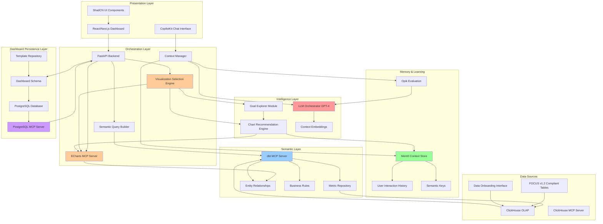

---

## 🗂️ Dashboard Persistence Architecture

The dashboard system utilizes a dedicated PostgreSQL `dashboards` schema to persist dashboard configurations, templates, and user customizations. This provides robust data integrity and enables sophisticated dashboard management features.

### Database Schema Design

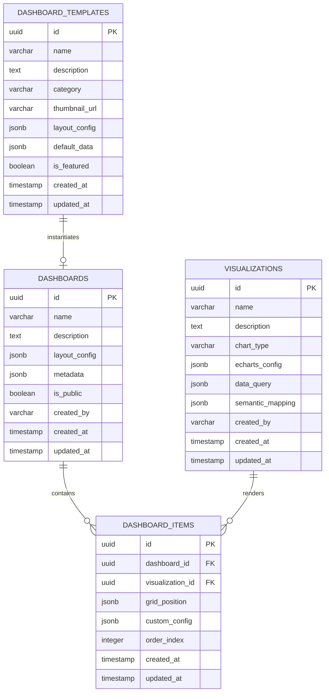

### PostgreSQL Schema Implementation

```sql
-- Dashboard persistence schema
CREATE SCHEMA IF NOT EXISTS dashboards;

-- Main dashboards table
CREATE TABLE dashboards.dashboards (
    id UUID PRIMARY KEY DEFAULT gen_random_uuid(),
    name VARCHAR(255) NOT NULL,
    description TEXT,
    layout_config JSONB DEFAULT '{}',
    metadata JSONB DEFAULT '{}',
    is_public BOOLEAN DEFAULT false,
    created_by VARCHAR(255),
    created_at TIMESTAMP WITH TIME ZONE DEFAULT NOW(),
    updated_at TIMESTAMP WITH TIME ZONE DEFAULT NOW()
);

-- Dashboard templates gallery
CREATE TABLE dashboards.dashboard_templates (
    id UUID PRIMARY KEY DEFAULT gen_random_uuid(),
    name VARCHAR(255) NOT NULL,
    description TEXT NOT NULL,
    category VARCHAR(100) NOT NULL,
    thumbnail_url VARCHAR(500),
    layout_config JSONB NOT NULL,
    default_data JSONB DEFAULT '{}',
    is_featured BOOLEAN DEFAULT false,
    created_at TIMESTAMP WITH TIME ZONE DEFAULT NOW(),
    updated_at TIMESTAMP WITH TIME ZONE DEFAULT NOW()
);

-- Individual visualizations catalog
CREATE TABLE dashboards.visualizations (
    id UUID PRIMARY KEY DEFAULT gen_random_uuid(),
    name VARCHAR(255) NOT NULL,
    description TEXT,
    chart_type VARCHAR(100) NOT NULL,
    echarts_config JSONB NOT NULL,
    data_query JSONB NOT NULL,
    semantic_mapping JSONB DEFAULT '{}',
    created_by VARCHAR(255),
    created_at TIMESTAMP WITH TIME ZONE DEFAULT NOW(),
    updated_at TIMESTAMP WITH TIME ZONE DEFAULT NOW()
);

-- Dashboard composition (many-to-many relationship)
CREATE TABLE dashboards.dashboard_items (
    id UUID PRIMARY KEY DEFAULT gen_random_uuid(),
    dashboard_id UUID NOT NULL REFERENCES dashboards.dashboards(id) ON DELETE CASCADE,
    visualization_id UUID NOT NULL REFERENCES dashboards.visualizations(id) ON DELETE CASCADE,
    grid_position JSONB NOT NULL, -- {x, y, width, height}
    custom_config JSONB DEFAULT '{}',
    order_index INTEGER NOT NULL DEFAULT 0,
    created_at TIMESTAMP WITH TIME ZONE DEFAULT NOW(),
    updated_at TIMESTAMP WITH TIME ZONE DEFAULT NOW()
);

-- Indexes for performance
CREATE INDEX idx_dashboards_created_by ON dashboards.dashboards(created_by);
CREATE INDEX idx_dashboards_is_public ON dashboards.dashboards(is_public);
CREATE INDEX idx_dashboard_templates_category ON dashboards.dashboard_templates(category);
CREATE INDEX idx_dashboard_templates_featured ON dashboards.dashboard_templates(is_featured);
CREATE INDEX idx_dashboard_items_dashboard_id ON dashboards.dashboard_items(dashboard_id);
CREATE INDEX idx_dashboard_items_order ON dashboards.dashboard_items(dashboard_id, order_index);
```

### Dashboard Template Gallery System

The template gallery provides pre-configured dashboard layouts optimized for different FinOps use cases and user personas.

```typescript
// Template structure for dashboard configuration
interface DashboardTemplate {
  id: string;
  name: string;
  description: string;
  category: 'financial-overview' | 'cost-optimization' | 'resource-utilization' | 'executive-summary';
  thumbnail_url?: string;
  layout_config: {
    grid: {
      cols: number;
      rows: 'auto' | number;
      gap: number;
    };
    items: DashboardItem[];
  };
  default_data: {
    sample_metrics: string[];
    sample_filters: Record<string, any>;
  };
  is_featured: boolean;
  persona_target: 'executive_stakeholder' | 'finops_analyst' | 'engineering_manager';
}

interface DashboardItem {
  id: string;
  type: 'visualization' | 'kpi_card' | 'text_widget';
  position: {
    x: number;
    y: number;
    width: number;
    height: number;
  };
  config: {
    chart_type?: string;
    metric?: string;
    dimensions?: string[];
    filters?: Record<string, any>;
    echarts_options?: any;
  };
}
```

### Dashboard Edit/View Mode Architecture

The dashboard system supports seamless transitions between view and edit modes, enabling non-technical users to customize layouts while preserving data integrity.

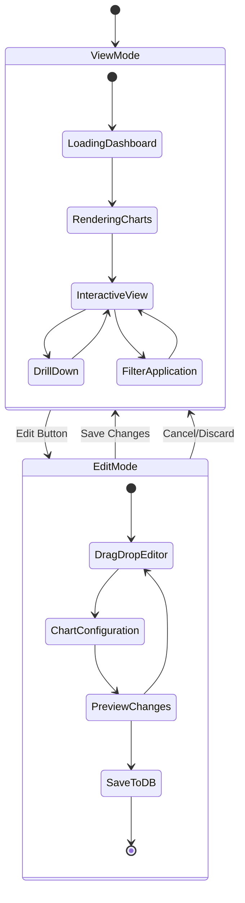

### Frontend Dashboard Integration

```typescript
// Dashboard view/edit component integration
// /app/dashboard/[id]/page.tsx
export default function DashboardPage({ params }: { params: { id: string } }) {
  const [mode, setMode] = useState<'view' | 'edit'>('view');
  const [dashboard, setDashboard] = useState<Dashboard | null>(null);

  // Load dashboard configuration from PostgreSQL
  useEffect(() => {
    const loadDashboard = async () => {
      const response = await fetch(`/api/dashboards/${params.id}`);
      const dashboardData = await response.json();
      setDashboard(dashboardData);
    };
    loadDashboard();
  }, [params.id]);

  return (
    <div className="dashboard-container">
      <DashboardHeader
        dashboard={dashboard}
        mode={mode}
        onModeChange={setMode}
      />

      {mode === 'view' ? (
        <DashboardRenderer
          layout={dashboard?.layout_config}
          readonly={true}
        />
      ) : (
        <DashboardEditor
          layout={dashboard?.layout_config}
          onSave={async (config) => {
            await fetch(`/api/dashboards/${params.id}`, {
              method: 'PATCH',
              headers: { 'Content-Type': 'application/json' },
              body: JSON.stringify({ layout_config: config })
            });
            setMode('view');
          }}
        />
      )}
    </div>
  );
}

// Template gallery component integration
// /app/dashboards/page.tsx
export default function DashboardsPage() {
  const [templates, setTemplates] = useState<DashboardTemplate[]>([]);
  const [dashboards, setDashboards] = useState<Dashboard[]>([]);

  const handleCreateFromTemplate = async (template: DashboardTemplate, name: string) => {
    const response = await fetch('/api/dashboards', {
      method: 'POST',
      headers: { 'Content-Type': 'application/json' },
      body: JSON.stringify({
        name,
        description: `Dashboard created from ${template.name} template`,
        layout_config: template.layout_config,
        metadata: { template_id: template.id }
      })
    });

    if (response.ok) {
      const newDashboard = await response.json();
      router.push(`/dashboard/${newDashboard.id}?mode=edit`);
    }
  };

  return (
    <Tabs defaultValue="my-dashboards">
      <TabsList>
        <TabsTrigger value="my-dashboards">My Dashboards</TabsTrigger>
        <TabsTrigger value="templates">Templates</TabsTrigger>
      </TabsList>

      <TabsContent value="my-dashboards">
        <DashboardGrid dashboards={dashboards} />
      </TabsContent>

      <TabsContent value="templates">
        <DashboardTemplateGallery onCreateFromTemplate={handleCreateFromTemplate} />
      </TabsContent>
    </Tabs>
  );
}
```

### API Integration with PostgreSQL MCP

```python
# Backend API routes leveraging PostgreSQL MCP
from fastapi import FastAPI, HTTPException
from typing import Optional, List
import asyncio

app = FastAPI()

@app.get("/api/dashboards")
async def get_dashboards(
    created_by: Optional[str] = None,
    is_public: Optional[bool] = None,
    limit: int = 50,
    offset: int = 0
):
    """Retrieve dashboards from PostgreSQL"""
    query = """
    SELECT id, name, description, layout_config, metadata,
           is_public, created_by, created_at, updated_at
    FROM dashboards.dashboards
    WHERE ($1::varchar IS NULL OR created_by = $1)
      AND ($2::boolean IS NULL OR is_public = $2)
    ORDER BY updated_at DESC
    LIMIT $3 OFFSET $4
    """

    result = await postgres_mcp_client.execute_sql(
        sql=query,
        params=[created_by, is_public, limit, offset]
    )

    return result.rows

@app.post("/api/dashboards")
async def create_dashboard(dashboard_data: dict):
    """Create new dashboard"""
    query = """
    INSERT INTO dashboards.dashboards
    (name, description, layout_config, metadata, is_public, created_by)
    VALUES ($1, $2, $3, $4, $5, $6)
    RETURNING id, name, description, layout_config, metadata,
              is_public, created_by, created_at, updated_at
    """

    result = await postgres_mcp_client.execute_sql(
        sql=query,
        params=[
            dashboard_data['name'],
            dashboard_data.get('description'),
            json.dumps(dashboard_data['layout_config']),
            json.dumps(dashboard_data.get('metadata', {})),
            dashboard_data.get('is_public', False),
            dashboard_data.get('created_by', 'anonymous')
        ]
    )

    return result.rows[0]

@app.get("/api/dashboard-templates")
async def get_dashboard_templates(
    category: Optional[str] = None,
    is_featured: Optional[bool] = None
):
    """Retrieve dashboard templates from gallery"""
    query = """
    SELECT id, name, description, category, thumbnail_url,
           layout_config, default_data, is_featured, created_at, updated_at
    FROM dashboards.dashboard_templates
    WHERE ($1::varchar IS NULL OR category = $1)
      AND ($2::boolean IS NULL OR is_featured = $2)
    ORDER BY is_featured DESC, name ASC
    """

    result = await postgres_mcp_client.execute_sql(
        sql=query,
        params=[category, is_featured]
    )

    return [
        {
            **row,
            'layout_config': json.loads(row['layout_config']),
            'default_data': json.loads(row['default_data'])
        }
        for row in result.rows
    ]
```

---

## 🔄 FOCUS v1.2 Data Onboarding Process

### ClickHouse Integration Architecture

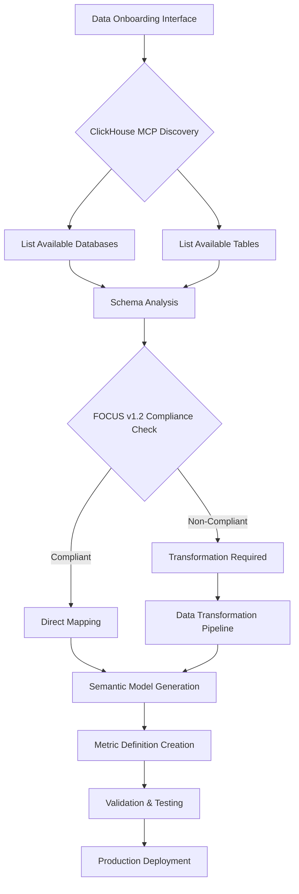

### Data Discovery and Mapping Workflow

#### Phase 1: ClickHouse Discovery
```python
class FocusDataOnboardingService:
    def __init__(self, clickhouse_mcp_client):
        self.clickhouse_client = clickhouse_mcp_client
        self.focus_schema_validator = FocusSchemaValidator()

    async def discover_available_data(self):
        """Discover all available ClickHouse databases and tables"""
        discovery_result = {
            'databases': await self.clickhouse_client.list_databases(),
            'tables': {},
            'focus_compliance': {}
        }

        for db in discovery_result['databases']:
            tables = await self.clickhouse_client.list_tables(database=db)
            discovery_result['tables'][db] = []

            for table in tables:
                table_schema = await self.clickhouse_client.describe_table(
                    database=db,
                    table=table
                )

                compliance_score = await self.assess_focus_compliance(table_schema)

                discovery_result['tables'][db].append({
                    'name': table,
                    'schema': table_schema,
                    'focus_compliance_score': compliance_score,
                    'estimated_mapping_effort': self.estimate_mapping_effort(compliance_score)
                })

        return discovery_result

    async def assess_focus_compliance(self, table_schema):
        """Assess how well a table aligns with FOCUS v1.2 specification"""
        required_fields = [
            'billing_account_id', 'billing_currency', 'billing_period_start',
            'billing_period_end', 'charge_category', 'charge_frequency',
            'charge_period_start', 'charge_period_end', 'billed_cost', 'service_name'
        ]

        present_fields = [col['name'].lower() for col in table_schema['columns']]
        compliance_score = 0

        # Check required fields presence
        required_score = sum(1 for field in required_fields if field in present_fields) / len(required_fields)

        # Check data types compatibility
        type_score = await self.assess_data_type_compatibility(table_schema)

        # Check field naming conventions
        naming_score = await self.assess_naming_conventions(table_schema)

        compliance_score = (required_score * 0.6 + type_score * 0.3 + naming_score * 0.1)

        return {
            'overall_score': compliance_score,
            'required_fields_score': required_score,
            'data_type_score': type_score,
            'naming_score': naming_score,
            'missing_required_fields': [f for f in required_fields if f not in present_fields],
            'recommendations': await self.generate_mapping_recommendations(table_schema)
        }
```

#### Phase 2: Interactive Table Mapping Interface

```yaml
# Frontend Data Onboarding Configuration
onboarding_interface:
  sections:
    - name: discovery
      title: "Available Data Discovery"
      components:
        - type: database_selector
          description: "Select ClickHouse databases to analyze"
          multi_select: true

        - type: table_grid
          description: "Available tables with FOCUS compliance scores"
          columns:
            - database
            - table_name
            - row_count
            - focus_compliance_score
            - mapping_complexity
            - recommended_action

    - name: schema_mapping
      title: "Schema Mapping Configuration"
      components:
        - type: field_mapper
          description: "Map table columns to FOCUS v1.2 fields"
          mapping_pairs:
            - source_field: "account_id"
              target_field: "billing_account_id"
              transformation: "direct"
              confidence: 0.95

            - source_field: "cost_amount"
              target_field: "billed_cost"
              transformation: "type_cast(Decimal64(4))"
              confidence: 0.90

            - source_field: "service"
              target_field: "service_name"
              transformation: "direct"
              confidence: 1.0

        - type: transformation_builder
          description: "Define data transformations for non-compliant fields"
          transformations:
            - field: charge_category
              source_logic: |
                CASE
                  WHEN usage_type = 'compute' THEN 'Usage'
                  WHEN usage_type = 'storage' THEN 'Usage'
                  WHEN usage_type = 'reserved' THEN 'Purchase'
                  ELSE 'Usage'
                END
              target_enum: ['Usage', 'Purchase', 'Tax', 'Credit', 'Adjustment', 'Rounding']

    - name: validation
      title: "Data Quality Validation"
      components:
        - type: sample_data_preview
          description: "Preview transformed data sample"
          sample_size: 1000

        - type: validation_results
          description: "FOCUS v1.2 compliance validation results"
          checks:
            - name: required_fields_present
              status: passed
              message: "All required FOCUS fields are present"

            - name: data_type_compatibility
              status: warning
              message: "2 fields require type conversion"

            - name: referential_integrity
              status: passed
              message: "All foreign key relationships valid"

        - type: quality_metrics
          description: "Data quality assessment"
          metrics:
            - name: completeness
              score: 0.95
              description: "95% of records have all required fields"

            - name: consistency
              score: 0.88
              description: "88% of records follow expected patterns"

            - name: accuracy
              score: 0.92
              description: "92% of cost values pass validation checks"

# Expected vs Available Tables Comparison
table_requirements:
  expected_tables:
    - name: focus_cost_usage_v1_2
      description: "Main FOCUS v1.2 compliant cost and usage data"
      required: true
      schema: focus_v1_2_core
      estimated_size: "10M+ rows/month"

    - name: focus_resource_attributes
      description: "Extended resource attributes and tags"
      required: false
      schema: focus_v1_2_extended
      estimated_size: "1M+ rows/month"

    - name: focus_commitment_discounts
      description: "Commitment discount details and utilization"
      required: false
      schema: focus_v1_2_commitments
      estimated_size: "10K+ rows/month"

  available_tables:
    - database: finops_prod
      tables:
        - name: aws_cost_usage_hourly
          focus_compliance: 0.75
          mapping_status: requires_transformation
          estimated_effort: medium

        - name: azure_consumption_daily
          focus_compliance: 0.65
          mapping_status: requires_significant_transformation
          estimated_effort: high

        - name: gcp_billing_export
          focus_compliance: 0.85
          mapping_status: minor_adjustments_needed
          estimated_effort: low

# Automated Mapping Suggestions
mapping_suggestions:
  high_confidence:
    - source: "aws_cost_usage_hourly.line_item_blended_cost"
      target: "focus_cost_usage_v1_2.billed_cost"
      transformation: "CAST(line_item_blended_cost AS Decimal64(4))"
      confidence: 0.95

    - source: "aws_cost_usage_hourly.product_product_name"
      target: "focus_cost_usage_v1_2.service_name"
      transformation: "product_product_name"
      confidence: 0.90

  medium_confidence:
    - source: "aws_cost_usage_hourly.line_item_usage_start_date"
      target: "focus_cost_usage_v1_2.charge_period_start"
      transformation: "CAST(line_item_usage_start_date AS DateTime64(3))"
      confidence: 0.80
      requires_validation: true

  low_confidence:
    - source: "aws_cost_usage_hourly.line_item_operation"
      target: "focus_cost_usage_v1_2.charge_category"
      transformation: "complex_categorization_logic"
      confidence: 0.60
      requires_manual_review: true
```

#### Phase 3: Data Transformation Pipeline

```sql
-- Example ClickHouse Materialized View for FOCUS v1.2 Transformation
CREATE MATERIALIZED VIEW focus_cost_usage_v1_2_mv
TO focus_cost_usage_v1_2
AS SELECT
    -- FOCUS Required Fields
    payer_account_id AS billing_account_id,
    'USD' AS billing_currency,
    toDate(bill_billing_period_start_date) AS billing_period_start,
    toDate(bill_billing_period_end_date) AS billing_period_end,

    -- Charge Category Mapping
    CASE
        WHEN line_item_line_item_type = 'Usage' THEN 'Usage'
        WHEN line_item_line_item_type = 'RIFee' THEN 'Purchase'
        WHEN line_item_line_item_type = 'Tax' THEN 'Tax'
        WHEN line_item_line_item_type = 'Credit' THEN 'Credit'
        ELSE 'Usage'
    END AS charge_category,

    -- Charge Frequency Mapping
    CASE
        WHEN line_item_line_item_type IN ('RIFee', 'SavingsPlansRecurringFee') THEN 'Recurring'
        WHEN line_item_line_item_type = 'Usage' THEN 'Usage-Based'
        ELSE 'One-Time'
    END AS charge_frequency,

    toDateTime64(line_item_usage_start_date, 3) AS charge_period_start,
    toDateTime64(line_item_usage_end_date, 3) AS charge_period_end,

    -- Core Metrics
    CAST(line_item_blended_cost AS Decimal64(4)) AS billed_cost,
    CAST(COALESCE(reservation_effective_cost, line_item_blended_cost) AS Decimal64(4)) AS effective_cost,
    CAST(line_item_unblended_cost AS Decimal64(4)) AS list_cost,

    -- Service and Resource Information
    product_product_name AS service_name,
    line_item_resource_id AS resource_id,
    resource_tags_user_name AS resource_name,
    product_product_family AS service_category,

    -- Usage Metrics
    CAST(line_item_usage_amount AS Decimal64(8)) AS usage_quantity,
    line_item_usage_type AS usage_unit,
    CAST(line_item_usage_amount AS Decimal64(8)) AS pricing_quantity,
    line_item_usage_type AS pricing_unit,

    -- Enhanced Analytics Fields
    resource_tags_cost_center AS allocation_cost_center,
    resource_tags_project AS allocation_project_id,
    resource_tags_team AS allocation_team,
    CASE
        WHEN resource_tags_environment = 'prod' THEN 'production'
        WHEN resource_tags_environment = 'stage' THEN 'staging'
        WHEN resource_tags_environment = 'dev' THEN 'development'
        WHEN resource_tags_environment = 'test' THEN 'test'
        ELSE NULL
    END AS allocation_environment,

    -- Commitment Discount Information
    savings_plans_savings_plans_arn AS commitment_discount_id,
    reservation_reservation_arn AS commitment_discount_id_backup,
    CASE
        WHEN savings_plans_savings_plans_arn IS NOT NULL THEN 'Usage'
        WHEN reservation_reservation_arn IS NOT NULL THEN 'Spend'
        ELSE NULL
    END AS commitment_discount_category

FROM aws_cost_usage_hourly
WHERE line_item_blended_cost > 0
    AND bill_billing_period_start_date >= '2024-01-01';
```

---

## 📊 Semantic Layer Design Process

### Phase 1: Business Context Modeling

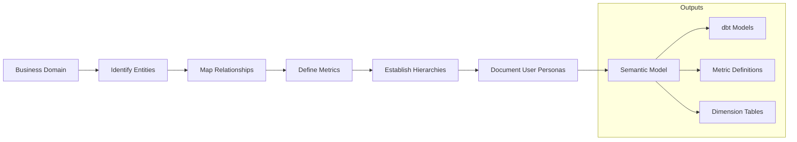

#### 1.1 FOCUS v1.2 Compliant Entity & Relationship Mapping

```yaml
domain: cloud_finops
focus_version: 1.2
semantic_model:
  base_table: focus_cost_and_usage

# FOCUS v1.2 Core Dimensions (Required)
core_dimensions:
  - name: billing_account_id
    type: string
    required: true
    description: "Unique identifier for the billing account"

  - name: billing_account_name
    type: string
    required: false
    description: "Display name for the billing account"

  - name: billing_currency
    type: string
    required: true
    description: "Currency used for billing (ISO 4217)"

  - name: billing_period_start
    type: date
    required: true
    description: "Start date of the billing period"

  - name: billing_period_end
    type: date
    required: true
    description: "End date of the billing period"

  - name: charge_category
    type: string
    required: true
    enum: [Usage, Purchase, Tax, Credit, Adjustment, Rounding]
    description: "High-level categorization of the charge"

  - name: charge_frequency
    type: string
    required: true
    enum: [One-Time, Recurring, Usage-Based]
    description: "Frequency of the charge"

  - name: charge_period_start
    type: datetime
    required: true
    description: "Start of the time period the charge covers"

  - name: charge_period_end
    type: datetime
    required: true
    description: "End of the time period the charge covers"

# FOCUS v1.2 Resource Identification
resource_dimensions:
  - name: resource_id
    type: string
    required: false
    description: "Unique identifier for the resource"

  - name: resource_name
    type: string
    required: false
    description: "Display name for the resource"

  - name: resource_type
    type: string
    required: false
    description: "Type or category of the resource"

  - name: service_category
    type: string
    required: false
    description: "Highest-level grouping of services"

  - name: service_name
    type: string
    required: true
    description: "Name of the service as defined by the provider"

# FOCUS v1.2 Core Metrics (Required)
core_metrics:
  - name: billed_cost
    type: decimal
    required: true
    description: "Cost after applying all adjustments, discounts, and taxes"

  - name: effective_cost
    type: decimal
    required: false
    description: "Amortized cost reflecting the true economic impact"

  - name: list_cost
    type: decimal
    required: false
    description: "Cost at public list prices before any discounts"

  - name: pricing_quantity
    type: decimal
    required: false
    description: "Quantity of units used for pricing calculations"

  - name: pricing_unit
    type: string
    required: false
    description: "Unit of measurement for pricing_quantity"

  - name: usage_quantity
    type: decimal
    required: false
    description: "Quantity of units consumed"

  - name: usage_unit
    type: string
    required: false
    description: "Unit of measurement for usage_quantity"

# Enhanced FinOps Dimensions for Analytics
enhanced_dimensions:
  - name: allocation_cost_center
    type: string
    required: false
    description: "Cost center for chargeback/showback"

  - name: allocation_project_id
    type: string
    required: false
    description: "Project identifier for cost allocation"

  - name: allocation_team
    type: string
    required: false
    description: "Team responsible for the resource"

  - name: allocation_environment
    type: string
    required: false
    enum: [production, staging, development, test]
    description: "Environment classification"

  - name: commitment_discount_category
    type: string
    required: false
    enum: [Spend, Usage]
    description: "Type of commitment discount applied"

  - name: commitment_discount_id
    type: string
    required: false
    description: "Identifier for the commitment discount"

  - name: commitment_discount_name
    type: string
    required: false
    description: "Display name for the commitment discount"

relationships:
  - type: one_to_many
    from: billing_account_id
    to: resource_id
    description: "Billing account contains multiple resources"

  - type: many_to_one
    from: resource_id
    to: service_name
    description: "Resources belong to specific services"

  - type: one_to_many
    from: allocation_cost_center
    to: resource_id
    description: "Cost centers contain multiple resources"

# ClickHouse Table Schema
clickhouse_schema:
  table_name: focus_cost_usage_v1_2
  engine: MergeTree()
  order_by: [billing_account_id, charge_period_start, service_name]
  partition_by: toYYYYMM(charge_period_start)

  columns:
    # FOCUS Required Fields
    - name: billing_account_id
      type: String
      codec: ZSTD(1)
    - name: billing_currency
      type: FixedString(3)
    - name: billing_period_start
      type: Date
    - name: billing_period_end
      type: Date
    - name: charge_category
      type: Enum8('Usage'=1, 'Purchase'=2, 'Tax'=3, 'Credit'=4, 'Adjustment'=5, 'Rounding'=6)
    - name: charge_frequency
      type: Enum8('One-Time'=1, 'Recurring'=2, 'Usage-Based'=3)
    - name: charge_period_start
      type: DateTime64(3)
    - name: charge_period_end
      type: DateTime64(3)
    - name: billed_cost
      type: Decimal64(4)
      codec: ZSTD(1)
    - name: service_name
      type: String
      codec: ZSTD(1)

    # FOCUS Optional Fields
    - name: effective_cost
      type: Nullable(Decimal64(4))
    - name: list_cost
      type: Nullable(Decimal64(4))
    - name: resource_id
      type: Nullable(String)
    - name: resource_name
      type: Nullable(String)
    - name: pricing_quantity
      type: Nullable(Decimal64(8))
    - name: usage_quantity
      type: Nullable(Decimal64(8))

    # Enhanced Analytics Fields
    - name: allocation_cost_center
      type: Nullable(String)
    - name: allocation_project_id
      type: Nullable(String)
    - name: allocation_environment
      type: Nullable(Enum8('production'=1, 'staging'=2, 'development'=3, 'test'=4))
```

#### 1.2 FOCUS v1.2 Compliant Metric Repository Definition

```yaml
# FOCUS-Based Core Metrics
focus_core_metrics:
  - name: total_billed_cost
    type: sum
    sql: "SUM(billed_cost)"
    base_field: billed_cost
    dimensions: [billing_account_id, service_name, charge_category]
    narrative_goal: magnitude_comparison
    recommended_chart: bar_chart
    focus_compliant: true
    description: "Total cost after all adjustments, discounts, and taxes"

  - name: effective_cost_trend
    type: time_series
    sql: "SUM(COALESCE(effective_cost, billed_cost)) OVER (ORDER BY charge_period_start)"
    base_field: effective_cost
    dimensions: [charge_period_start]
    narrative_goal: change_over_time
    recommended_chart: line_chart
    focus_compliant: true
    description: "Amortized cost trend reflecting true economic impact"

  - name: commitment_discount_coverage
    type: ratio
    sql: "SUM(CASE WHEN commitment_discount_id IS NOT NULL THEN billed_cost ELSE 0 END) / SUM(billed_cost)"
    base_field: [billed_cost, commitment_discount_id]
    dimensions: [billing_account_id, service_name]
    narrative_goal: magnitude_comparison
    recommended_chart: bar_chart
    focus_compliant: true
    description: "Percentage of spend covered by commitment discounts"

# Enhanced FinOps Analytics Metrics
finops_enhanced_metrics:
  - name: cost_center_variance
    type: deviation
    sql: "(actual_cost - budgeted_cost) / budgeted_cost"
    base_field: billed_cost
    dimensions: [allocation_cost_center, charge_period_start]
    narrative_goal: deviation
    recommended_chart: bullet_chart
    focus_compliant: false
    description: "Budget variance by cost center"

  - name: service_cost_distribution
    type: distribution
    sql: "billed_cost"
    base_field: billed_cost
    dimensions: [service_name, charge_category]
    narrative_goal: distribution
    recommended_chart: treemap
    focus_compliant: true
    description: "Distribution of costs across services and charge types"

  - name: usage_efficiency_ratio
    type: calculated
    sql: "CASE WHEN usage_quantity > 0 THEN billed_cost / usage_quantity ELSE NULL END"
    base_field: [billed_cost, usage_quantity, usage_unit]
    dimensions: [service_name, resource_type, usage_unit]
    narrative_goal: correlation
    recommended_chart: scatter_plot
    focus_compliant: true
    description: "Cost per unit of usage for efficiency analysis"

# Time-Based Aggregation Metrics
temporal_metrics:
  - name: monthly_cost_trend
    type: time_series_aggregated
    sql: "SUM(billed_cost)"
    base_field: billed_cost
    time_dimension: charge_period_start
    time_grain: month
    dimensions: [service_name, allocation_environment]
    narrative_goal: change_over_time
    recommended_chart: line_chart
    focus_compliant: true

  - name: daily_cost_anomalies
    type: anomaly_detection
    sql: "SUM(billed_cost)"
    base_field: billed_cost
    time_dimension: charge_period_start
    time_grain: day
    dimensions: [billing_account_id, service_name]
    narrative_goal: deviation
    recommended_chart: line_chart_with_bands
    focus_compliant: true
    anomaly_threshold: 2_standard_deviations

# Cross-Dimensional Analysis Metrics
analytical_metrics:
  - name: service_cost_concentration
    type: concentration_index
    sql: "POWER(SUM(billed_cost * billed_cost) / POWER(SUM(billed_cost), 2), 0.5)"
    base_field: billed_cost
    dimensions: [billing_account_id, charge_period_start]
    narrative_goal: magnitude_comparison
    recommended_chart: bar_chart
    focus_compliant: true
    description: "Herfindahl index for cost concentration across services"

  - name: commitment_discount_utilization
    type: utilization_rate
    sql: "SUM(CASE WHEN commitment_discount_category = 'Usage' THEN usage_quantity ELSE 0 END) / SUM(commitment_capacity)"
    base_field: [usage_quantity, commitment_discount_category]
    dimensions: [commitment_discount_id, charge_period_start]
    narrative_goal: magnitude_comparison
    recommended_chart: bullet_chart
    focus_compliant: true
    description: "Utilization rate of usage-based commitment discounts"

# Data Quality and Compliance Metrics
data_quality_metrics:
  - name: focus_compliance_score
    type: data_quality
    sql: "COUNT(CASE WHEN billing_account_id IS NOT NULL AND service_name IS NOT NULL AND billed_cost IS NOT NULL THEN 1 END) / COUNT(*)"
    base_field: [billing_account_id, service_name, billed_cost]
    dimensions: [billing_account_id, charge_period_start]
    narrative_goal: magnitude_comparison
    recommended_chart: bar_chart
    focus_compliant: true
    description: "Percentage of records meeting FOCUS v1.2 minimum requirements"

  - name: allocation_coverage
    type: coverage_metric
    sql: "SUM(CASE WHEN allocation_cost_center IS NOT NULL THEN billed_cost ELSE 0 END) / SUM(billed_cost)"
    base_field: [billed_cost, allocation_cost_center]
    dimensions: [billing_account_id, service_name]
    narrative_goal: magnitude_comparison
    recommended_chart: bar_chart
    focus_compliant: false
    description: "Percentage of costs allocated to cost centers"

# Metric Validation Rules
metric_validation:
  - metric: total_billed_cost
    validations:
      - type: non_negative
        message: "Billed cost cannot be negative"
      - type: currency_match
        field: billing_currency
        message: "Currency must be consistent within billing period"

  - metric: effective_cost_trend
    validations:
      - type: logical_consistency
        rule: "effective_cost >= 0 OR effective_cost IS NULL"
        message: "Effective cost must be non-negative or null"

  - metric: commitment_discount_coverage
    validations:
      - type: range_check
        min: 0
        max: 1
        message: "Coverage ratio must be between 0 and 1"
```

#### 1.3 User Persona Profiles

```yaml
personas:
  - name: executive_stakeholder
    technical_level: low
    domain_expertise: high
    preferred_complexity: simple
    attention_span: short
    chart_preferences:
      - bullet_chart
      - bar_chart
      - line_chart
    cognitive_load_threshold: low
    
  - name: finops_analyst
    technical_level: high
    domain_expertise: high
    preferred_complexity: advanced
    attention_span: extended
    chart_preferences:
      - scatter_plot
      - violin_plot
      - heatmap
      - sankey_diagram
    cognitive_load_threshold: high
    
  - name: engineering_manager
    technical_level: medium
    domain_expertise: medium
    preferred_complexity: moderate
    attention_span: medium
    chart_preferences:
      - column_chart
      - dumbbell_chart
      - stacked_bar
    cognitive_load_threshold: medium
```

---

## 🎨 Visualization Selection Engine

### Two-Phase Implementation Architecture

#### Complete Two-Phase Architecture Flow

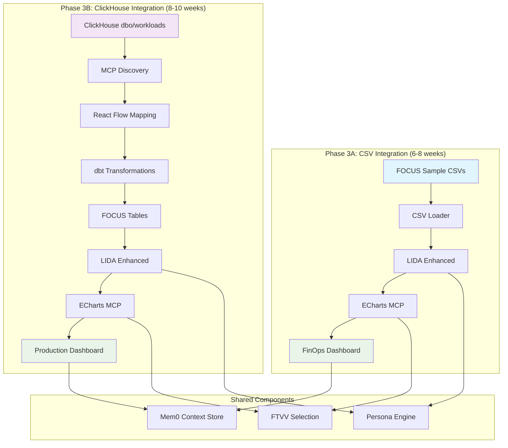

### Visualization Selection Engine Architecture

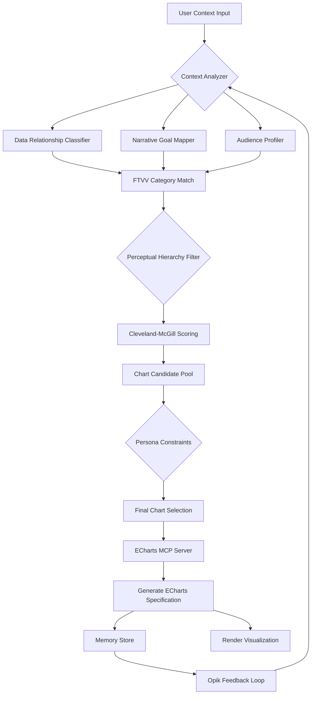

### Phase 3A: FOCUS CSV Integration Workflow

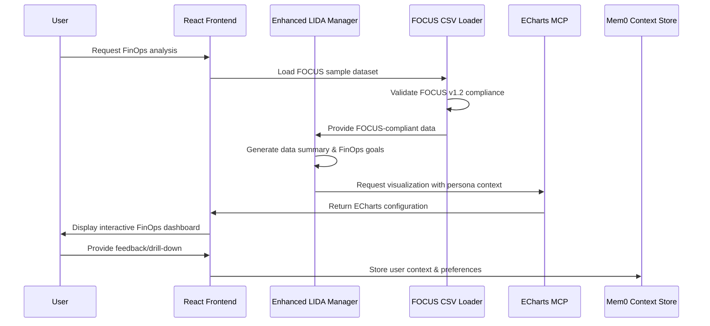

### Phase 3B: ClickHouse Production Integration Workflow

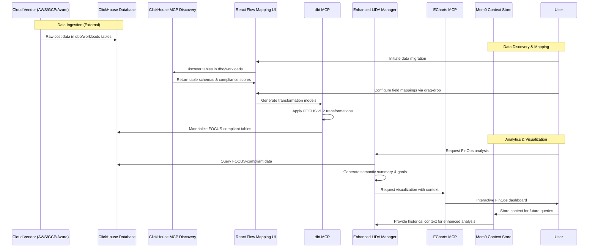

### Selection Algorithm Workflow (Shared Component)

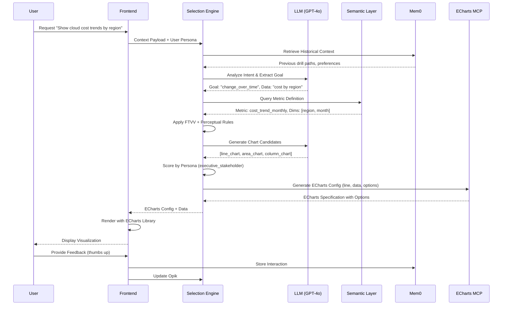

### Decision Matrix Implementation

```python
# Pseudo-code for Visualization Selection Engine
class VisualizationSelector:
    def __init__(self, semantic_layer, llm, memory, persona_db):
        self.semantic_layer = semantic_layer
        self.llm = llm
        self.memory = memory
        self.persona_db = persona_db
        self.ftvv_categories = self.load_ftvv_taxonomy()
        self.perceptual_hierarchy = self.load_cleveland_mcgill()
        
    def select_visualization(self, context_payload, user_persona):
        # Step 1: Extract Intent & Data Relationship
        intent = self.llm.analyze_intent(context_payload)
        data_relationship = self.classify_relationship(intent)
        
        # Step 2: Map to FTVV Narrative Goal
        narrative_goal = self.map_to_ftvv(data_relationship, intent)
        
        # Step 3: Query Semantic Layer for Metric Definition
        metric_def = self.semantic_layer.get_metric(intent.metric_name)
        
        # Step 4: Generate Chart Candidates
        candidates = self.get_chart_candidates(
            narrative_goal, 
            metric_def.recommended_chart
        )
        
        # Step 5: Score by Perceptual Hierarchy
        scored_candidates = []
        for chart in candidates:
            perceptual_score = self.perceptual_hierarchy.score(chart)
            persona_compatibility = self.persona_db.compatibility(
                chart, user_persona
            )
            context_relevance = self.memory.relevance_score(
                chart, context_payload
            )
            
            total_score = (
                0.4 * perceptual_score +
                0.3 * persona_compatibility +
                0.3 * context_relevance
            )
            scored_candidates.append((chart, total_score))
        
        # Step 6: Select Optimal Chart
        optimal_chart = max(scored_candidates, key=lambda x: x[1])

        # Step 7: Generate ECharts Specification via MCP
        spec = self.generate_echarts_spec(
            optimal_chart[0],
            metric_def,
            context_payload
        )

        # Step 8: Store in Memory
        self.memory.store({
            'context': context_payload,
            'chart_type': optimal_chart[0],
            'narrative_goal': narrative_goal,
            'user_persona': user_persona
        })
        
        return spec
    
    def classify_relationship(self, intent):
        """Map to: comparison, distribution, relationship, change_over_time"""
        prompt = f"""
        Based on this query intent: {intent.query}
        Classify the primary data relationship:
        1. comparison - comparing categories or groups
        2. distribution - showing spread across ranges
        3. relationship - correlation between variables
        4. change_over_time - temporal trends
        5. composition - part-to-whole breakdown
        
        Return only the classification.
        """
        return self.llm.classify(prompt)
    
    def map_to_ftvv(self, data_relationship, intent):
        """Map to FTVV's 9 categories"""
        mapping = {
            'comparison': ['magnitude', 'ranking'],
            'distribution': ['distribution'],
            'relationship': ['correlation'],
            'change_over_time': ['change_over_time'],
            'composition': ['part_to_whole']
        }
        # Use LLM to refine based on intent nuances
        candidates = mapping.get(data_relationship, [])
        return self.llm.select_narrative_goal(candidates, intent)

    def generate_echarts_spec(self, chart_type, metric_def, context_payload):
        """Generate ECharts configuration via MCP Server"""
        # Map chart type to ECharts type
        chart_type_mapping = {
            'bar_chart': 'bar',
            'line_chart': 'line',
            'area_chart': 'line',  # with areaStyle
            'pie_chart': 'pie',
            'scatter_plot': 'scatter',
            'heatmap': 'heatmap',
            'funnel': 'funnel',
            'sankey_diagram': 'sankey',
            'tree': 'tree',
            'treemap': 'treemap',
            'sunburst': 'sunburst'
        }

        echarts_type = chart_type_mapping.get(chart_type, 'bar')

        # Prepare data for ECharts MCP Server
        title = f"{metric_def.name} - {context_payload.narrative_goal}"
        series_name = metric_def.name
        x_axis_name = context_payload.dimensions[0] if context_payload.dimensions else "Category"
        y_axis_name = metric_def.display_name or metric_def.name

        # Call ECharts MCP Server
        echarts_spec = self.echarts_mcp.get_chart(
            type=echarts_type,
            data=context_payload.data,
            title=title,
            series_name=series_name,
            x_axis_name=x_axis_name,
            y_axis_name=y_axis_name
        )

        return echarts_spec
```

---

## 🔄 End-to-End Implementation Workflow

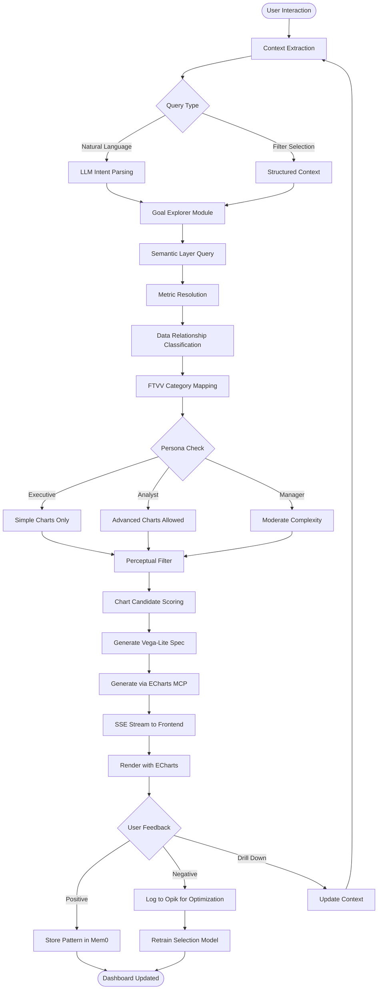

---

## 🚀 Domain Onboarding Process: Cloud FinOps Example

### Onboarding Workflow

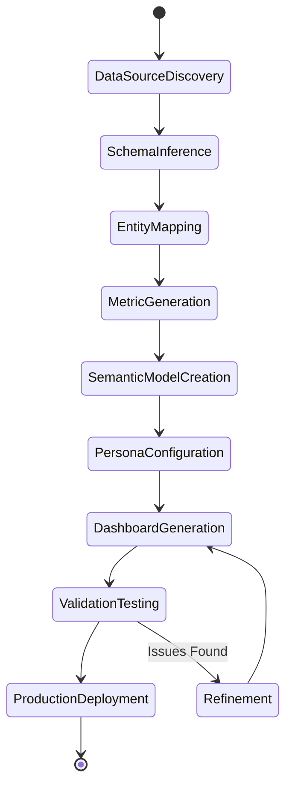

### Step-by-Step Configuration

#### Step 1: Data Source Connection

```yaml
# config/finops_datasource.yaml
datasources:
  - name: aws_cost_explorer
    type: api
    connection:
      endpoint: "https://ce.amazonaws.com"
      auth: aws_iam
      refresh_interval: daily
    schema_mapping:
      cost_table: aws_cost_usage
      dimensions: [service, region, account_id, resource_id]
      
  - name: azure_cost_management
    type: api
    connection:
      endpoint: "https://management.azure.com/cost"
      auth: azure_ad
      refresh_interval: daily
    schema_mapping:
      cost_table: azure_consumption
      dimensions: [subscription, resource_group, meter_category]
      
  - name: gcp_billing
    type: bigquery
    connection:
      project: billing-export
      dataset: cloud_costs
    schema_mapping:
      cost_table: gcp_billing_export
      dimensions: [project, service, sku, location]
```

#### Step 2: LLM-Guided Schema Inference

```python
# Automated schema analysis
class FinOpsOnboardingAgent:
    def infer_semantic_model(self, datasource_config):
        """LLM analyzes raw schema and suggests semantic entities"""
        
        # 1. Extract sample data
        sample_data = self.datasource.get_sample(limit=1000)
        schema_info = self.datasource.get_schema()
        
        # 2. LLM analyzes and suggests entities
        prompt = f"""
        You are a FinOps domain expert. Analyze this schema:
        
        Tables: {schema_info.tables}
        Columns: {schema_info.columns}
        Sample Data: {sample_data.head()}
        
        Suggest:
        1. Business entities (e.g., Resource, CostCenter, Service)
        2. Natural hierarchies (e.g., Account > Project > Resource)
        3. Key metrics to track (e.g., TotalCost, CostPerUnit, Utilization)
        4. Relevant dimensions for analysis
        5. Common drill paths for FinOps analysis
        
        Return as YAML semantic model definition.
        """
        
        semantic_model = self.llm.generate(prompt)
        
        # 3. Validate against FinOps best practices
        validated_model = self.validate_finops_model(semantic_model)
        
        return validated_model
    
    def generate_metric_definitions(self, semantic_model):
        """Create dbt metric definitions"""
        
        metrics = []
        for entity in semantic_model.entities:
            # Standard FinOps metrics per entity
            if entity.type == "cost":
                metrics.extend([
                    {
                        'name': f'{entity.name}_total',
                        'type': 'sum',
                        'narrative_goal': 'magnitude',
                        'chart': 'bar_chart'
                    },
                    {
                        'name': f'{entity.name}_trend',
                        'type': 'time_series',
                        'narrative_goal': 'change_over_time',
                        'chart': 'line_chart'
                    },
                    {
                        'name': f'{entity.name}_variance',
                        'type': 'deviation',
                        'narrative_goal': 'deviation',
                        'chart': 'bullet_chart'
                    }
                ])
        
        return self.generate_dbt_yaml(metrics)
```

#### Step 3: Dashboard Template Generation

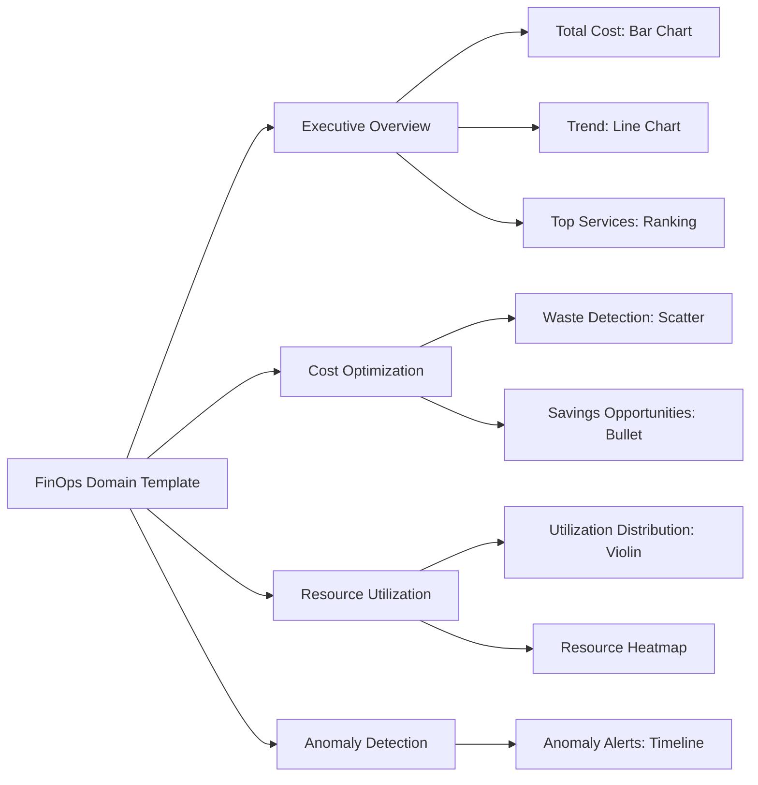

#### Step 4: Generated Dashboard Configuration

```yaml
# auto-generated: finops_executive_dashboard.yaml
dashboard:
  name: "Cloud FinOps Executive Overview"
  persona: executive_stakeholder
  refresh_rate: daily
  
  sections:
    - name: cost_summary
      layout: grid_2x2
      widgets:
        - type: kpi_card
          metric: total_cloud_cost
          comparison: month_over_month
          
        - type: visualization
          metric: cost_trend_monthly
          chart_type: line_chart
          dimensions: [month]
          narrative_goal: change_over_time
          config:
            show_grid: false
            smooth_line: true
            highlight_current_month: true
            
        - type: visualization
          metric: cost_by_service_top10
          chart_type: bar_chart
          dimensions: [service_name]
          narrative_goal: ranking
          config:
            sort: descending
            color_scale: blues
            show_values: true
            
        - type: visualization
          metric: budget_variance
          chart_type: bullet_chart
          dimensions: [cost_center]
          narrative_goal: deviation
          config:
            threshold_ranges: [0.8, 1.0, 1.2]
            target_line: 1.0
            
    - name: optimization_opportunities
      layout: single_column
      widgets:
        - type: visualization
          metric: resource_utilization_vs_cost
          chart_type: scatter_plot
          dimensions: [resource_id, utilization_percent, cost]
          narrative_goal: relationship
          config:
            quadrant_lines: true
            quadrant_labels:
              - "Underutilized & Expensive"
              - "Right-sized"
            size_encoding: cost
            color_encoding: resource_type
            
  filters:
    - dimension: date_range
      default: last_30_days
      options: [last_7_days, last_30_days, last_90_days, custom]
      
    - dimension: cloud_provider
      default: all
      multi_select: true
      
    - dimension: cost_center
      default: all
      cascading: true
      
  drill_paths:
    - from: cost_by_service
      to: cost_by_region
      context_preserved: true
      
    - from: cost_by_region
      to: cost_by_resource
      context_preserved: true
```

#### Step 5: Context-Aware Suggestion System

```python
class ContextAwareSuggestionEngine:
    """Leverages Mem0 to suggest next analysis steps"""
    
    def suggest_next_view(self, current_context, user_history):
        # Retrieve similar past sessions
        similar_sessions = self.mem0.search(
            query=current_context.semantic_key,
            filter={'user_persona': current_context.persona},
            limit=5
        )
        
        # Analyze common drill paths
        common_paths = self.analyze_drill_patterns(similar_sessions)
        
        # LLM generates contextual suggestions
        prompt = f"""
        User is currently viewing: {current_context.current_view}
        Filters applied: {current_context.filters}
        Notable insight: {current_context.insight}
        
        Based on FinOps best practices and this user's history, suggest 3 logical next analyses.
        For each suggestion provide:
        1. Analysis name
        2. Rationale (why this is relevant now)
        3. Recommended visualization type
        """
        
        suggestions = self.llm.generate_suggestions(prompt)
        
        return [
            {
                'title': sug.name,
                'rationale': sug.rationale,
                'action': self.create_navigation_action(sug),
                'chart_preview': self.generate_preview_thumbnail(sug)
            }
            for sug in suggestions
        ]
```

---

## 🛠️ Technical Implementation Stack

### MCP Server Integration

#### ECharts MCP Server

The ECharts MCP Server provides a standardized interface for generating professional, interactive charts. It supports multiple chart types optimized for data storytelling:

**Supported Chart Types:**
- **Bar/Column Charts**: For magnitude comparisons and rankings (Cleveland-McGill position encoding)
- **Line/Area Charts**: For temporal trends and change over time
- **Pie Charts**: For part-to-whole composition (limited to high-level personas)
- **Scatter Plots**: For correlation and relationship analysis
- **Funnel Charts**: For conversion and process flow visualization
- **Tree/Treemap/Sunburst**: For hierarchical data and drill-down analysis
- **Heatmaps**: For multi-dimensional pattern detection

**Integration Pattern:**
```python
# ECharts MCP Client Wrapper
class EChartsMCPClient:
    def __init__(self, mcp_session):
        self.session = mcp_session

    async def generate_chart(self, chart_type, data, title, series_name,
                            x_axis_name, y_axis_name, options=None):
        """
        Generate ECharts configuration via MCP Server

        Args:
            chart_type: Type of chart (bar, line, pie, scatter, etc.)
            data: Chart data in format [[x1, y1], [x2, y2], ...]
            title: Chart title
            series_name: Name of the data series
            x_axis_name: Label for X-axis with units
            y_axis_name: Label for Y-axis with units
            options: Additional ECharts options for customization

        Returns:
            ECharts configuration object
        """
        result = await self.session.call_tool(
            "get-chart",
            arguments={
                "type": chart_type,
                "data": data,
                "title": title,
                "seriesName": series_name,
                "xAxisName": x_axis_name,
                "yAxisName": y_axis_name
            }
        )

        # Merge with custom options if provided
        if options:
            echarts_config = result.content[0].text
            echarts_config.update(options)

        return echarts_config

    def map_narrative_goal_to_chart_type(self, narrative_goal, data_shape):
        """Map FTVV narrative goal to optimal ECharts type"""
        mapping = {
            'magnitude': 'bar',
            'ranking': 'bar',
            'change_over_time': 'line',
            'distribution': 'bar',  # or violin via custom series
            'correlation': 'scatter',
            'part_to_whole': 'pie',
            'deviation': 'bar',  # with reference lines
            'flow': 'sankey',
            'hierarchy': 'tree' if data_shape.is_tree else 'treemap'
        }
        return mapping.get(narrative_goal, 'bar')
```

### Backend Service Layer

```python
# main.py - FastAPI Implementation
from fastapi import FastAPI, WebSocket
from fastapi.responses import StreamingResponse
from pydantic import BaseModel
import asyncio
from mcp import ClientSession
from mcp.client.stdio import stdio_client

app = FastAPI(title="Agentic Analytics API")

# Initialize ECharts MCP Client
echarts_mcp_client = None

async def init_echarts_mcp():
    """Initialize connection to ECharts MCP Server"""
    global echarts_mcp_client
    server_params = stdio_client("mcp-echarts")
    async with ClientSession(*server_params) as session:
        echarts_mcp_client = session
        return session

app = FastAPI(title="Agentic Analytics API")

class AnalyticsContext(BaseModel):
    user_id: str
    persona: str
    filters: dict
    dimensions: list[str]
    metrics: list[str]
    drill_path: list[str]
    query: str | None

@app.post("/api/v1/analyze")
async def analyze(context: AnalyticsContext):
    """Generate visualization based on context"""
    
    # 1. Retrieve user context from Mem0
    historical_context = await mem0_client.get_context(
        user_id=context.user_id,
        semantic_key=generate_semantic_key(context)
    )
    
    # 2. Parse intent via LLM if natural language query
    if context.query:
        intent = await llm_orchestrator.parse_intent(
            query=context.query,
            context=historical_context
        )
        context.metrics = intent.metrics
        context.dimensions = intent.dimensions
    
    # 3. Select optimal visualization
    viz_selector = VisualizationSelector(
        semantic_layer=dbt_mcp_client,
        llm=llm_orchestrator,
        memory=mem0_client,
        persona_db=persona_repository
    )
    
    viz_spec = await viz_selector.select_visualization(
        context_payload=context,
        user_persona=context.persona
    )
    
    # 4. Execute query via semantic layer
    query_result = await dbt_mcp_client.execute_query(
        metric=context.metrics[0],
        dimensions=context.dimensions,
        filters=context.filters
    )

    # 5. Generate ECharts specification via MCP
    echarts_config = await echarts_mcp_client.call_tool(
        "get-chart",
        arguments={
            "type": viz_spec.chart_type,
            "data": query_result.data,
            "title": f"{context.metrics[0]} - {viz_spec.narrative_goal}",
            "seriesName": context.metrics[0],
            "xAxisName": context.dimensions[0] if context.dimensions else "Category",
            "yAxisName": context.metrics[0]
        }
    )

    # 6. Generate final specification
    final_spec = {
        'chart_type': viz_spec.chart_type,
        'data': query_result.data,
        'echarts_config': echarts_config,
        'config': viz_spec.config,
        'narrative_goal': viz_spec.narrative_goal,
        'insight_summary': await generate_insight_summary(query_result)
    }
    
    # 7. Store interaction in Mem0
    await mem0_client.store_interaction(
        user_id=context.user_id,
        context=context,
        result=final_spec
    )

    return final_spec

@app.websocket("/ws/stream-analysis")
async def stream_analysis(websocket: WebSocket):
    """SSE streaming for progressive results"""
    await websocket.accept()
    
    try:
        while True:
            context_json = await websocket.receive_text()
            context = AnalyticsContext.parse_raw(context_json)
            
            # Stream progressive results
            async for update in progressive_analysis(context):
                await websocket.send_json({
                    'type': update.type,
                    'data': update.data,
                    'progress': update.progress
                })
                
    except Exception as e:
        await websocket.close()

async def progressive_analysis(context):
    """Yield incremental results"""
    yield {'type': 'status', 'data': 'Analyzing intent...', 'progress': 0.1}
    
    intent = await llm_orchestrator.parse_intent(context.query)
    yield {'type': 'intent', 'data': intent, 'progress': 0.3}
    
    yield {'type': 'status', 'data': 'Querying semantic layer...', 'progress': 0.5}
    
    data = await dbt_mcp_client.execute_query(intent)
    yield {'type': 'data', 'data': data, 'progress': 0.7}
    
    yield {'type': 'status', 'data': 'Selecting optimal visualization...', 'progress': 0.8}

    viz_spec = await select_visualization(context, data)

    yield {'type': 'status', 'data': 'Generating ECharts configuration...', 'progress': 0.9}

    echarts_config = await echarts_mcp_client.generate_chart(
        chart_type=viz_spec.chart_type,
        data=data,
        title=viz_spec.title,
        series_name=context.metrics[0],
        x_axis_name=context.dimensions[0],
        y_axis_name=context.metrics[0]
    )

    yield {'type': 'visualization', 'data': {
        'spec': viz_spec,
        'echarts_config': echarts_config
    }, 'progress': 1.0}
```

### Frontend Communication Architecture

#### Critical Principle: Separation of UI Navigation from AI Interactions

**IMPORTANT**: To ensure optimal user experience and performance, the frontend must clearly separate simple UI navigation from AI-powered interactions.

##### UI Navigation (DirectUIUpdate Messages - No LLM)
Use **DirectUIUpdate messages** over AgUI protocol for immediate UI state changes without LLM processing:

- **Dashboard item clicks**: Show/hide Data Assistant panel sections
- **Dashboard title clicks**: Switch between Dashboard Properties view
- **Dashboard preview clicks**: Show Add Items and Dashboard Settings
- **Mode changes**: Enter/exit edit mode
- **Panel navigation**: Switch between different assistant panel views
- **Filter applications**: Apply dashboard filters
- **Tab switching**: Navigate between dashboard sections

```typescript
// ✅ CORRECT - DirectUIUpdate messages for UI navigation (No LLM)
const handleItemClick = (itemId: string, itemTitle: string) => {
  sendDirectUIUpdate(`Show item properties for "${itemTitle}" (${itemId}) in Data Assistant panel`);
};

const handleModeChange = (mode: "edit" | "view") => {
  sendDirectUIUpdate(`Switch to ${mode} mode`, {
    action_type: 'state_change',
    ui_context: { mode }
  });
};
```

**Note**: DirectUIUpdate messages are processed by `handleDirectUIUpdate` in AgUiProvider, which updates the DashboardContext directly without invoking the LLM. This maintains the protocol-based architecture while ensuring immediate UI responsiveness.

##### AI Interactions (AI Messages - With LLM)
Use **AI messages via AgUI protocol** only for actions requiring AI processing or content generation:

- **Save/Reset operations**: Data persistence and validation
- **Content editing**: Dashboard name, description, item properties changes
- **Item creation**: Adding new dashboard components
- **Settings changes**: Grid layout, dashboard configuration
- **Conversational queries**: User asking questions about data
- **Chart generation**: Creating new visualizations
- **Data analysis**: Interpreting metrics and generating insights

```typescript
// ✅ CORRECT - AI messages for AI-powered actions
const handleSave = () => {
  sendAIMessage("Save all dashboard changes");
};

const handleAddItem = (itemType: string) => {
  sendAIMessage(`Add a new ${itemType} item to the dashboard`);
};

const handlePropertyChange = (property: string, value: string) => {
  sendAIMessage(`Update ${property} to "${value}"`);
};
```

##### Anti-Patterns to Avoid
```typescript
// ❌ WRONG - Using AI messages for simple UI navigation (causes unnecessary LLM delay)
const handleItemClick = (itemId: string) => {
  sendAIMessage(`Show properties for item ${itemId} in Data Assistant`);
};

// ❌ WRONG - Direct context calls (bypasses protocol-based architecture)
const handleItemClick = (itemId: string) => {
  setSelectedItemId(itemId);
  setActiveSection("item-properties");
};

// ❌ WRONG - Direct function calls for AI-powered actions (bypasses protocol)
const handleSave = () => {
  dashboardContext.onSave?.();
};
```

##### Benefits of This Architecture
- **Immediate UI feedback** for navigation actions (0ms delay)
- **Proper AI integration** for content and data operations
- **Optimal performance** by avoiding unnecessary API calls
- **Clear architectural boundaries** between UI state and AI logic
- **Better user experience** with instant visual feedback
- **Cost efficiency** by reducing LLM invocations for simple UI tasks

### Frontend Integration

```typescript
// hooks/useAgenticAnalytics.tsx
import { useCopilotAction, useCopilotReadable } from '@copilotkit/react-core';

export function useAgenticAnalytics() {
  const [context, setContext] = useState<AnalyticsContext>({
    filters: {},
    dimensions: [],
    metrics: [],
    drillPath: []
  });

  // Make context readable to CopilotKit
  useCopilotReadable({
    description: 'Current analytics context including filters, metrics, and drill path',
    value: context
  });

  // Define actions for the agent
  useCopilotAction({
    name: 'analyzeData',
    description: 'Generate visualization based on user request',
    parameters: [
      {
        name: 'query',
        type: 'string',
        description: 'Natural language query'
      }
    ],
    handler: async ({ query }) => {
      const response = await fetch('/api/v1/analyze', {
        method: 'POST',
        body: JSON.stringify({
          ...context,
          query
        })
      });

      const result = await response.json();

      // Result includes both viz spec and ECharts config
      return {
        spec: result.spec,
        echartsConfig: result.echarts_config,
        data: result.data,
        insights: result.insight_summary
      };
    }
  });

  useCopilotAction({
    name: 'drillDown',
    description: 'Drill into specific dimension',
    parameters: [
      {
        name: 'dimension',
        type: 'string'
      },
      {
        name: 'value',
        type: 'string'
      }
    ],
    handler: async ({ dimension, value }) => {
      const newContext = {
        ...context,
        filters: {
          ...context.filters,
          [dimension]: value
        },
        drillPath: [...context.drillPath, { dimension, value }]
      };
      
      setContext(newContext);
      
      // Trigger re-analysis
      return analyzeWithContext(newContext);
    }
  });

  return {
    context,
    setContext,
    analyzeData,
    drillDown
  };
}
```

```typescript
// components/visualization/AgenticDashboard.tsx
import { CopilotKit } from '@copilotkit/react-core';
import { CopilotSidebar } from '@copilotkit/react-ui';
import ReactECharts from 'echarts-for-react';

export function AgenticDashboard() {
  const { context, analyzeData } = useAgenticAnalytics();
  const [visualizations, setVisualizations] = useState([]);

  return (
    <CopilotKit runtimeUrl="/api/copilotkit">
      <div className="dashboard-layout">
        <header>
          <FilterBar
            filters={context.filters}
            onChange={(filters) => updateContext({ filters })}
          />
        </header>

        <main className="visualization-grid">
          {visualizations.map((viz) => (
            <VisualizationCard
              key={viz.id}
              spec={viz.spec}
              data={viz.data}
              echartsConfig={viz.echartsConfig}
              onDrillDown={(dim, val) => drillDown(dim, val)}
              onFeedback={(rating) => submitFeedback(viz.id, rating)}
            />
          ))}
        </main>
        
        <CopilotSidebar
          instructions={`
            You are a FinOps analytics assistant. Help users:
            1. Explore cloud cost data
            2. Identify optimization opportunities
            3. Generate relevant visualizations
            4. Explain insights in business terms
            
            Current context: ${JSON.stringify(context)}
          `}
          defaultOpen={true}
          labels={{
            title: "FinOps Assistant",
            initial: "Ask me about your cloud costs..."
          }}
        />
      </div>
    </CopilotKit>
  );
}
```

```typescript
// components/visualization/VisualizationCard.tsx
import ReactECharts from 'echarts-for-react';
import { Card, CardHeader, CardTitle, CardContent } from '@/components/ui/card';
import { ThumbsUp, ThumbsDown } from 'lucide-react';

interface VisualizationCardProps {
  spec: VisualizationSpec;
  echartsConfig: any;
  data: any[];
  onDrillDown: (dimension: string, value: string) => void;
  onFeedback: (rating: 'positive' | 'negative') => void;
}

export function VisualizationCard({
  spec,
  echartsConfig,
  data,
  onDrillDown,
  onFeedback
}: VisualizationCardProps) {
  // Add click handler for drill-down
  const onChartClick = (params: any) => {
    if (params.componentType === 'series' && params.name) {
      const dimension = spec.dimensions[0];
      onDrillDown(dimension, params.name);
    }
  };

  // Enhance ECharts config with interactivity
  const enhancedConfig = {
    ...echartsConfig,
    tooltip: {
      ...echartsConfig.tooltip,
      trigger: 'item',
      formatter: (params: any) => {
        return `${params.name}: ${params.value}`;
      }
    },
    toolbox: {
      feature: {
        saveAsImage: { title: 'Save as Image' },
        dataView: { title: 'View Data', readOnly: true },
        restore: { title: 'Restore' }
      }
    }
  };

  return (
    <Card className="visualization-card">
      <CardHeader className="flex flex-row items-center justify-between">
        <CardTitle>{spec.title}</CardTitle>
        <div className="flex gap-2">
          <button
            onClick={() => onFeedback('positive')}
            className="p-2 hover:bg-green-100 rounded"
          >
            <ThumbsUp size={16} />
          </button>
          <button
            onClick={() => onFeedback('negative')}
            className="p-2 hover:bg-red-100 rounded"
          >
            <ThumbsDown size={16} />
          </button>
        </div>
      </CardHeader>
      <CardContent>
        <ReactECharts
          option={enhancedConfig}
          style={{ height: '400px', width: '100%' }}
          onEvents={{
            click: onChartClick
          }}
        />
        {spec.insight_summary && (
          <div className="mt-4 p-3 bg-blue-50 rounded">
            <p className="text-sm text-blue-900">
              <strong>Insight:</strong> {spec.insight_summary}
            </p>
          </div>
        )}
      </CardContent>
    </Card>
  );
}
```

---

## 📈 Success Metrics & Validation

### Quantitative KPIs

```yaml
performance_metrics:
  - name: time_to_insight
    target: "< 3 seconds"
    measurement: "First visualization render time"
    
  - name: query_accuracy
    target: "> 95%"
    measurement: "Semantic layer query match rate"
    
  - name: visualization_appropriateness
    target: "> 90%"
    measurement: "User approval rating via Opik"
    
  - name: cognitive_load_score
    target: "< 2.5 / 5"
    measurement: "User-reported comprehension effort"
    
  - name: action_conversion_rate
    target: "> 70%"
    measurement: "% of views leading to business decision"

quality_metrics:
  - name: perceptual_accuracy
    calculation: "Cleveland-McGill score of selected charts"
    target: "Position/Length encoding > 80% of time"
    
  - name: persona_alignment
    calculation: "Chart complexity vs. user technical level"
    target: "100% compliance with persona constraints"
    
  - name: narrative_clarity
    calculation: "FTVV category match with user intent"
    target: "> 92%"
```

### Qualitative Validation Process

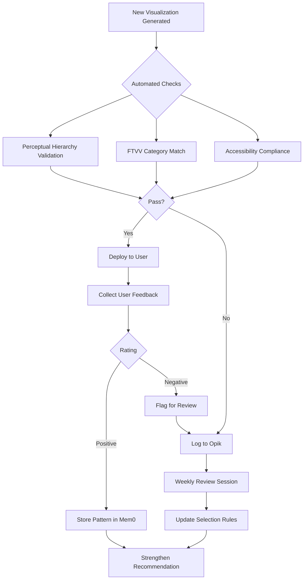

---

## 🎓 Training & Change Management

### IT Professional Onboarding Path

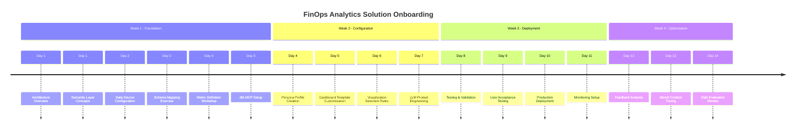

### Self-Service Configuration UI

```typescript
// Guided onboarding wizard
interface OnboardingWizard {
  steps: [
    {
      id: 'connect_datasource',
      title: 'Connect Your Cloud Cost Data',
      component: DataSourceConnector,
      aiAssist: true,
      prompt: 'Help user configure AWS/Azure/GCP cost APIs'
    },
    {
      id: 'discover_schema',
      title: 'Discover Your Data Model',
      component: SchemaDiscovery,
      aiAssist: true,
      prompt: 'Analyze schema and suggest semantic entities'
    },
    {
      id: 'define_metrics',
      title: 'Define Key Metrics',
      component: MetricBuilder,
      aiAssist: true,
      prompt: 'Suggest FinOps metrics based on schema'
    },
    {
      id: 'configure_personas',
      title: 'Set Up User Personas',
      component: PersonaConfigurator,
      aiAssist: false
    },
    {
      id: 'generate_dashboards',
      title: 'Generate Initial Dashboards',
      component: DashboardGenerator,
      aiAssist: true,
      prompt: 'Create dashboards for each persona'
    },
    {
      id: 'test_validate',
      title: 'Test & Validate',
      component: ValidationPanel,
      aiAssist: true,
      prompt: 'Verify data accuracy and visualization appropriateness'
    }
  ]
}
```

---

## 🔐 Governance & Compliance

### Data Governance Layer

```yaml
governance_policies:
  metric_approval:
    required: true
    approvers: [data_steward, domain_owner]
    process: "New metrics must pass validation before production"
    
  visualization_standards:
    enforcement: mandatory
    rules:
      - name: perceptual_accuracy
        condition: "chart_type in approved_list"
        action: block
        
      - name: accessibility
        condition: "color_contrast_ratio >= 4.5"
        action: warn
        
      - name: integrity
        condition: "y_axis_starts_at_zero == true OR deviation_noted == true"
        action: block
        
  data_access:
    row_level_security: true
    filter_by: [cost_center, region]
    policy: "Users see only their authorized scope"
    
  audit_trail:
    retention: 2_years
    logged_events:
      - visualization_generated
      - user_feedback_submitted
      - drill_down_performed
      - filter_applied
      - export_executed
```

---

## 🌟 Differentiation & Innovation

### Competitive Advantages

| Feature | Traditional BI | Agentic Analytics Solution |
|---------|----------------|---------------------------|
| **Chart Selection** | Manual, analyst-driven | Automated via FTVV + Cleveland-McGill + LLM |
| **Chart Generation** | Hard-coded configurations | Dynamic via ECharts MCP Server |
| **Semantic Layer** | Static, pre-defined | Dynamic, context-aware via dbt MCP |
| **User Guidance** | Documentation | Embedded AI copilot with memory |
| **Optimization** | Ad-hoc | Continuous via Opik + Mem0 feedback loops |
| **Onboarding** | Weeks of training | Days with LLM-guided configuration |
| **Personalization** | Role-based dashboards | Persona-adaptive visualizations |
| **Cognitive Load** | Not measured | Actively minimized via perceptual hierarchy |
| **Narrative Clarity** | Implicit | Explicitly engineered via FTVV categories |
| **Interactivity** | Limited drill-down | Full ECharts interactivity + agent-driven exploration |

### Future Roadmap

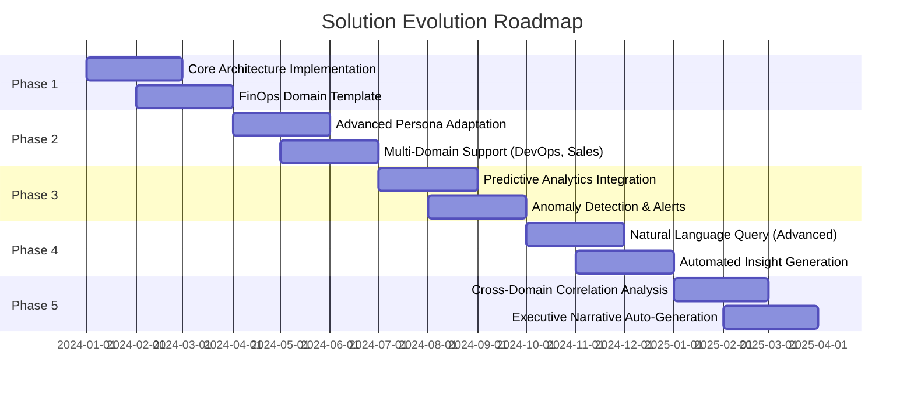

---

## 🔄 LIDA Visualization Persistence & dbt Lineage (Update Q2 2025)

To guarantee every generated visualization exposes verifiable SQL lineage, the runtime now persists dbt metadata in Postgres rather than relying on hardcoded frontend maps.

### Data Model Changes

| Table | Columns |
|-------|---------|
| `dashboards.lida_dbt_models` | `id` (PK), `name`, `description`, `path`, `sql`, `aliases` (`text[]`), `created_at`, `updated_at` |
| `dashboards.lida_visualizations` | `id`, `title`, `description`, `chart_type`, `chart_config`, `code`, `insights`, `dataset_name`, `dbt_metadata` (`jsonb`), `created_at`, `updated_at` |

- `lida_dbt_models` is seeded on startup (for bundled demo datasets) and can be extended via migrations or tooling.
- When the backend stores or retrieves a visualization it automatically hydrates `dbt_metadata` by matching `dataset_name`/aliases against `lida_dbt_models`.
- The frontend gallery renders the “dbt Model” tab directly from the persisted metadata—no static maps or duplicated definitions.

### API Surface

- `GET /lida/dbt-models` → returns the catalog (`id`, `name`, `path`, `description`, `sql`).
- `GET /lida/dbt-models/{modelId}` → single model lookup, including alias resolution.
- Visualization endpoints (`/lida/visualizations`, `/ag-ui/database` create/update) transparently upsert `dbt_metadata`.

### Frontend Responsibilities

1. Fetch dbt model catalog on mount and cache by alias (case/format insensitive).
2. Attach `dbt_metadata` when persisting visualizations (fallback to backend auto-hydration for server-side generation).
3. Render dbt lineage UI exclusively from the persisted metadata object.

This shift guarantees dbt lineage remains in sync across environments, enables future admin tooling, and eliminates the risk of stale hardcoded SQL definitions in the UI.

### Entity Relationship Overview

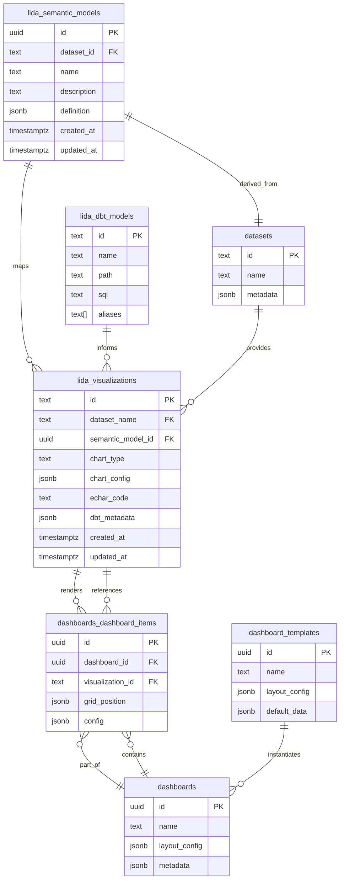

---

## 📋 Conclusion

This **Context-Aware Agentic Data Visualization Solution** represents a paradigm shift in business intelligence by:

1. **Formalizing the Art**: Applying cognitive science (Cleveland-McGill) and structured frameworks (FTVV) to ensure every visualization maximizes comprehension
2. **Automating Expertise**: Using LLM-powered agents to replicate expert-level visualization selection and narrative design
3. **Leveraging Professional Charting**: Integrating ECharts MCP Server for production-grade, interactive visualizations with enterprise features
4. **Personalizing Experience**: Adapting complexity and chart types to audience personas for optimal cognitive efficiency
5. **Enabling Continuous Improvement**: Leveraging Mem0 and Opik to learn from user behavior and optimize over time
6. **Accelerating Deployment**: Providing LLM-guided onboarding that reduces time-to-value from weeks to days

By unifying semantic layer governance with perceptually-optimized visualization selection, organizations can transform data exploration from a technical exercise into a strategic communication tool that drives decisive management action.

**Next Steps**: 
1. Deploy FinOps proof-of-concept with 3-5 pilot users
2. Collect baseline metrics (time-to-insight, action conversion rate)
3. Iterate on persona profiles based on real feedback
4. Expand to additional domains (DevOps, Sales, Marketing)

---

**Document Version**: 1.0  
**Last Updated**: 2024  
**Author**: Solution Architecture Team  
**Status**: Ready for Implementation
