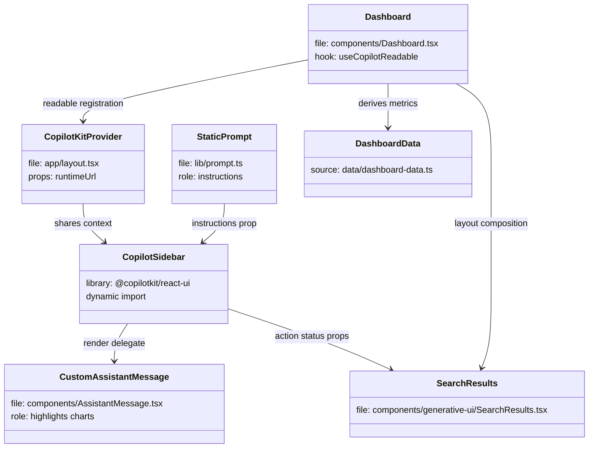
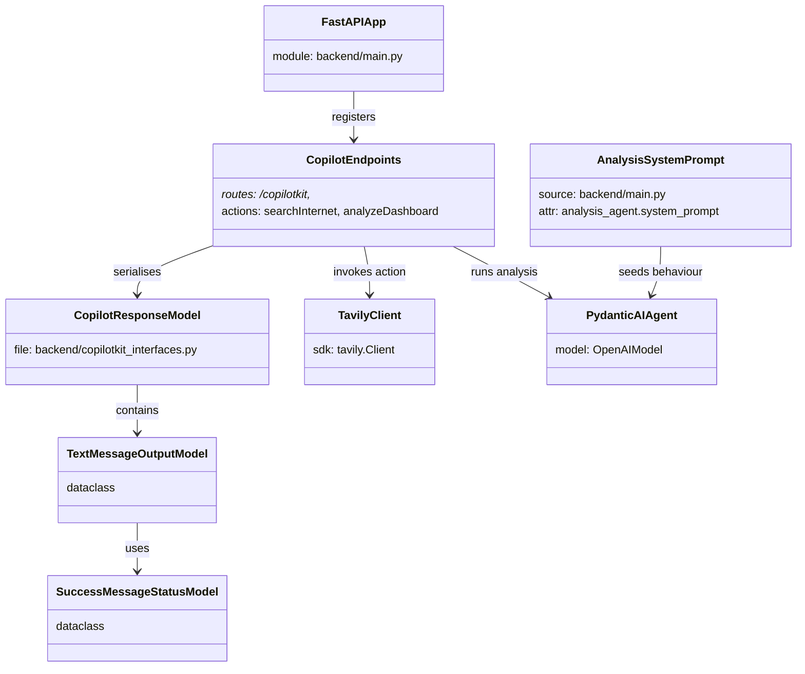
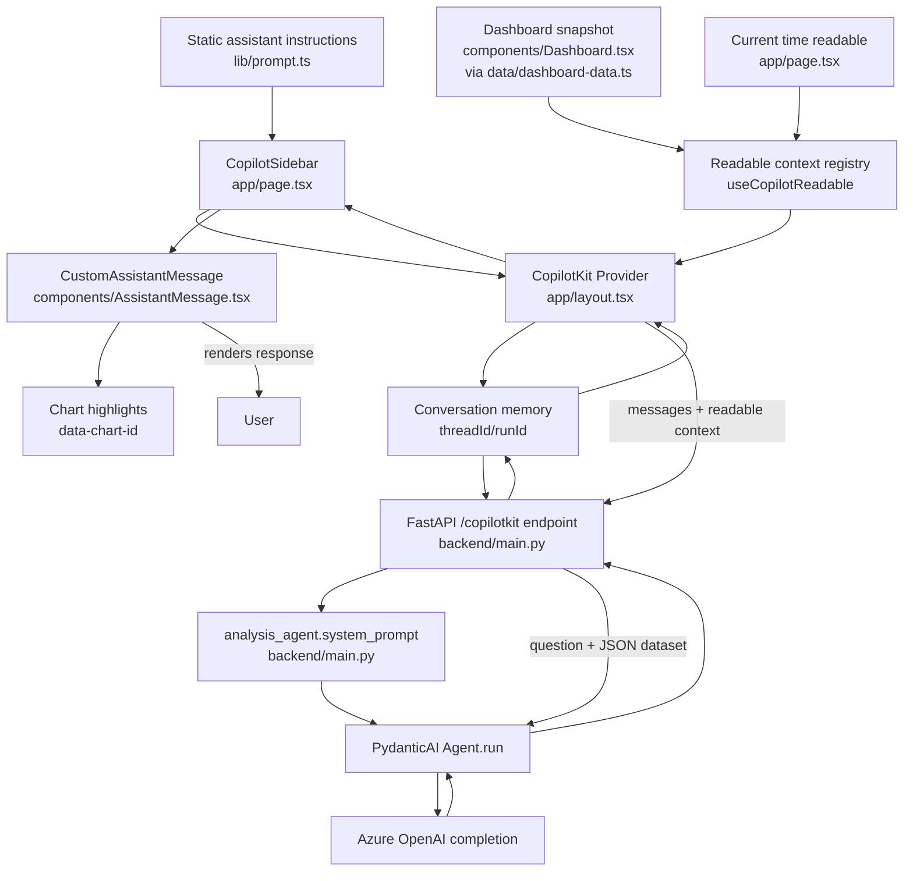
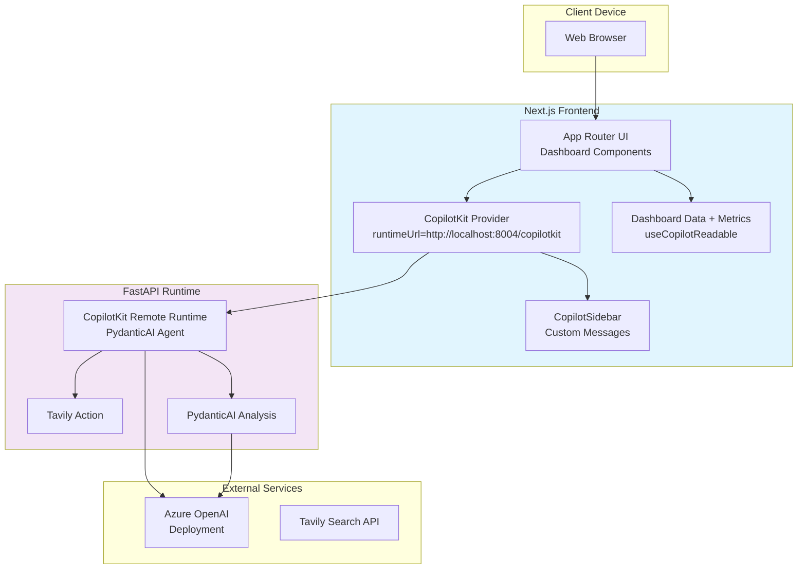
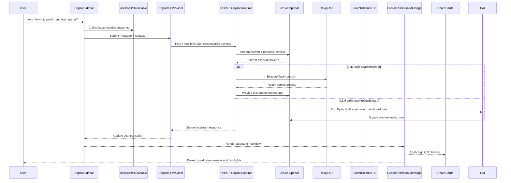

# Architecture Overview

This document describes the end-to-end architecture of the **Copilot Chat with Your Data** example application. The solution combines a Next.js 15 App Router frontend, a FastAPI backend that hosts the CopilotKit remote runtime powered by PydanticAI, and Azure OpenAI backed large language model (LLM) execution with optional Tavily web search augmentation.

## System Overview
- **Next.js frontend (`app/`, `components/`)**: Renders the dashboard and chat shell in React 19 with Tailwind utility classes and custom chart wrappers around Recharts. All user-facing components live on the client for responsive interactivity.
- **CopilotKit bridge (`app/layout.tsx`)**: Wraps the application tree in the `CopilotKit` provider, disables the dev console, and points it at `process.env.NEXT_PUBLIC_COPILOT_RUNTIME_URL` (default `http://localhost:8004/copilotkit`) so all children share a single chat session with the FastAPI runtime.
- **Chat experience (`app/page.tsx`, `components/AssistantMessage.tsx`)**: Dynamically imports the `CopilotSidebar`, injects static assistant instructions from `lib/prompt.ts`, registers a live `useCopilotReadable` for the current time, offsets the layout when the sidebar is open, and sanitizes assistant responses while triggering chart highlight animations.
- **Structured data + generative UI (`components/Dashboard.tsx`)**: Computes KPI aggregates, exposes the full dataset through `useCopilotReadable`, and registers a render-only `useCopilotAction` that drives the `SearchResults` status component so the UI reflects Tavily execution progress.
- **FastAPI Copilot runtime (`backend/main.py`)**: Serves the CopilotKit remote endpoint on `/copilotkit`, normalises allowed origins for CORS enforcement, wires Tavily search alongside a PydanticAI dashboard analysis agent seeded with an inline system prompt, and brokers all Azure OpenAI requests.
- **Runtime GraphQL models (`backend/copilotkit_interfaces.py`)**: Defines dataclasses mirroring CopilotKit's GraphQL schema so responses are serialised consistently across the runtime.
- **External AI services**: Azure OpenAI handles LLM completions for both the Copilot runtime and the PydanticAI agent; Tavily Search API provides optional real-time search augmentation when the runtime triggers the action.

## Runtime Components
- **CopilotKit Provider**: Configured in `app/layout.tsx`, establishes the connection to the FastAPI runtime, hides the dev console, and shares state between all CopilotKit hooks.
- **Dashboard + Charts**: Built from `components/Dashboard.tsx` with static datasets and helper functions in `data/dashboard-data.ts`. Derived metrics are recalculated on render so the AI always reads fresh values.
- **Copilot Sidebar**: `@copilotkit/react-ui` sidebar streamed in via dynamic import, labelled as a “Data Assistant”, seeded with the custom prompt, and extended with the `CustomAssistantMessage` renderer that strips chart directives from chat output.
- **FastAPI CopilotKit Runtime**: Hosts the CopilotKit remote endpoint, orchestrates conversations against Azure OpenAI via PydanticAI, and streams responses back to the client.
- **Runtime Actions**: `searchInternet` executes Tavily queries server-side, while `analyzeDashboard` runs a PydanticAI agent over the dashboard dataset to produce markdown insights returned in CopilotKit's GraphQL envelope.
- **External Services**: Azure OpenAI performs completion streaming and powers the PydanticAI agent; Tavily responds to internet search requests initiated by the runtime action.

## Class Diagrams

### Frontend relationship diagram

### Backend relationship diagram

## Data Flow
1. When `app/page.tsx` mounts, the dashboard loads static datasets from `data/dashboard-data.ts`, derives KPI summaries, and registers the current time readable.
2. `useCopilotReadable` serialises the datasets and metrics so CopilotKit can inject them into prompts and tool calls.
3. The user sends a message from the `CopilotSidebar`. The provider packages the message, conversation history, and readable context and posts it to the FastAPI runtime (`/copilotkit`).
4. FastAPI receives the CopilotKit request, validates the origin against the normalised allow-list, assembles the prompt, merges readable data, and streams the request to Azure OpenAI through the configured PydanticAI agent.
5. If the agent invokes `searchInternet`, the Tavily client runs server-side and its markdown output is supplied back to the LLM. Otherwise, the agent answers directly using the dashboard dataset.
6. The CopilotKit runtime streams the response back to the browser, including any action results.
7. The `CopilotSidebar` renders streamed tokens as assistant messages, the custom renderer applies chart highlights based on directives, and `SearchResults` visualises action status updates.

## Context and Prompt Flow

## Deployment View

## Sequence: Typical Chat Interaction

## Cross-Cutting Concerns
- **Configuration**: The frontend targets the FastAPI runtime via `NEXT_PUBLIC_COPILOT_RUNTIME_URL` (default `http://localhost:8004/copilotkit`). The backend requires Azure OpenAI credentials and optionally `TAVILY_API_KEY`; it validates these at startup and exposes `/health` for monitoring.
- **Security**: Secrets and Tavily credentials stay entirely within the FastAPI runtime. Requests must originate from the normalised `FRONTEND_ORIGINS` allow-list before CORS headers are set, and the frontend communicates over HTTPS without handling sensitive keys.
- **Local development**: Run `bun run dev` for Next.js (port 3000) and `uvicorn main:app --port 8004 --reload` for the FastAPI runtime. Both share the same Azure OpenAI project via environment variables.
- **Extensibility**: Extend `backend/dashboard_data.py` to enrich the PydanticAI agent context, register additional actions within the FastAPI runtime, or augment the shared dataclasses in `backend/copilotkit_interfaces.py` without altering the frontend chat interface.
- **User experience**: `CopilotKit`'s dev console stays disabled in production-style builds and the custom assistant message component owns the chart-highlighting lifecycle so UI polish remains consolidated in one place.
