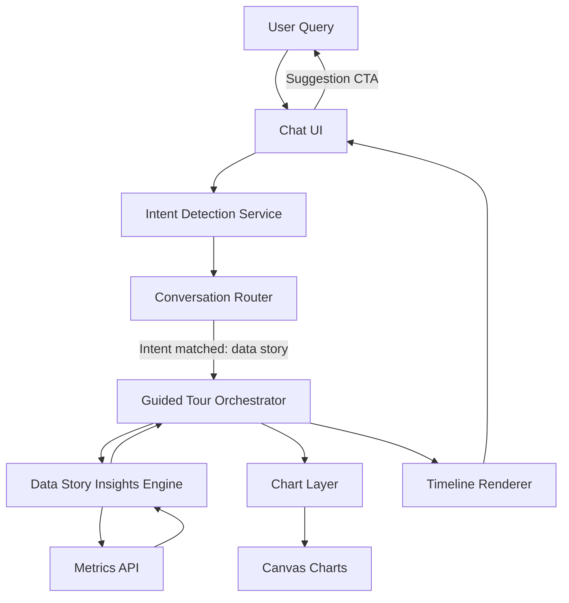
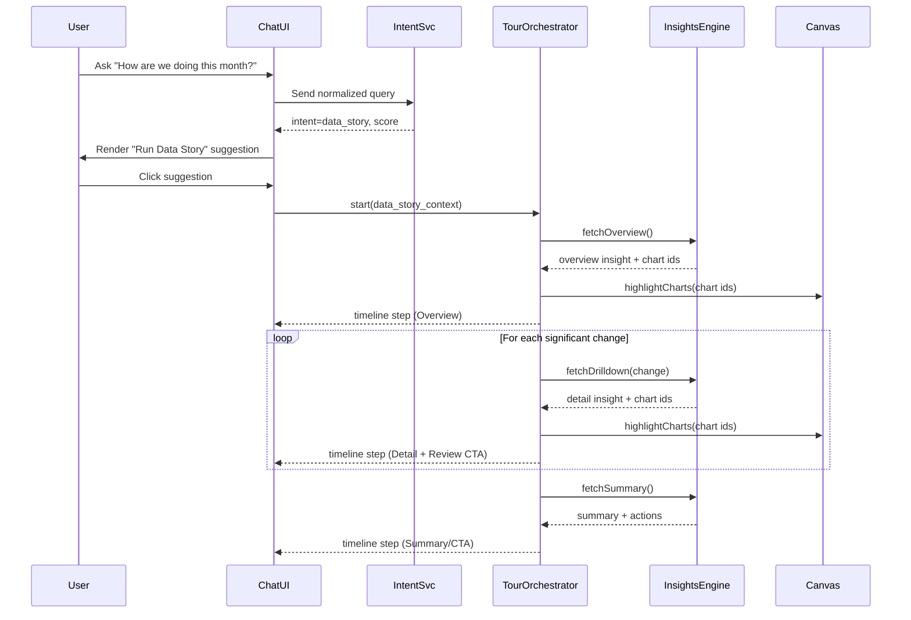

# Data Story Architecture Design

## Purpose
Define the technical approach for the "data story" guided-tour feature that surfaces contextual insights and synchronizes chart highlights with conversational timeline steps.

## Key Components
- **Intent Detection Service**: Reuses existing semantic parsing to flag queries aligned with trend analysis; emits `data_story` intents with confidence scores and context metadata.
- **Conversation Router**: Middleware inside the chat backend that inspects intents, queues suggestion messages, and orchestrates follow-up actions.
- **Guided Tour Orchestrator**: Stateful controller responsible for building the vertical timeline, sequencing requests to the insights engine, coordinating chart highlights, and merging agent-produced strategic commentary into the closing sections.
- **Strategic Commentary Adapter**: Wraps the unified strategic commentary prompt, normalises Risks/Opportunities/Recommendations output, and hands it to the orchestrator and audio services.
- **Data Story Insights Engine**: Aggregates metrics from the analytics warehouse, computes the overview/changes/summary structure, maps insights to visualizations, and accepts injected commentary for the strategic wrap-up.
- **Timeline Renderer**: Chat-side component that renders the vertical timeline blocks, attaches "Review" buttons, and maintains scroll/selection sync.
- **Chart Layer Integration**: Canvas controller capable of highlighting charts when requested and exposing review hooks for each timeline section.

## Flow Overview
1. User submits a natural-language question that reaches the Chat UI.
2. The Intent Detection Service classifies intents. When confidence crosses the threshold, the Conversation Router pushes a "Run Data Story" suggestion button into the chat.
3. Upon CTA activation, the Guided Tour Orchestrator constructs the story skeleton, requesting overview, significant change details, and summary from the Insights Engine, and in parallel triggers the Strategic Commentary Adapter using the unified prompt.
4. The adapter returns normalised markdown sections which are appended to the skeleton before rendering the "Strategic commentary" timeline blocks and feeding the audio summariser.
5. Each section returned includes chart identifiers, highlight metadata, and optional follow-up prompts that the Timeline Renderer displays.
6. Timeline steps emit highlight commands to the chart layer and embed "Review" actions that replay those highlights without recomputing insights.

## Data Contracts
- `IntentResult`: `{ intent: "data_story", score: number, dimensions: string[], timeframe: DateRange }`
- `StrategicCommentary`: `{ markdown: string, risks: string[], opportunities: string[], recommendations: string[] }`
- `StoryStep`: `{ id: string, type: "overview" | "change" | "summary", text: string, chartIds: string[], highlight: HighlightSpec, reviewPrompt?: string }`
- `HighlightSpec`: `{ mode: "focus" | "pulse", durationMs: number, relatedElements: string[] }`

## Orchestration Logic
- The orchestrator maintains a finite state machine with phases `idle`, `loading_overview`, `loading_changes`, and `completed` to synchronize chat updates and chart highlights.
- React Query (frontend) or server actions (backend) stream timeline steps as soon as they are ready; fallback to incremental SSR if streaming is unavailable.
- Debounce highlight commands to avoid rapid flicker when multiple charts share the same step.

## Guided Tour Experience
- Timeline sections render sequentially with a vertical progress indicator; new sections slide in to emphasize storytelling.
- "Review" button dispatches a `replayHighlight(stepId)` event that re-triggers the chart highlight without touching the data providers.
- Canvas overlay displays the currently active insight summary to keep visual and textual narratives aligned.

## Dependencies & Integrations
- Requires chart metadata service to map chart IDs to DOM nodes or overlay API endpoints.
- Leverages existing analytics API but extends it with endpoints for overview, significant-changes, and summary segments.
- Uses Socket/Server-Sent Events channel already available for progressive chat updates.

## Open Questions
- Confidence threshold tuning for auto-surfacing the suggestion CTA.
- Pagination and performance when significant changes produce a long list of drill-down sections.
- Internationalization of templated call-to-action phrases in timeline steps.
