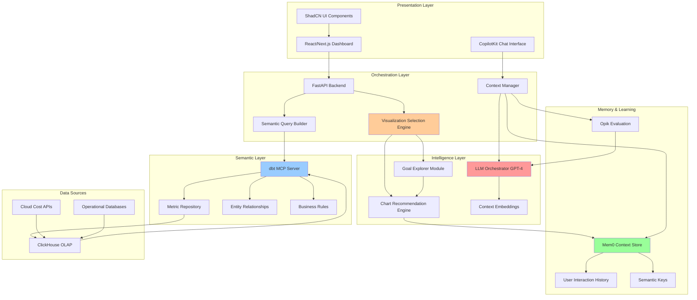
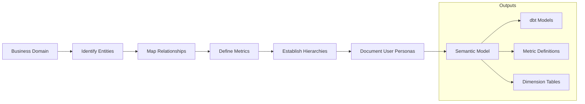
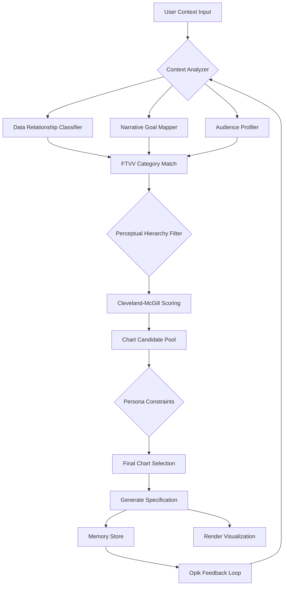
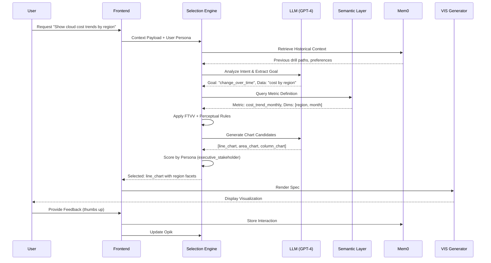
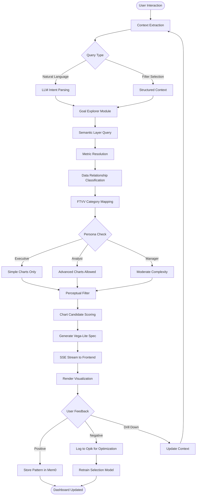
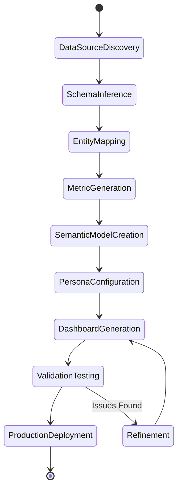
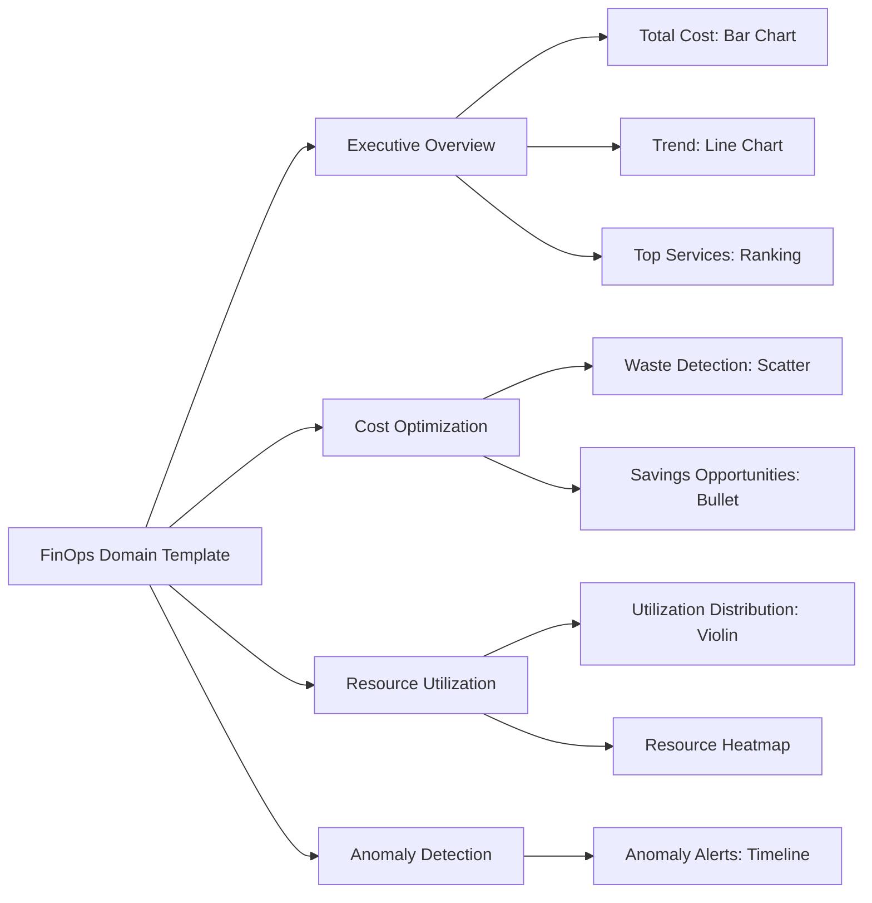
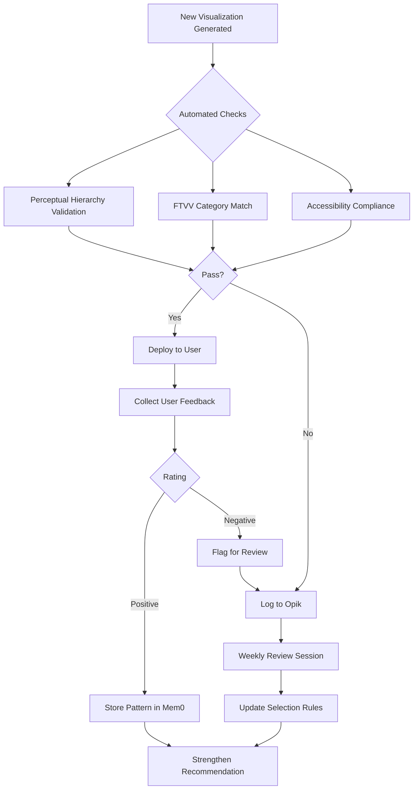
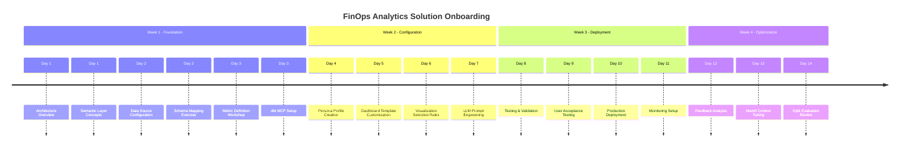
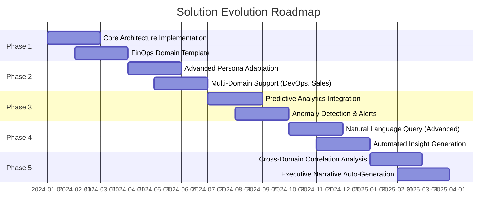

User: fileNode to-be-arch.md
User: fileNode Selecting_Visualizations_for_Data_Stories.md
User:  study these two doc thourouly , and relfect on it, then propose a data visualization design porcess which will maximum communication efficiency and effectiveness to the target audience, and drive the acions in next management. the process start with understanding data, metrics, audience and business goal, through building a semantic layout data model on business,data and user persona, then based on the understanding to dynamicly suggest visualizations to create a dashboard on each business domain and operational topic. Aslo leverage LLM and context engineering to guide the IT pro to onboarding the solution by config data sources and setup in order to make the solution works for a specific analytic domain such as cloud FinOps. output a solution proposal in md, with mermaid charts to clarify architecture and workflows.
Model: # 🎯 Context-Aware Agentic Data Visualization Solution

## Executive Summary

This solution synthesizes **cognitive science-driven visualization governance** with **agentic semantic analytics** to deliver a self-configuring, context-aware BI platform. By combining structured visualization selection frameworks (FTVV, Cleveland-McGill hierarchy) with LLM-powered semantic understanding, the system automatically generates optimized dashboards that maximize comprehension and drive decisive management action.

**Core Innovation**: A semantic-first approach that maps business context → data relationships → narrative goals → perceptually-optimized visualizations, powered by an agentic layer that learns from user behavior and feedback.

---

## 🧭 Design Philosophy & Principles

### 1. **Cognitive Efficiency First**
- Leverage Cleveland-McGill perceptual hierarchy (position > length > angle > area)
- Minimize cognitive load through pre-attentive attributes (color, size)
- Prioritize actionable insights over aesthetic novelty

### 2. **Semantic Governance**
- Business logic encoded in dbt semantic layer
- Metric definitions as single source of truth
- Context-aware query translation

### 3. **Audience-Centric Adaptation**
- Technical sophistication assessment
- Domain expertise profiling
- Accessibility requirements mapping

### 4. **Continuous Optimization**
- Human-in-the-loop feedback (Opik)
- Memory-based context recall (Mem0)
- Prompt and visualization pattern refinement

---

## 🏗️ Solution Architecture



---

## 📊 Semantic Layer Design Process

### Phase 1: Business Context Modeling



#### 1.1 Entity & Relationship Mapping

```yaml
domain: cloud_finops
entities:
  - name: cloud_resource
    attributes:
      - resource_id
      - resource_type
      - service_name
      - region
      - tags
      
  - name: cost_allocation
    attributes:
      - cost_center
      - project_id
      - team
      - environment
      
  - name: usage_metrics
    attributes:
      - cpu_hours
      - storage_gb
      - network_gb
      - api_calls

relationships:
  - type: one_to_many
    from: cost_allocation
    to: cloud_resource
    
  - type: one_to_many
    from: cloud_resource
    to: usage_metrics
```

#### 1.2 Metric Repository Definition

```yaml
metrics:
  - name: total_cloud_cost
    type: sum
    sql: "SUM(cost_amount)"
    dimensions: [cost_center, region, service]
    narrative_goal: magnitude_comparison
    recommended_chart: bar_chart
    
  - name: cost_trend_monthly
    type: time_series
    sql: "SUM(cost_amount) OVER (ORDER BY month)"
    dimensions: [month]
    narrative_goal: change_over_time
    recommended_chart: line_chart
    
  - name: cost_variance
    type: deviation
    sql: "(actual_cost - budgeted_cost) / budgeted_cost"
    dimensions: [cost_center]
    narrative_goal: deviation
    recommended_chart: bullet_chart
    
  - name: resource_utilization_distribution
    type: distribution
    sql: "cpu_utilization_percent"
    dimensions: [resource_type]
    narrative_goal: distribution
    recommended_chart: violin_plot
```

#### 1.3 User Persona Profiles

```yaml
personas:
  - name: executive_stakeholder
    technical_level: low
    domain_expertise: high
    preferred_complexity: simple
    attention_span: short
    chart_preferences:
      - bullet_chart
      - bar_chart
      - line_chart
    cognitive_load_threshold: low
    
  - name: finops_analyst
    technical_level: high
    domain_expertise: high
    preferred_complexity: advanced
    attention_span: extended
    chart_preferences:
      - scatter_plot
      - violin_plot
      - heatmap
      - sankey_diagram
    cognitive_load_threshold: high
    
  - name: engineering_manager
    technical_level: medium
    domain_expertise: medium
    preferred_complexity: moderate
    attention_span: medium
    chart_preferences:
      - column_chart
      - dumbbell_chart
      - stacked_bar
    cognitive_load_threshold: medium
```

---

## 🎨 Visualization Selection Engine

### Architecture Components



### Selection Algorithm Workflow



### Decision Matrix Implementation

```python
# Pseudo-code for Visualization Selection Engine
class VisualizationSelector:
    def __init__(self, semantic_layer, llm, memory, persona_db):
        self.semantic_layer = semantic_layer
        self.llm = llm
        self.memory = memory
        self.persona_db = persona_db
        self.ftvv_categories = self.load_ftvv_taxonomy()
        self.perceptual_hierarchy = self.load_cleveland_mcgill()
        
    def select_visualization(self, context_payload, user_persona):
        # Step 1: Extract Intent & Data Relationship
        intent = self.llm.analyze_intent(context_payload)
        data_relationship = self.classify_relationship(intent)
        
        # Step 2: Map to FTVV Narrative Goal
        narrative_goal = self.map_to_ftvv(data_relationship, intent)
        
        # Step 3: Query Semantic Layer for Metric Definition
        metric_def = self.semantic_layer.get_metric(intent.metric_name)
        
        # Step 4: Generate Chart Candidates
        candidates = self.get_chart_candidates(
            narrative_goal, 
            metric_def.recommended_chart
        )
        
        # Step 5: Score by Perceptual Hierarchy
        scored_candidates = []
        for chart in candidates:
            perceptual_score = self.perceptual_hierarchy.score(chart)
            persona_compatibility = self.persona_db.compatibility(
                chart, user_persona
            )
            context_relevance = self.memory.relevance_score(
                chart, context_payload
            )
            
            total_score = (
                0.4 * perceptual_score +
                0.3 * persona_compatibility +
                0.3 * context_relevance
            )
            scored_candidates.append((chart, total_score))
        
        # Step 6: Select Optimal Chart
        optimal_chart = max(scored_candidates, key=lambda x: x[1])
        
        # Step 7: Generate Specification
        spec = self.generate_vega_lite_spec(
            optimal_chart[0], 
            metric_def, 
            context_payload
        )
        
        # Step 8: Store in Memory
        self.memory.store({
            'context': context_payload,
            'chart_type': optimal_chart[0],
            'narrative_goal': narrative_goal,
            'user_persona': user_persona
        })
        
        return spec
    
    def classify_relationship(self, intent):
        """Map to: comparison, distribution, relationship, change_over_time"""
        prompt = f"""
        Based on this query intent: {intent.query}
        Classify the primary data relationship:
        1. comparison - comparing categories or groups
        2. distribution - showing spread across ranges
        3. relationship - correlation between variables
        4. change_over_time - temporal trends
        5. composition - part-to-whole breakdown
        
        Return only the classification.
        """
        return self.llm.classify(prompt)
    
    def map_to_ftvv(self, data_relationship, intent):
        """Map to FTVV's 9 categories"""
        mapping = {
            'comparison': ['magnitude', 'ranking'],
            'distribution': ['distribution'],
            'relationship': ['correlation'],
            'change_over_time': ['change_over_time'],
            'composition': ['part_to_whole']
        }
        # Use LLM to refine based on intent nuances
        candidates = mapping.get(data_relationship, [])
        return self.llm.select_narrative_goal(candidates, intent)
```

---

## 🔄 End-to-End Implementation Workflow



---

## 🚀 Domain Onboarding Process: Cloud FinOps Example

### Onboarding Workflow



### Step-by-Step Configuration

#### Step 1: Data Source Connection

```yaml
# config/finops_datasource.yaml
datasources:
  - name: aws_cost_explorer
    type: api
    connection:
      endpoint: "https://ce.amazonaws.com"
      auth: aws_iam
      refresh_interval: daily
    schema_mapping:
      cost_table: aws_cost_usage
      dimensions: [service, region, account_id, resource_id]
      
  - name: azure_cost_management
    type: api
    connection:
      endpoint: "https://management.azure.com/cost"
      auth: azure_ad
      refresh_interval: daily
    schema_mapping:
      cost_table: azure_consumption
      dimensions: [subscription, resource_group, meter_category]
      
  - name: gcp_billing
    type: bigquery
    connection:
      project: billing-export
      dataset: cloud_costs
    schema_mapping:
      cost_table: gcp_billing_export
      dimensions: [project, service, sku, location]
```

#### Step 2: LLM-Guided Schema Inference

```python
# Automated schema analysis
class FinOpsOnboardingAgent:
    def infer_semantic_model(self, datasource_config):
        """LLM analyzes raw schema and suggests semantic entities"""
        
        # 1. Extract sample data
        sample_data = self.datasource.get_sample(limit=1000)
        schema_info = self.datasource.get_schema()
        
        # 2. LLM analyzes and suggests entities
        prompt = f"""
        You are a FinOps domain expert. Analyze this schema:
        
        Tables: {schema_info.tables}
        Columns: {schema_info.columns}
        Sample Data: {sample_data.head()}
        
        Suggest:
        1. Business entities (e.g., Resource, CostCenter, Service)
        2. Natural hierarchies (e.g., Account > Project > Resource)
        3. Key metrics to track (e.g., TotalCost, CostPerUnit, Utilization)
        4. Relevant dimensions for analysis
        5. Common drill paths for FinOps analysis
        
        Return as YAML semantic model definition.
        """
        
        semantic_model = self.llm.generate(prompt)
        
        # 3. Validate against FinOps best practices
        validated_model = self.validate_finops_model(semantic_model)
        
        return validated_model
    
    def generate_metric_definitions(self, semantic_model):
        """Create dbt metric definitions"""
        
        metrics = []
        for entity in semantic_model.entities:
            # Standard FinOps metrics per entity
            if entity.type == "cost":
                metrics.extend([
                    {
                        'name': f'{entity.name}_total',
                        'type': 'sum',
                        'narrative_goal': 'magnitude',
                        'chart': 'bar_chart'
                    },
                    {
                        'name': f'{entity.name}_trend',
                        'type': 'time_series',
                        'narrative_goal': 'change_over_time',
                        'chart': 'line_chart'
                    },
                    {
                        'name': f'{entity.name}_variance',
                        'type': 'deviation',
                        'narrative_goal': 'deviation',
                        'chart': 'bullet_chart'
                    }
                ])
        
        return self.generate_dbt_yaml(metrics)
```

#### Step 3: Dashboard Template Generation



#### Step 4: Generated Dashboard Configuration

```yaml
# auto-generated: finops_executive_dashboard.yaml
dashboard:
  name: "Cloud FinOps Executive Overview"
  persona: executive_stakeholder
  refresh_rate: daily
  
  sections:
    - name: cost_summary
      layout: grid_2x2
      widgets:
        - type: kpi_card
          metric: total_cloud_cost
          comparison: month_over_month
          
        - type: visualization
          metric: cost_trend_monthly
          chart_type: line_chart
          dimensions: [month]
          narrative_goal: change_over_time
          config:
            show_grid: false
            smooth_line: true
            highlight_current_month: true
            
        - type: visualization
          metric: cost_by_service_top10
          chart_type: bar_chart
          dimensions: [service_name]
          narrative_goal: ranking
          config:
            sort: descending
            color_scale: blues
            show_values: true
            
        - type: visualization
          metric: budget_variance
          chart_type: bullet_chart
          dimensions: [cost_center]
          narrative_goal: deviation
          config:
            threshold_ranges: [0.8, 1.0, 1.2]
            target_line: 1.0
            
    - name: optimization_opportunities
      layout: single_column
      widgets:
        - type: visualization
          metric: resource_utilization_vs_cost
          chart_type: scatter_plot
          dimensions: [resource_id, utilization_percent, cost]
          narrative_goal: relationship
          config:
            quadrant_lines: true
            quadrant_labels:
              - "Underutilized & Expensive"
              - "Right-sized"
            size_encoding: cost
            color_encoding: resource_type
            
  filters:
    - dimension: date_range
      default: last_30_days
      options: [last_7_days, last_30_days, last_90_days, custom]
      
    - dimension: cloud_provider
      default: all
      multi_select: true
      
    - dimension: cost_center
      default: all
      cascading: true
      
  drill_paths:
    - from: cost_by_service
      to: cost_by_region
      context_preserved: true
      
    - from: cost_by_region
      to: cost_by_resource
      context_preserved: true
```

#### Step 5: Context-Aware Suggestion System

```python
class ContextAwareSuggestionEngine:
    """Leverages Mem0 to suggest next analysis steps"""
    
    def suggest_next_view(self, current_context, user_history):
        # Retrieve similar past sessions
        similar_sessions = self.mem0.search(
            query=current_context.semantic_key,
            filter={'user_persona': current_context.persona},
            limit=5
        )
        
        # Analyze common drill paths
        common_paths = self.analyze_drill_patterns(similar_sessions)
        
        # LLM generates contextual suggestions
        prompt = f"""
        User is currently viewing: {current_context.current_view}
        Filters applied: {current_context.filters}
        Notable insight: {current_context.insight}
        
        Based on FinOps best practices and this user's history, suggest 3 logical next analyses.
        For each suggestion provide:
        1. Analysis name
        2. Rationale (why this is relevant now)
        3. Recommended visualization type
        """
        
        suggestions = self.llm.generate_suggestions(prompt)
        
        return [
            {
                'title': sug.name,
                'rationale': sug.rationale,
                'action': self.create_navigation_action(sug),
                'chart_preview': self.generate_preview_thumbnail(sug)
            }
            for sug in suggestions
        ]
```

---

## 🛠️ Technical Implementation Stack

### Backend Service Layer

```python
# main.py - FastAPI Implementation
from fastapi import FastAPI, WebSocket
from fastapi.responses import StreamingResponse
from pydantic import BaseModel
import asyncio

app = FastAPI(title="Agentic Analytics API")

class AnalyticsContext(BaseModel):
    user_id: str
    persona: str
    filters: dict
    dimensions: list[str]
    metrics: list[str]
    drill_path: list[str]
    query: str | None

@app.post("/api/v1/analyze")
async def analyze(context: AnalyticsContext):
    """Generate visualization based on context"""
    
    # 1. Retrieve user context from Mem0
    historical_context = await mem0_client.get_context(
        user_id=context.user_id,
        semantic_key=generate_semantic_key(context)
    )
    
    # 2. Parse intent via LLM if natural language query
    if context.query:
        intent = await llm_orchestrator.parse_intent(
            query=context.query,
            context=historical_context
        )
        context.metrics = intent.metrics
        context.dimensions = intent.dimensions
    
    # 3. Select optimal visualization
    viz_selector = VisualizationSelector(
        semantic_layer=dbt_mcp_client,
        llm=llm_orchestrator,
        memory=mem0_client,
        persona_db=persona_repository
    )
    
    viz_spec = await viz_selector.select_visualization(
        context_payload=context,
        user_persona=context.persona
    )
    
    # 4. Execute query via semantic layer
    query_result = await dbt_mcp_client.execute_query(
        metric=context.metrics[0],
        dimensions=context.dimensions,
        filters=context.filters
    )
    
    # 5. Generate final specification
    final_spec = {
        'chart_type': viz_spec.chart_type,
        'data': query_result.data,
        'config': viz_spec.config,
        'narrative_goal': viz_spec.narrative_goal,
        'insight_summary': await generate_insight_summary(query_result)
    }
    
    # 6. Store interaction in Mem0
    await mem0_client.store_interaction(
        user_id=context.user_id,
        context=context,
        result=final_spec
    )
    
    return final_spec

@app.websocket("/ws/stream-analysis")
async def stream_analysis(websocket: WebSocket):
    """SSE streaming for progressive results"""
    await websocket.accept()
    
    try:
        while True:
            context_json = await websocket.receive_text()
            context = AnalyticsContext.parse_raw(context_json)
            
            # Stream progressive results
            async for update in progressive_analysis(context):
                await websocket.send_json({
                    'type': update.type,
                    'data': update.data,
                    'progress': update.progress
                })
                
    except Exception as e:
        await websocket.close()

async def progressive_analysis(context):
    """Yield incremental results"""
    yield {'type': 'status', 'data': 'Analyzing intent...', 'progress': 0.1}
    
    intent = await llm_orchestrator.parse_intent(context.query)
    yield {'type': 'intent', 'data': intent, 'progress': 0.3}
    
    yield {'type': 'status', 'data': 'Querying semantic layer...', 'progress': 0.5}
    
    data = await dbt_mcp_client.execute_query(intent)
    yield {'type': 'data', 'data': data, 'progress': 0.7}
    
    yield {'type': 'status', 'data': 'Selecting optimal visualization...', 'progress': 0.8}
    
    viz_spec = await select_visualization(context, data)
    yield {'type': 'visualization', 'data': viz_spec, 'progress': 1.0}
```

### Frontend Integration

```typescript
// hooks/useAgenticAnalytics.ts
import { useCopilotAction, useCopilotReadable } from '@copilotkit/react-core';

export function useAgenticAnalytics() {
  const [context, setContext] = useState<AnalyticsContext>({
    filters: {},
    dimensions: [],
    metrics: [],
    drillPath: []
  });

  // Make context readable to CopilotKit
  useCopilotReadable({
    description: 'Current analytics context including filters, metrics, and drill path',
    value: context
  });

  // Define actions for the agent
  useCopilotAction({
    name: 'analyzeData',
    description: 'Generate visualization based on user request',
    parameters: [
      {
        name: 'query',
        type: 'string',
        description: 'Natural language query'
      }
    ],
    handler: async ({ query }) => {
      const response = await fetch('/api/v1/analyze', {
        method: 'POST',
        body: JSON.stringify({
          ...context,
          query
        })
      });
      
      const vizSpec = await response.json();
      return vizSpec;
    }
  });

  useCopilotAction({
    name: 'drillDown',
    description: 'Drill into specific dimension',
    parameters: [
      {
        name: 'dimension',
        type: 'string'
      },
      {
        name: 'value',
        type: 'string'
      }
    ],
    handler: async ({ dimension, value }) => {
      const newContext = {
        ...context,
        filters: {
          ...context.filters,
          [dimension]: value
        },
        drillPath: [...context.drillPath, { dimension, value }]
      };
      
      setContext(newContext);
      
      // Trigger re-analysis
      return analyzeWithContext(newContext);
    }
  });

  return {
    context,
    setContext,
    analyzeData,
    drillDown
  };
}
```

```typescript
// components/AgenticDashboard.tsx
import { CopilotKit } from '@copilotkit/react-core';
import { CopilotSidebar } from '@copilotkit/react-ui';

export function AgenticDashboard() {
  const { context, analyzeData } = useAgenticAnalytics();
  const [visualizations, setVisualizations] = useState([]);

  return (
    <CopilotKit runtimeUrl="/api/copilotkit">
      <div className="dashboard-layout">
        <header>
          <FilterBar 
            filters={context.filters}
            onChange={(filters) => updateContext({ filters })}
          />
        </header>
        
        <main className="visualization-grid">
          {visualizations.map((viz) => (
            <VisualizationCard
              key={viz.id}
              spec={viz.spec}
              data={viz.data}
              onDrillDown={(dim, val) => drillDown(dim, val)}
              onFeedback={(rating) => submitFeedback(viz.id, rating)}
            />
          ))}
        </main>
        
        <CopilotSidebar
          instructions={`
            You are a FinOps analytics assistant. Help users:
            1. Explore cloud cost data
            2. Identify optimization opportunities
            3. Generate relevant visualizations
            4. Explain insights in business terms
            
            Current context: ${JSON.stringify(context)}
          `}
          defaultOpen={true}
          labels={{
            title: "FinOps Assistant",
            initial: "Ask me about your cloud costs..."
          }}
        />
      </div>
    </CopilotKit>
  );
}
```

---

## 📈 Success Metrics & Validation

### Quantitative KPIs

```yaml
performance_metrics:
  - name: time_to_insight
    target: "< 3 seconds"
    measurement: "First visualization render time"
    
  - name: query_accuracy
    target: "> 95%"
    measurement: "Semantic layer query match rate"
    
  - name: visualization_appropriateness
    target: "> 90%"
    measurement: "User approval rating via Opik"
    
  - name: cognitive_load_score
    target: "< 2.5 / 5"
    measurement: "User-reported comprehension effort"
    
  - name: action_conversion_rate
    target: "> 70%"
    measurement: "% of views leading to business decision"

quality_metrics:
  - name: perceptual_accuracy
    calculation: "Cleveland-McGill score of selected charts"
    target: "Position/Length encoding > 80% of time"
    
  - name: persona_alignment
    calculation: "Chart complexity vs. user technical level"
    target: "100% compliance with persona constraints"
    
  - name: narrative_clarity
    calculation: "FTVV category match with user intent"
    target: "> 92%"
```

### Qualitative Validation Process



---

## 🎓 Training & Change Management

### IT Professional Onboarding Path



### Self-Service Configuration UI

```typescript
// Guided onboarding wizard
interface OnboardingWizard {
  steps: [
    {
      id: 'connect_datasource',
      title: 'Connect Your Cloud Cost Data',
      component: DataSourceConnector,
      aiAssist: true,
      prompt: 'Help user configure AWS/Azure/GCP cost APIs'
    },
    {
      id: 'discover_schema',
      title: 'Discover Your Data Model',
      component: SchemaDiscovery,
      aiAssist: true,
      prompt: 'Analyze schema and suggest semantic entities'
    },
    {
      id: 'define_metrics',
      title: 'Define Key Metrics',
      component: MetricBuilder,
      aiAssist: true,
      prompt: 'Suggest FinOps metrics based on schema'
    },
    {
      id: 'configure_personas',
      title: 'Set Up User Personas',
      component: PersonaConfigurator,
      aiAssist: false
    },
    {
      id: 'generate_dashboards',
      title: 'Generate Initial Dashboards',
      component: DashboardGenerator,
      aiAssist: true,
      prompt: 'Create dashboards for each persona'
    },
    {
      id: 'test_validate',
      title: 'Test & Validate',
      component: ValidationPanel,
      aiAssist: true,
      prompt: 'Verify data accuracy and visualization appropriateness'
    }
  ]
}
```

---

## 🔐 Governance & Compliance

### Data Governance Layer

```yaml
governance_policies:
  metric_approval:
    required: true
    approvers: [data_steward, domain_owner]
    process: "New metrics must pass validation before production"
    
  visualization_standards:
    enforcement: mandatory
    rules:
      - name: perceptual_accuracy
        condition: "chart_type in approved_list"
        action: block
        
      - name: accessibility
        condition: "color_contrast_ratio >= 4.5"
        action: warn
        
      - name: integrity
        condition: "y_axis_starts_at_zero == true OR deviation_noted == true"
        action: block
        
  data_access:
    row_level_security: true
    filter_by: [cost_center, region]
    policy: "Users see only their authorized scope"
    
  audit_trail:
    retention: 2_years
    logged_events:
      - visualization_generated
      - user_feedback_submitted
      - drill_down_performed
      - filter_applied
      - export_executed
```

---

## 🌟 Differentiation & Innovation

### Competitive Advantages

| Feature | Traditional BI | Agentic Analytics Solution |
|---------|----------------|---------------------------|
| **Chart Selection** | Manual, analyst-driven | Automated via FTVV + Cleveland-McGill + LLM |
| **Semantic Layer** | Static, pre-defined | Dynamic, context-aware via dbt MCP |
| **User Guidance** | Documentation | Embedded AI copilot with memory |
| **Optimization** | Ad-hoc | Continuous via Opik + Mem0 feedback loops |
| **Onboarding** | Weeks of training | Days with LLM-guided configuration |
| **Personalization** | Role-based dashboards | Persona-adaptive visualizations |
| **Cognitive Load** | Not measured | Actively minimized via perceptual hierarchy |
| **Narrative Clarity** | Implicit | Explicitly engineered via FTVV categories |

### Future Roadmap



---

## 📋 Conclusion

This **Context-Aware Agentic Data Visualization Solution** represents a paradigm shift in business intelligence by:

1. **Formalizing the Art**: Applying cognitive science (Cleveland-McGill) and structured frameworks (FTVV) to ensure every visualization maximizes comprehension
2. **Automating Expertise**: Using LLM-powered agents to replicate expert-level visualization selection and narrative design
3. **Personalizing Experience**: Adapting complexity and chart types to audience personas for optimal cognitive efficiency
4. **Enabling Continuous Improvement**: Leveraging Mem0 and Opik to learn from user behavior and optimize over time
5. **Accelerating Deployment**: Providing LLM-guided onboarding that reduces time-to-value from weeks to days

By unifying semantic layer governance with perceptually-optimized visualization selection, organizations can transform data exploration from a technical exercise into a strategic communication tool that drives decisive management action.

**Next Steps**: 
1. Deploy FinOps proof-of-concept with 3-5 pilot users
2. Collect baseline metrics (time-to-insight, action conversion rate)
3. Iterate on persona profiles based on real feedback
4. Expand to additional domains (DevOps, Sales, Marketing)

---

**Document Version**: 1.0  
**Last Updated**: 2024  
**Author**: Solution Architecture Team  
**Status**: Ready for Implementation
