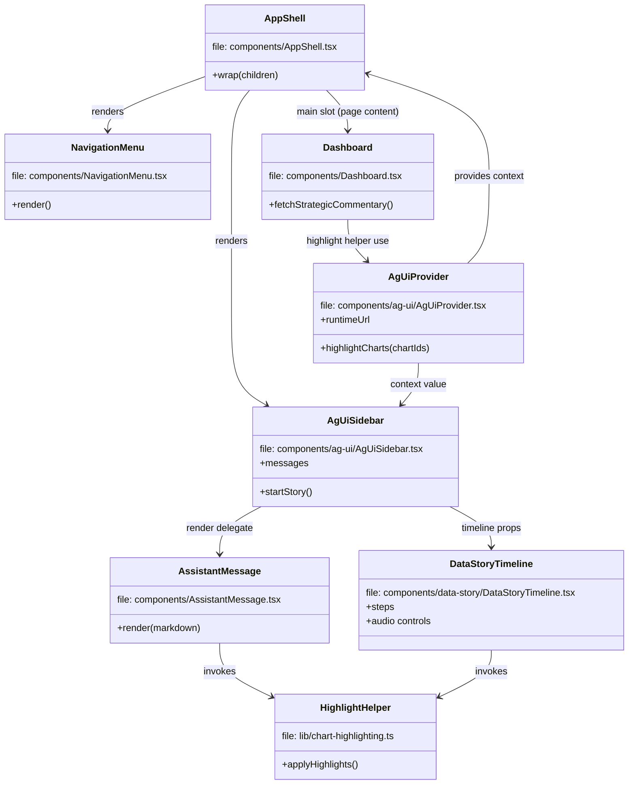
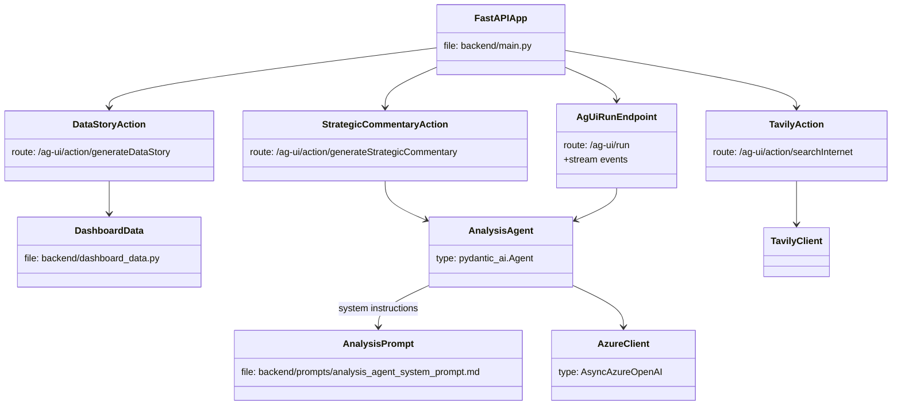
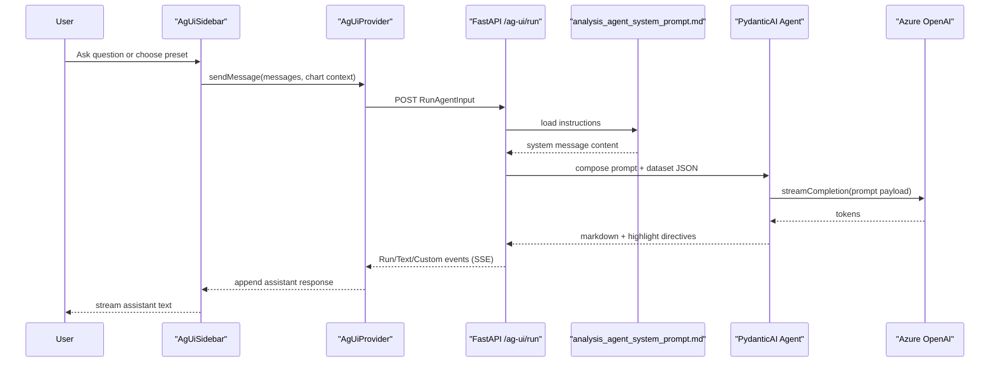
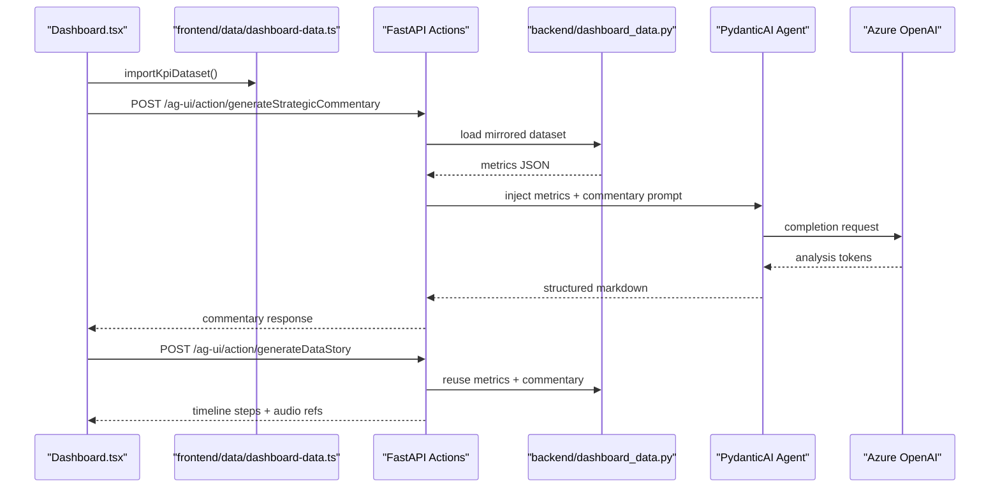
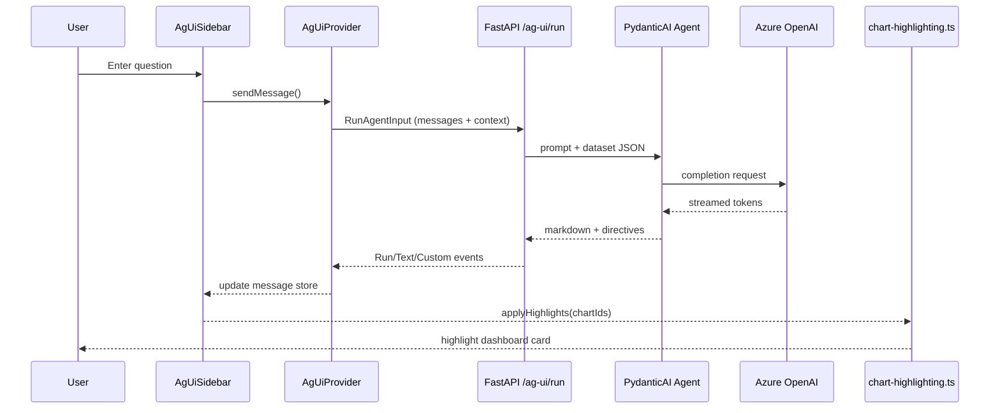
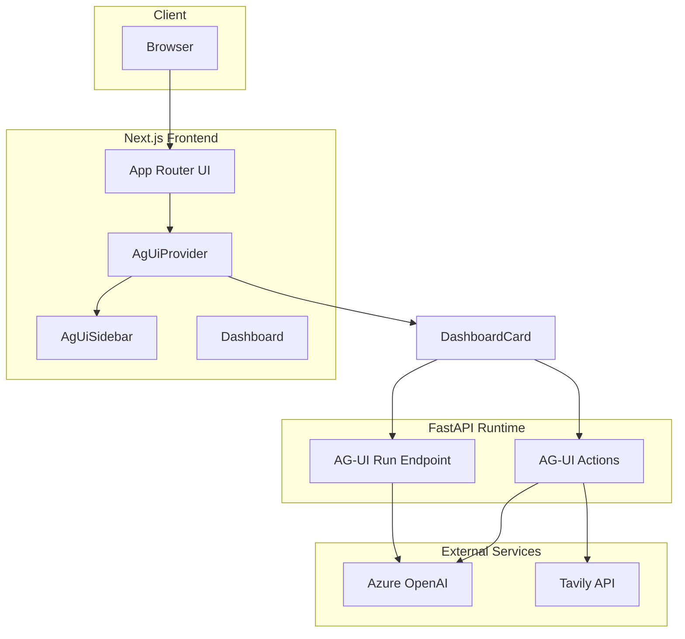

# Technical Design Specification — Chat with Your Data (AG‑UI Architecture)

This consolidated specification captures the system design, architecture, and implementation details for the **Chat with Your Data** experience. It supersedes the prior separate architecture and technical design documents.

## 1. Product Overview
- **Purpose** – Deliver a dashboard-style web app where users analyse SaaS KPIs with an AI assistant that can explain trends, highlight charts, and synthesise strategic commentary.
- **Core Outcomes**
  1. Render deterministic KPI cards and charts for a fictional SaaS business.
  2. Answer natural-language questions via the AG‑UI protocol, streaming assistant responses and highlight directives.
  3. Provide data-story timelines and an automatic “Strategic Commentary” summary (risks, opportunities, recommendations) generated by the backend.
- **Primary Users** – Analysts, stakeholders, and developers exploring AG‑UI integrations.

## 2. Architecture Overview
- **Protocol Choice** – The app communicates exclusively through the AG‑UI protocol (`/ag-ui/run`, `/ag-ui/action/*`). CopilotKit SDK clients are deprecated.
- **Frontend** – Next.js 15 (App Router) with React 19 client components, Tailwind + shadcn styling, and Recharts wrappers.
- **AG‑UI Bridge** – `AgUiProvider` instantiates an `HttpAgent`, connects to `NEXT_PUBLIC_AG_UI_RUNTIME_URL` (default `http://localhost:8004/ag-ui/run`), and shares chat state across the tree.
- **Chat Surface** – `AgUiSidebar` streams assistance, renders markdown via `AssistantMessage`, and dispatches highlight events through `lib/chart-highlighting.ts`.
- **Dashboard & Commentary** – `Dashboard` computes KPI aggregates, renders chart panels, and fetches strategic commentary by POSTing to `/ag-ui/action/generateStrategicCommentary`.
- **Backend Runtime** – FastAPI app implements AG‑UI streaming, deterministic data stories, strategic commentary action, optional Tavily search, and audio narration.
- **Shared Dataset** – Mirrored structures in `frontend/data/dashboard-data.ts` and `backend/dashboard_data.py` ensure visuals and LLM context stay in sync.
- **External Services** – Azure OpenAI provides completions; Tavily Search augments answers when configured.

## 3. System Components
- **AgUiProvider (`components/ag-ui/AgUiProvider.tsx`)** – Manages the `HttpAgent`, subscribes to Run/Text/Custom events, stores messages, and exposes helpers (`highlightCharts`, audio callbacks) plus Data Story context.
- **AgUiSidebar (`components/ag-ui/AgUiSidebar.tsx`)** – Chat UI with preset prompts, suggestion cards, data-story timeline, and progress indicators; renders as a shadcn Sheet on mobile and a docked panel on large screens.
- **AssistantMessage (`components/AssistantMessage.tsx`)** – Markdown renderer converting `highlight://` links into buttons that call `highlightCharts`; applies shadcn styling, streaming indications, and delegates to `normalizeMarkdownTables` so pipe-delimited model output is auto-upgraded into valid tables.
- **Markdown Helpers (`lib/markdown.ts`)** – Normalises tables by inserting missing header separator rows (for example `| --- |`) and trimming stray whitespace so `react-markdown` emits structured `<table>` elements instead of paragraph fallbacks.
- **Data Story Components (`components/data-story/*`)** – Timeline UI controlling audio playback, step highlighting, and review controls.
- **AppShell (`components/AppShell.tsx`)** – Client layout wrapper rendered by `app/layout.tsx`; mounts the docked navigation sheet, handles responsive sidebar docking, toggles, and slots the active page into the shared chrome alongside `Header`, `Footer`, and `AgUiSidebar`.
- **NavigationMenu (`components/NavigationMenu.tsx`)** – Left-aligned shadcn Sheet (modal disabled) with ABI logo link, navigation links, and footer copy; hidden below `md` breakpoint and exposes static width (18rem).
- **Dashboard (`components/Dashboard.tsx`)** – KPI cards, chart panels, and strategic commentary card organised in shadcn Tabs (Risks/Opportunities/Recommendations); fetches commentary directly from the backend action with loading/error states.
- **Highlight Helper (`lib/chart-highlighting.ts`)** – DOM utility applying/removing `chart-card-highlight` class used by assistant, timeline, and AG‑UI events.
- **UI Primitives (`components/ui/tabs.tsx`, `components/ui/sheet.tsx`)** – shadcn-style wrappers around Radix primitives for commentary tabs and mobile sheet presentation.
- **Backend Actions (`backend/main.py`)** – `/ag-ui/run`, `/ag-ui/action/generateDataStory`, `/ag-ui/action/generateStrategicCommentary`, `/ag-ui/action/generateDataStoryAudio`, and optional `/ag-ui/action/searchInternet`.

## 4. Module Relationships
### Frontend

### Backend

## 5. Data & Prompt Flow
### Prompt Flow Sequence

### Data Context Sequence

## 6. E2E Sequence Diagram

## 7. Deployment View

## 8. Strategic Commentary Flow
1. `Dashboard` renders metrics and POSTs to `/ag-ui/action/generateStrategicCommentary` (runtime URL derived from environment variable).
2. FastAPI merges dashboard JSON into the agent prompt and runs the PydanticAI agent against Azure OpenAI.
3. Backend responds with markdown grouped into Risks, Opportunities, and Recommendations and stores the structured bullets in memory for the current request scope.
4. Frontend renders the markdown with loading/error skeletons; content is stored only in component state.
5. The same commentary payload is injected into the data-story generator so the "Strategic commentary" timeline sections mirror the agent output without recomputing analytic summaries, and the shared analysis prompt also powers audio narration to keep tone and emphasis aligned.

## 9. Environment & Configuration
- **Frontend** – `NEXT_PUBLIC_AG_UI_RUNTIME_URL`, Tailwind config, fonts.
- **Backend** – `AZURE_OPENAI_API_KEY`, `AZURE_OPENAI_ENDPOINT`, `AZURE_OPENAI_DEPLOYMENT`, optional `TAVILY_API_KEY`, `FRONTEND_ORIGINS`, `DATA_STORY_AUDIO_ENABLED`.
- `.env.example` should document the above.

## 10. Build & Tooling
- **Frontend** – Bun (`dev`, `build`, `start`, `lint`), Tailwind CSS, ESLint, TypeScript.
- **Backend** – FastAPI, Uvicorn, python-dotenv, tavily, pydantic-ai; Docker optional.

## 11. Testing & Validation
- Manual checks: load dashboard, ensure strategic commentary loads, ask assistant questions, confirm highlight animations, exercise data story timeline/audio controls.
- Backend smoke: `uvicorn main:app --reload --port 8004` and verify `/health`.
- Future work: component tests for commentary states, backend unit tests for actions, Playwright end-to-end AG‑UI flows.

## 12. Deployment Checklist
1. Configure Azure OpenAI and Tavily secrets.
2. Deploy FastAPI runtime (container/Azure App Service) exposing `/ag-ui` endpoints over HTTPS.
3. Build and deploy frontend (e.g., Vercel) with `NEXT_PUBLIC_AG_UI_RUNTIME_URL` pointing at the runtime.
4. Monitor AG‑UI streaming logs, highlight behaviour, and CORS headers.

## 13. Extension Ideas
- Persist conversation history per user session.
- Replace static dataset with live data sources.
- Add authentication/authorisation for sensitive dashboards.
- Extend AG‑UI actions for forecast or anomaly detection.

Keep this document updated alongside `AGENTS.MD` and migration notes as the architecture evolves.
