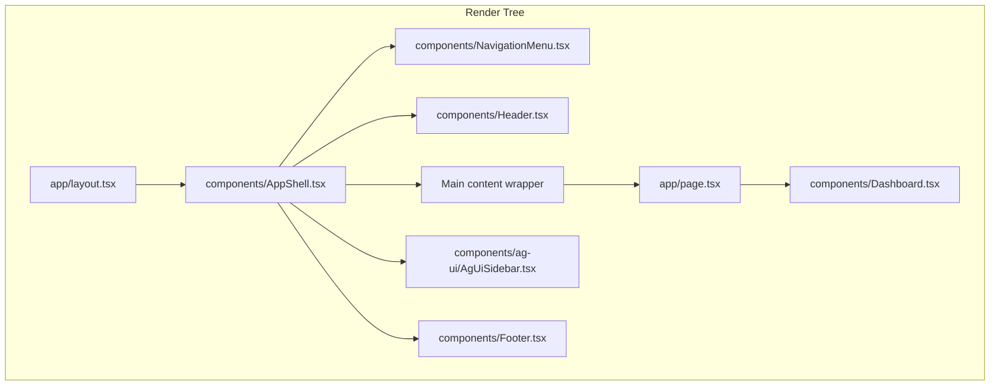

# UI Layout Overview

The Next.js root layout (`app/layout.tsx`) supplies global providers, fonts, and the `<html>/<body>` scaffold, while the route component (`app/page.tsx`) composes the visible chrome around the dashboard. The diagram below highlights how these pieces relate to the primary UI components.

- `app/layout.tsx` renders the global HTML shell, attaches font variables, wraps children with `AgUiProvider`, and mounts the `AppShell` client component so header/footer/sidebar chrome surrounds every page.
- `app/page.tsx` (the dashboard route) now simply returns the `Dashboard` component—the shared chrome is supplied by `AppShell`.
- `components/NavigationMenu.tsx` renders a docked shadcn Sheet on the left with the ABI logo and navigation links (Overview, Dynamic Dashboard); hidden on sub-md screens.
- `components/Header.tsx` provides navigation, branding, and sidebar toggles that remain visible at the top of the dashboard page.
- `components/Dashboard.tsx` fills the main content region with metrics, charts, and strategic commentary panels.
- `components/Footer.tsx` anchors persistent footer details beneath the main dashboard panel.
- `components/ag-ui/AgUiSidebar.tsx` docks to the right when open, offering assistant interactions alongside the dashboard view.
- `components/ag-ui/AgUiProvider.tsx` still wraps the shell from `app/layout.tsx`, ensuring AG‑UI events, chat state, and highlight helpers remain available to `Header`, `Dashboard`, and the sidebar regardless of the active route.
