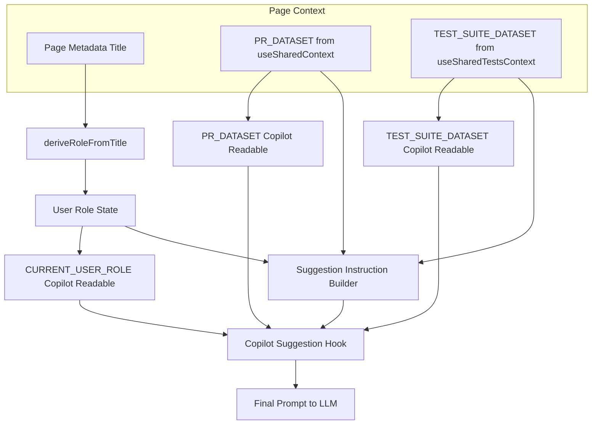

# Prompt Flow

```mermaid
flowchart TD
    subgraph PageContext[Page Context]
        A[Page Metadata Title]
        C[PR_DATASET from useSharedContext]
        D[TEST_SUITE_DATASET from useSharedTestsContext]
    end

    A --> E[deriveRoleFromTitle]
    E --> G[User Role State]
    G --> H[CURRENT_USER_ROLE Copilot Readable]

    C --> I[PR_DATASET Copilot Readable]
    D --> J[TEST_SUITE_DATASET Copilot Readable]

    G --> K[Suggestion Instruction Builder]
    C --> K
    D --> K
    H --> L[Copilot Suggestion Hook]
    I --> L
    J --> L
    K --> L

    L --> M[Final Prompt to LLM]
```

The diagram shows how metadata, pathname, and shared datasets combine to produce the prompt payload that feeds the Copilot suggestion hook and ultimately the LLM.
